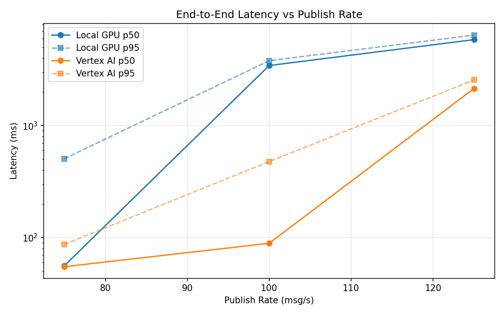
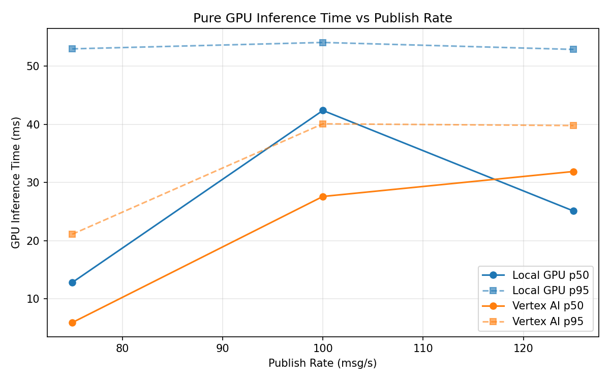
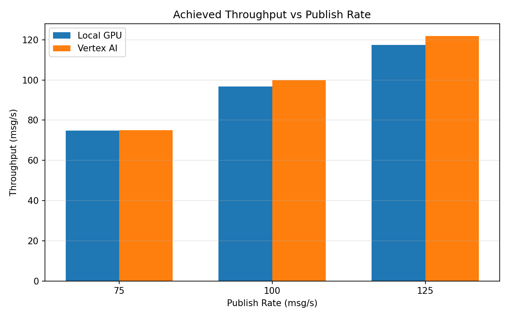

# Benchmark Report

Generated: 2026-03-08 01:37:49

## Configuration

| Parameter | Value |
|---|---|
| Messages per phase | 100s per phase |
| Rates (msg/s) | 75, 100, 125 |
| Experiments | Local GPU, Vertex AI |

## Throughput

| Rate (msg/s) | Local GPU | Vertex AI |
|---|---|---|
| 75 | 74.9 | 75.0 |
| 100 | 96.7 | 99.9 |
| 125 | 117.4 | 121.9 |

## End-to-End Latency (ms)

| Rate | Percentile | Local GPU | Vertex AI |
|---|---|---|---|
| 75 | p50 | 56.0 | 55.0 |
| 75 | p95 | 507.0 | 87.0 |
| 75 | p99 | 686.0 | 631.1 |
| 100 | p50 | 3444.0 | 89.0 |
| 100 | p95 | 3804.0 | 478.0 |
| 100 | p99 | 3859.0 | 713.0 |
| 125 | p50 | 5868.5 | 2151.0 |
| 125 | p95 | 6442.0 | 2562.0 |
| 125 | p99 | 6518.0 | 2654.0 |

## GPU Inference Time (ms)

| Rate | Percentile | Local GPU | Vertex AI |
|---|---|---|---|
| 75 | p50 | 12.8 | 5.9 |
| 75 | p95 | 53.0 | 21.1 |
| 75 | p99 | 57.1 | 35.7 |
| 100 | p50 | 42.4 | 27.6 |
| 100 | p95 | 54.1 | 40.1 |
| 100 | p99 | 58.1 | 50.1 |
| 125 | p50 | 25.1 | 31.9 |
| 125 | p95 | 52.9 | 39.8 |
| 125 | p99 | 57.1 | 48.8 |

## Charts

### Latency vs Publish Rate

### GPU Inference Time vs Publish Rate

### Throughput vs Publish Rate

