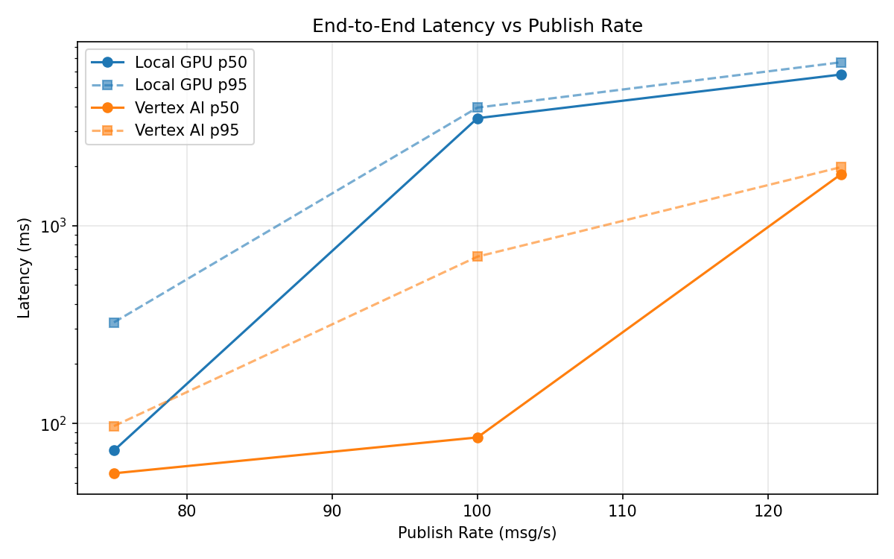
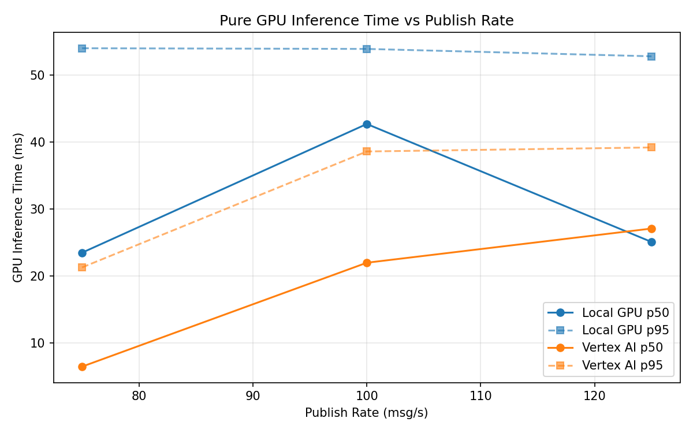
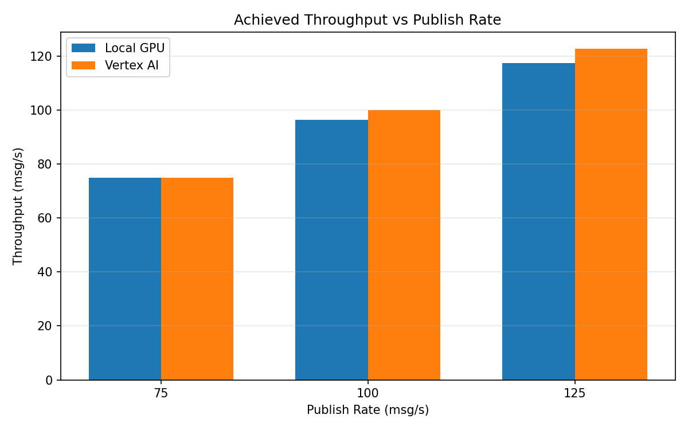

# Benchmark Report

Generated: 2026-03-08 00:58:40

## Configuration

| Parameter | Value |
|---|---|
| Messages per phase | 100s per phase |
| Rates (msg/s) | 75, 100, 125 |
| Experiments | Local GPU, Vertex AI |

## Throughput

| Rate (msg/s) | Local GPU | Vertex AI |
|---|---|---|
| 75 | 74.9 | 75.0 |
| 100 | 96.5 | 100.0 |
| 125 | 117.5 | 122.8 |

## End-to-End Latency (ms)

| Rate | Percentile | Local GPU | Vertex AI |
|---|---|---|---|
| 75 | p50 | 73.0 | 56.0 |
| 75 | p95 | 324.0 | 97.0 |
| 75 | p99 | 410.0 | 406.0 |
| 100 | p50 | 3483.5 | 85.0 |
| 100 | p95 | 3940.0 | 696.0 |
| 100 | p99 | 4035.0 | 979.0 |
| 125 | p50 | 5788.0 | 1813.0 |
| 125 | p95 | 6674.0 | 1971.0 |
| 125 | p99 | 6793.0 | 2015.0 |

## GPU Inference Time (ms)

| Rate | Percentile | Local GPU | Vertex AI |
|---|---|---|---|
| 75 | p50 | 23.5 | 6.5 |
| 75 | p95 | 54.0 | 21.3 |
| 75 | p99 | 58.3 | 36.1 |
| 100 | p50 | 42.7 | 22.0 |
| 100 | p95 | 53.9 | 38.6 |
| 100 | p99 | 57.9 | 48.0 |
| 125 | p50 | 25.1 | 27.1 |
| 125 | p95 | 52.8 | 39.2 |
| 125 | p99 | 57.8 | 48.8 |

## Charts

### Latency vs Publish Rate

### GPU Inference Time vs Publish Rate

### Throughput vs Publish Rate

