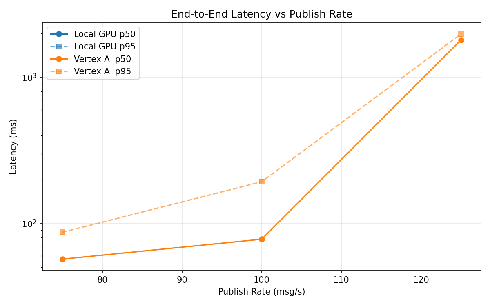
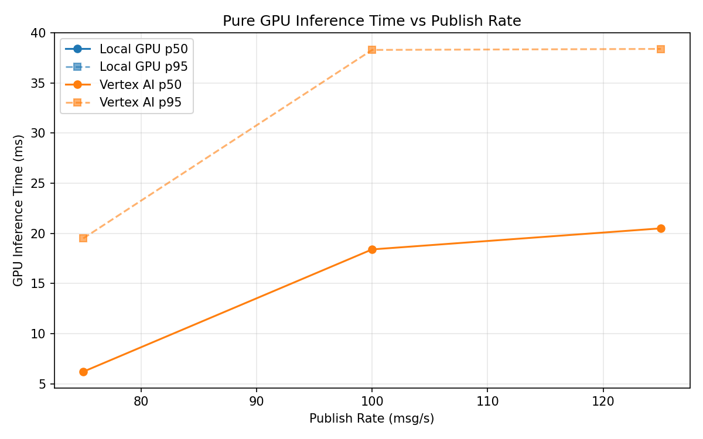
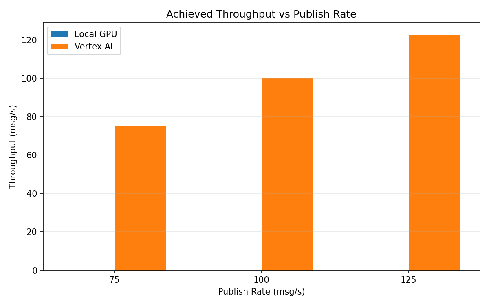

# Benchmark Report

Generated: 2026-03-08 01:53:34

## Configuration

| Parameter | Value |
|---|---|
| Messages per phase | 100s per phase |
| Rates (msg/s) | 75, 100, 125 |
| Experiments | Local GPU, Vertex AI |

## Throughput

| Rate (msg/s) | Local GPU | Vertex AI |
|---|---|---|
| 75 | — | 75.0 |
| 100 | — | 100.0 |
| 125 | — | 122.7 |

## End-to-End Latency (ms)

| Rate | Percentile | Local GPU | Vertex AI |
|---|---|---|---|
| 75 | p50 | — | 57.0 |
| 75 | p95 | — | 87.0 |
| 75 | p99 | — | 402.0 |
| 100 | p50 | — | 78.0 |
| 100 | p95 | — | 193.0 |
| 100 | p99 | — | 373.0 |
| 125 | p50 | — | 1803.0 |
| 125 | p95 | — | 1981.0 |
| 125 | p99 | — | 2017.0 |

## GPU Inference Time (ms)

| Rate | Percentile | Local GPU | Vertex AI |
|---|---|---|---|
| 75 | p50 | — | 6.2 |
| 75 | p95 | — | 19.5 |
| 75 | p99 | — | 35.2 |
| 100 | p50 | — | 18.4 |
| 100 | p95 | — | 38.3 |
| 100 | p99 | — | 48.5 |
| 125 | p50 | — | 20.5 |
| 125 | p95 | — | 38.4 |
| 125 | p99 | — | 47.7 |

## Charts

### Latency vs Publish Rate

### GPU Inference Time vs Publish Rate

### Throughput vs Publish Rate

