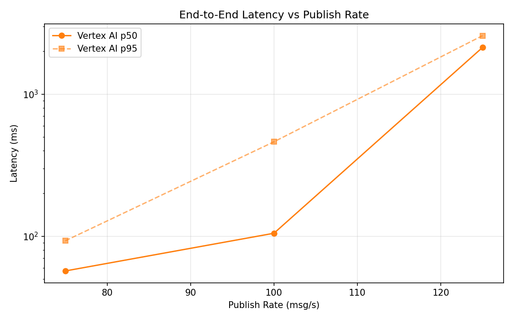
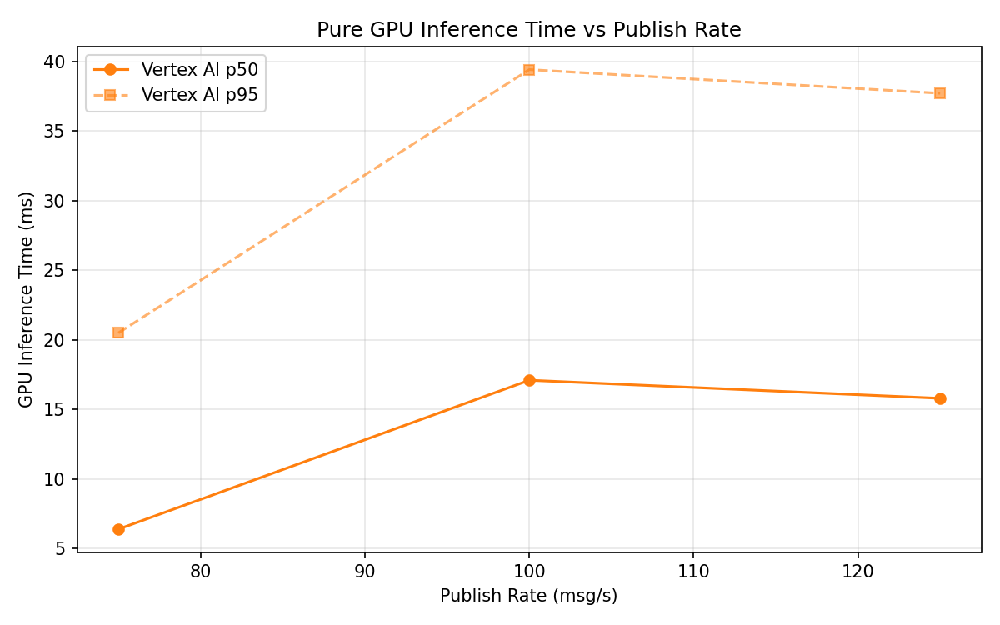
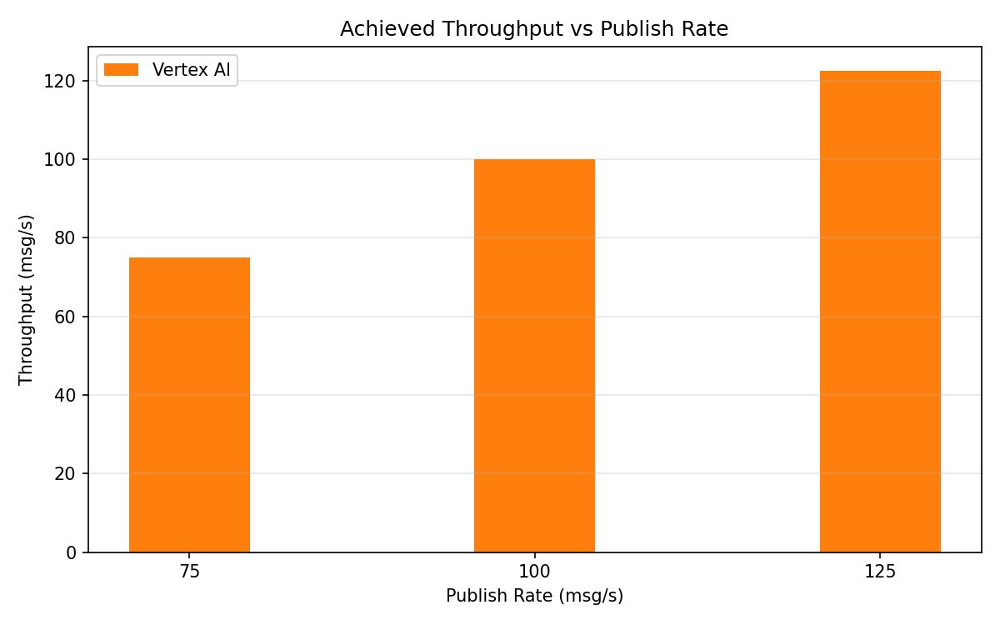

# Benchmark Report

Generated: 2026-03-08 03:00:06

## Configuration

| Parameter | Value |
|---|---|
| Messages per phase | 100s per phase |
| Rates (msg/s) | 75, 100, 125 |
| Experiments | Vertex AI |

## Throughput

| Rate (msg/s) | Vertex AI |
|---|---|
| 75 | 75.0 |
| 100 | 99.9 |
| 125 | 122.5 |

## End-to-End Latency (ms)

| Rate | Percentile | Vertex AI |
|---|---|---|
| 75 | p50 | 57.0 |
| 75 | p95 | 93.0 |
| 75 | p99 | 626.0 |
| 100 | p50 | 105.0 |
| 100 | p95 | 462.0 |
| 100 | p99 | 573.0 |
| 125 | p50 | 2131.0 |
| 125 | p95 | 2580.0 |
| 125 | p99 | 2649.0 |

## GPU Inference Time (ms)

| Rate | Percentile | Vertex AI |
|---|---|---|
| 75 | p50 | 6.4 |
| 75 | p95 | 20.5 |
| 75 | p99 | 34.7 |
| 100 | p50 | 17.1 |
| 100 | p95 | 39.4 |
| 100 | p99 | 50.8 |
| 125 | p50 | 15.8 |
| 125 | p95 | 37.7 |
| 125 | p99 | 46.1 |

## Charts

### Latency vs Publish Rate

### GPU Inference Time vs Publish Rate

### Throughput vs Publish Rate

