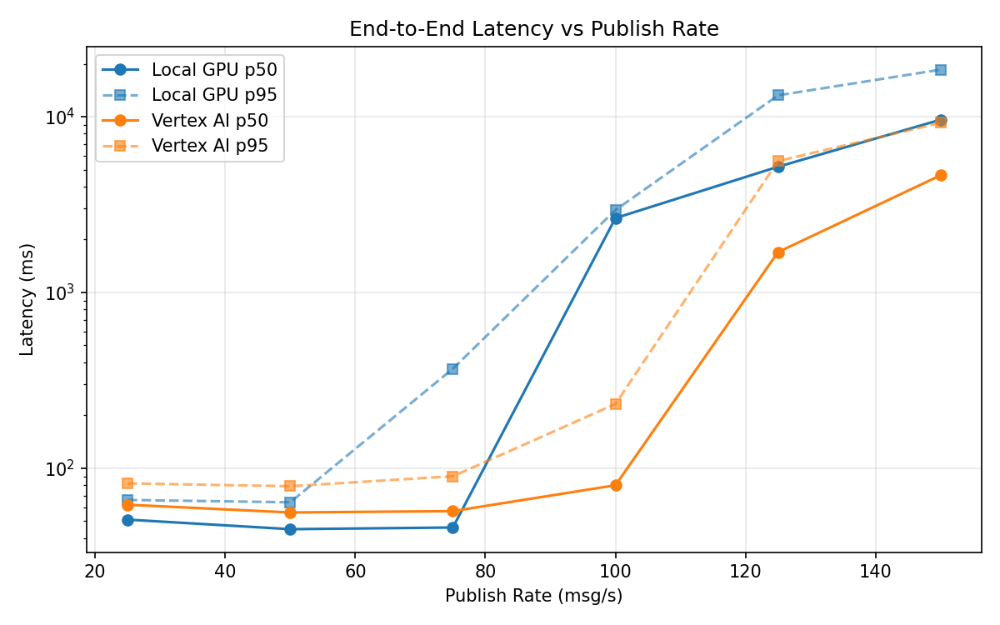
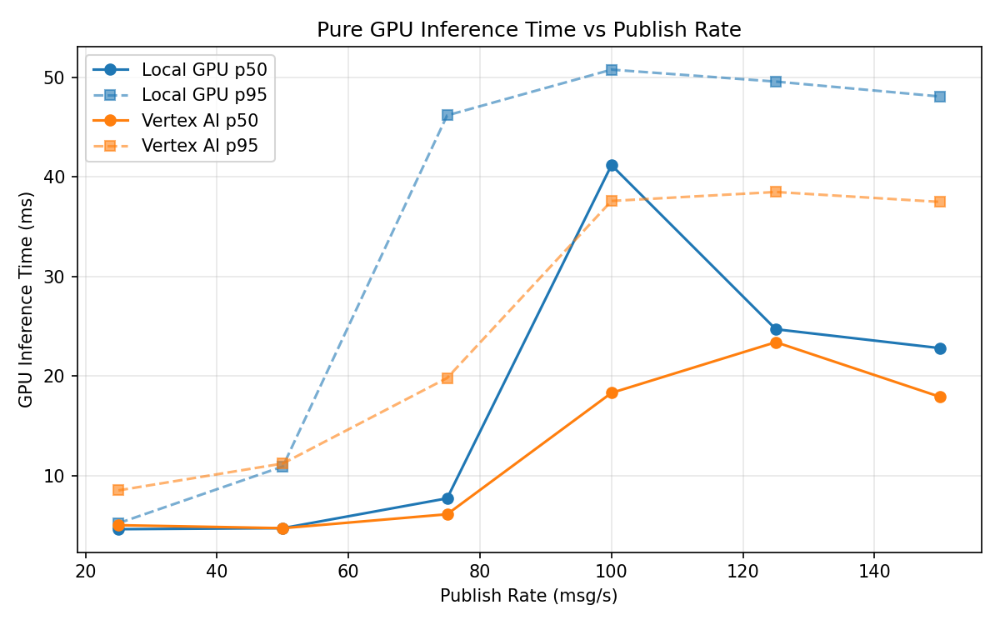
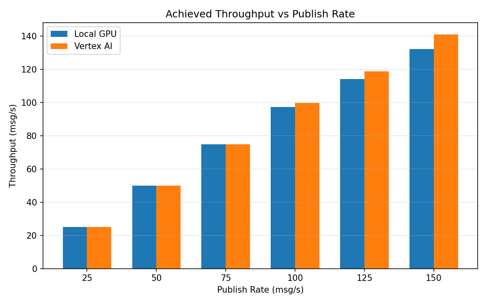

# Benchmark Report

Generated: 2026-03-08 02:28:39

## Configuration

| Parameter | Value |
|---|---|
| Messages per phase | 100s per phase |
| Rates (msg/s) | 25, 50, 75, 100, 125, 150 |
| Experiments | Local GPU, Vertex AI |

## Throughput

| Rate (msg/s) | Local GPU | Vertex AI |
|---|---|---|
| 25 | 25.0 | 25.0 |
| 50 | 50.0 | 50.0 |
| 75 | 75.0 | 75.0 |
| 100 | 97.3 | 99.9 |
| 125 | 114.2 | 118.9 |
| 150 | 132.3 | 141.1 |

## End-to-End Latency (ms)

| Rate | Percentile | Local GPU | Vertex AI |
|---|---|---|---|
| 25 | p50 | 51.0 | 62.0 |
| 25 | p95 | 66.0 | 82.0 |
| 25 | p99 | 90.1 | 123.0 |
| 50 | p50 | 45.0 | 56.0 |
| 50 | p95 | 64.0 | 79.0 |
| 50 | p99 | 157.1 | 218.0 |
| 75 | p50 | 46.0 | 57.0 |
| 75 | p95 | 368.1 | 90.0 |
| 75 | p99 | 801.0 | 326.2 |
| 100 | p50 | 2649.5 | 80.0 |
| 100 | p95 | 2946.0 | 232.0 |
| 100 | p99 | 3002.0 | 428.0 |
| 125 | p50 | 5192.0 | 1697.0 |
| 125 | p95 | 13231.0 | 5594.8 |
| 125 | p99 | 14162.0 | 7227.9 |
| 150 | p50 | 9613.5 | 4642.0 |
| 150 | p95 | 18528.0 | 9226.0 |
| 150 | p99 | 19178.0 | 9899.0 |

## GPU Inference Time (ms)

| Rate | Percentile | Local GPU | Vertex AI |
|---|---|---|---|
| 25 | p50 | 4.6 | 5.0 |
| 25 | p95 | 5.2 | 8.5 |
| 25 | p99 | 10.8 | 11.3 |
| 50 | p50 | 4.7 | 4.7 |
| 50 | p95 | 10.9 | 11.2 |
| 50 | p99 | 41.7 | 20.9 |
| 75 | p50 | 7.7 | 6.1 |
| 75 | p95 | 46.2 | 19.8 |
| 75 | p99 | 51.4 | 34.9 |
| 100 | p50 | 41.2 | 18.3 |
| 100 | p95 | 50.8 | 37.6 |
| 100 | p99 | 54.4 | 47.7 |
| 125 | p50 | 24.7 | 23.4 |
| 125 | p95 | 49.6 | 38.5 |
| 125 | p99 | 53.6 | 47.8 |
| 150 | p50 | 22.8 | 17.9 |
| 150 | p95 | 48.1 | 37.5 |
| 150 | p99 | 52.3 | 45.8 |

## Charts

### Latency vs Publish Rate

### GPU Inference Time vs Publish Rate

### Throughput vs Publish Rate

