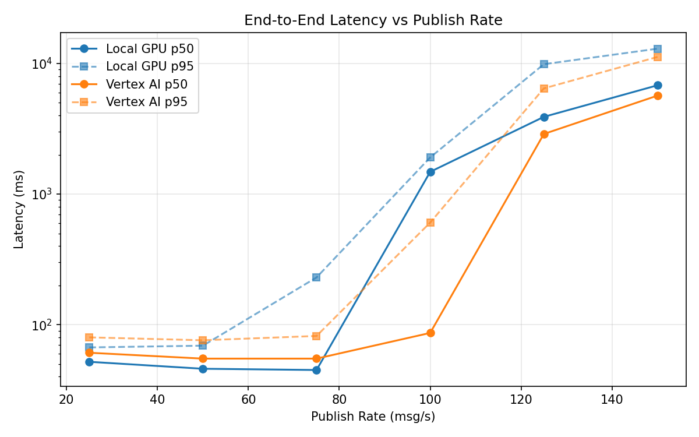
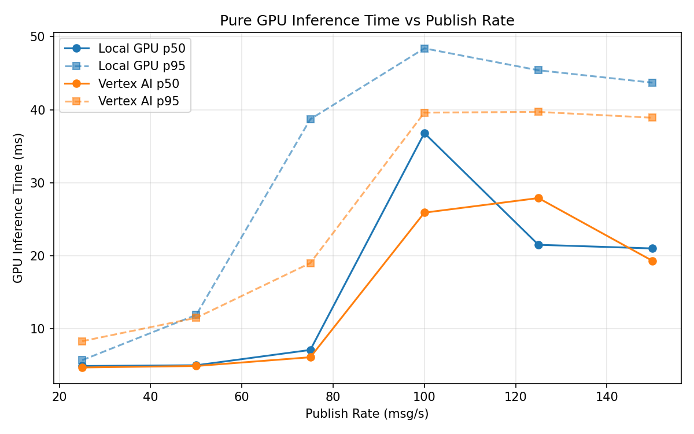
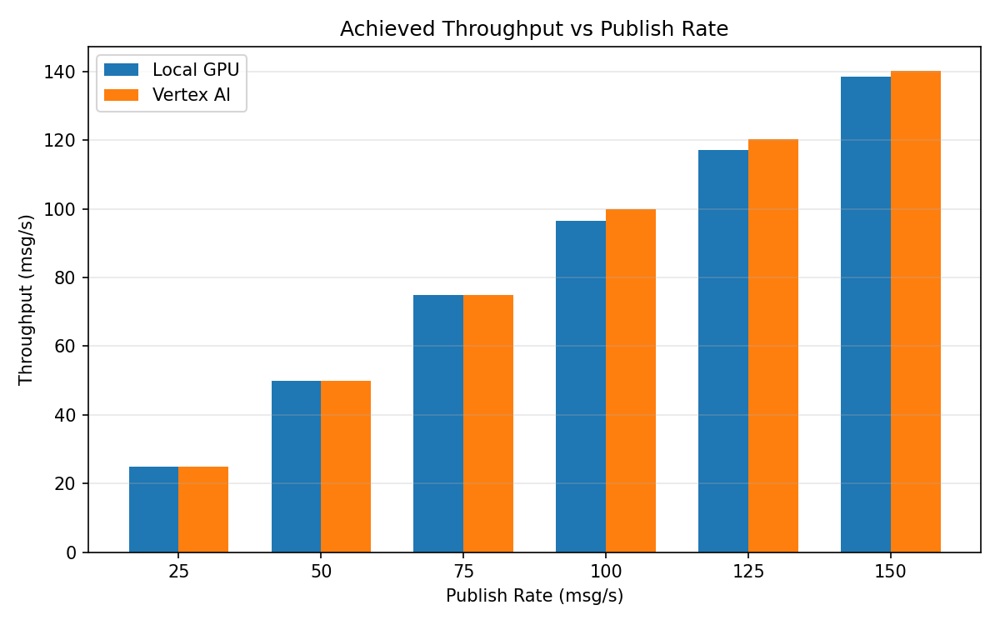

# Benchmark Report

Generated: 2026-03-08 02:48:19

## Configuration

| Parameter | Value |
|---|---|
| Messages per phase | 100s per phase |
| Rates (msg/s) | 25, 50, 75, 100, 125, 150 |
| Experiments | Local GPU, Vertex AI |

## Throughput

| Rate (msg/s) | Local GPU | Vertex AI |
|---|---|---|
| 25 | 25.0 | 25.0 |
| 50 | 50.0 | 50.0 |
| 75 | 75.0 | 75.0 |
| 100 | 96.6 | 99.9 |
| 125 | 117.0 | 120.2 |
| 150 | 138.5 | 140.2 |

## End-to-End Latency (ms)

| Rate | Percentile | Local GPU | Vertex AI |
|---|---|---|---|
| 25 | p50 | 52.0 | 61.0 |
| 25 | p95 | 67.0 | 80.0 |
| 25 | p99 | 88.0 | 329.0 |
| 50 | p50 | 46.0 | 55.0 |
| 50 | p95 | 69.1 | 76.0 |
| 50 | p99 | 640.0 | 128.0 |
| 75 | p50 | 45.0 | 55.0 |
| 75 | p95 | 230.0 | 82.0 |
| 75 | p99 | 849.0 | 175.0 |
| 100 | p50 | 1480.0 | 86.5 |
| 100 | p95 | 1907.2 | 605.0 |
| 100 | p99 | 4502.9 | 936.0 |
| 125 | p50 | 3900.0 | 2884.0 |
| 125 | p95 | 9867.0 | 6441.1 |
| 125 | p99 | 10287.0 | 7269.0 |
| 150 | p50 | 6801.0 | 5669.5 |
| 150 | p95 | 12967.0 | 11213.1 |
| 150 | p99 | 13939.0 | 11998.0 |

## GPU Inference Time (ms)

| Rate | Percentile | Local GPU | Vertex AI |
|---|---|---|---|
| 25 | p50 | 4.9 | 4.7 |
| 25 | p95 | 5.7 | 8.3 |
| 25 | p99 | 11.1 | 12.5 |
| 50 | p50 | 5.0 | 4.9 |
| 50 | p95 | 11.9 | 11.5 |
| 50 | p99 | 42.6 | 19.5 |
| 75 | p50 | 7.1 | 6.1 |
| 75 | p95 | 38.7 | 19.0 |
| 75 | p99 | 47.1 | 34.3 |
| 100 | p50 | 36.8 | 25.9 |
| 100 | p95 | 48.4 | 39.6 |
| 100 | p99 | 53.0 | 49.2 |
| 125 | p50 | 21.5 | 27.9 |
| 125 | p95 | 45.4 | 39.7 |
| 125 | p99 | 50.0 | 48.8 |
| 150 | p50 | 21.0 | 19.3 |
| 150 | p95 | 43.7 | 38.9 |
| 150 | p99 | 48.5 | 47.5 |

## Charts

### Latency vs Publish Rate

### GPU Inference Time vs Publish Rate

### Throughput vs Publish Rate

