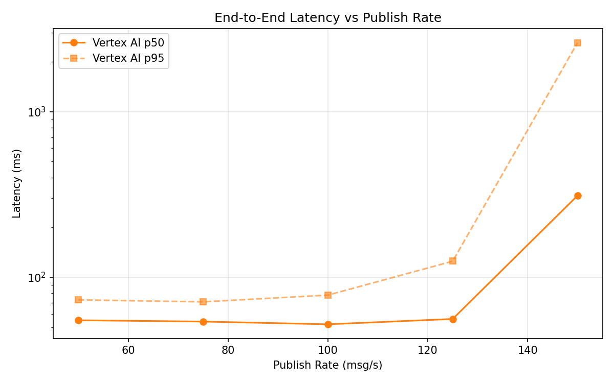
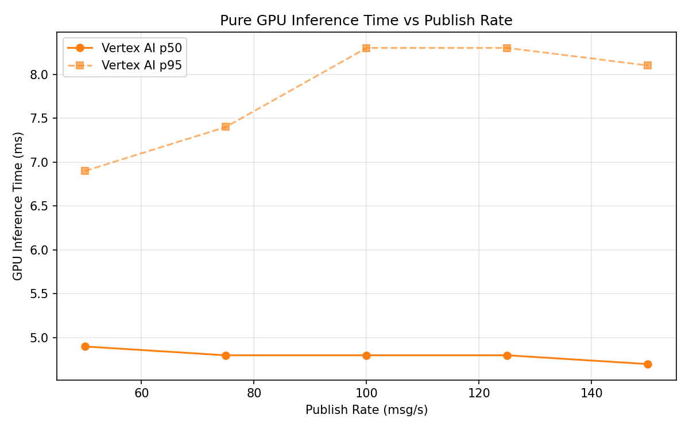
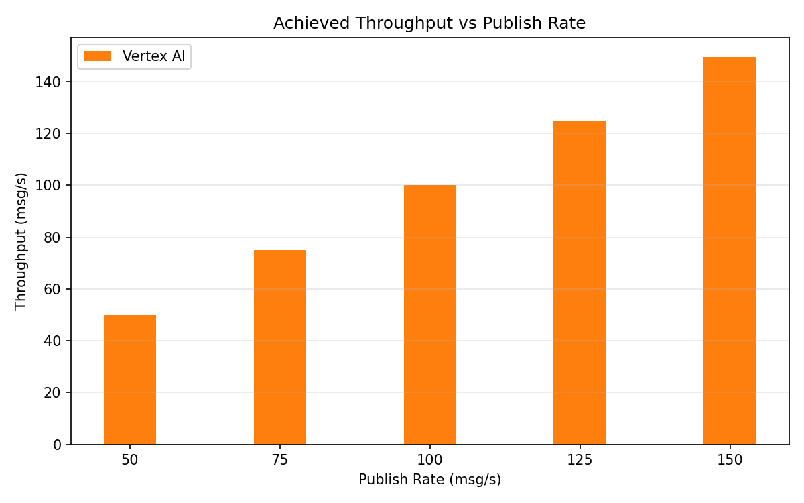

# Benchmark Report

Generated: 2026-03-09 12:27:35

## Configuration

| Parameter | Value |
|---|---|
| Messages per phase | 100s per phase |
| Rates (msg/s) | 50, 75, 100, 125, 150 |
| Experiments | Vertex AI |

## Throughput

| Rate (msg/s) | Vertex AI |
|---|---|
| 50 | 50.0 |
| 75 | 75.0 |
| 100 | 100.0 |
| 125 | 124.9 |
| 150 | 149.6 |

## End-to-End Latency (ms)

| Rate | Percentile | Vertex AI |
|---|---|---|
| 50 | p50 | 55.0 |
| 50 | p95 | 73.0 |
| 50 | p99 | 111.0 |
| 75 | p50 | 54.0 |
| 75 | p95 | 71.0 |
| 75 | p99 | 553.1 |
| 100 | p50 | 52.0 |
| 100 | p95 | 78.0 |
| 100 | p99 | 482.0 |
| 125 | p50 | 56.0 |
| 125 | p95 | 125.0 |
| 125 | p99 | 630.1 |
| 150 | p50 | 311.0 |
| 150 | p95 | 2606.0 |
| 150 | p99 | 3526.0 |

## GPU Inference Time (ms)

| Rate | Percentile | Vertex AI |
|---|---|---|
| 50 | p50 | 4.9 |
| 50 | p95 | 6.9 |
| 50 | p99 | 8.7 |
| 75 | p50 | 4.8 |
| 75 | p95 | 7.4 |
| 75 | p99 | 9.1 |
| 100 | p50 | 4.8 |
| 100 | p95 | 8.3 |
| 100 | p99 | 11.0 |
| 125 | p50 | 4.8 |
| 125 | p95 | 8.3 |
| 125 | p99 | 11.1 |
| 150 | p50 | 4.7 |
| 150 | p95 | 8.1 |
| 150 | p99 | 11.1 |

## Charts

### Latency vs Publish Rate

### GPU Inference Time vs Publish Rate

### Throughput vs Publish Rate

