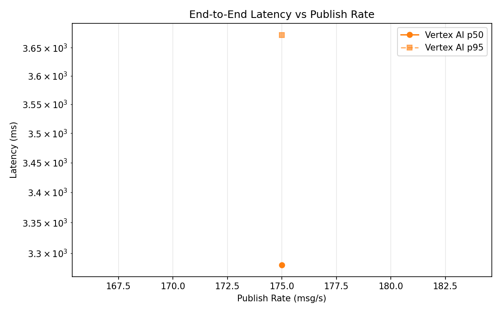
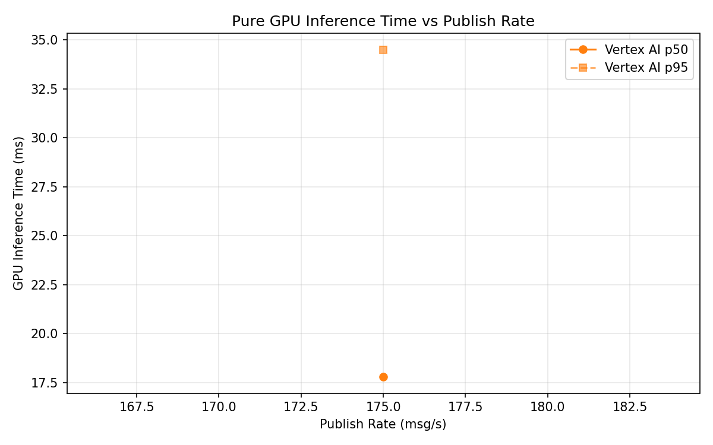
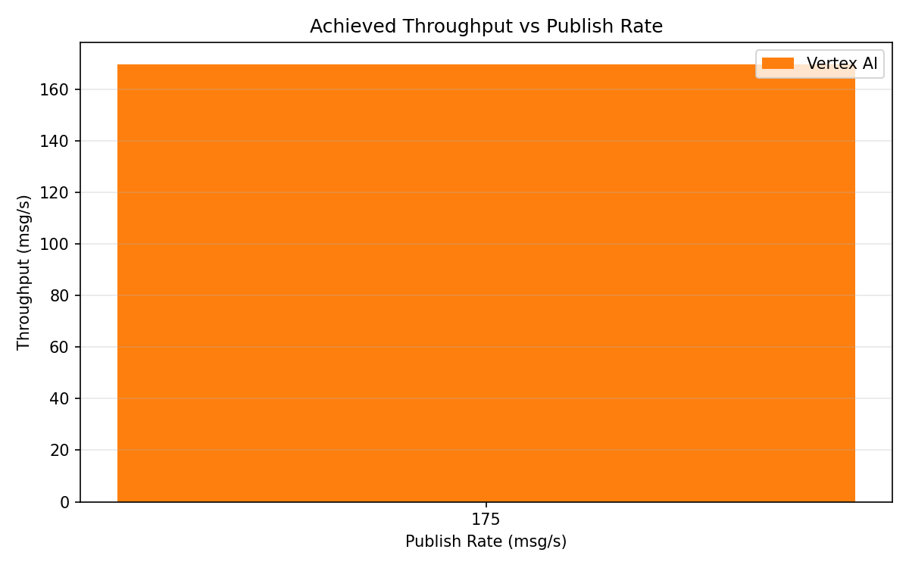

# Benchmark Report

Generated: 2026-03-09 18:20:57

## Configuration

| Parameter | Value |
|---|---|
| Messages per phase | 100s per phase |
| Rates (msg/s) | 175 |
| Experiments | Vertex AI |

## Throughput

| Rate (msg/s) | Vertex AI |
|---|---|
| 175 | 169.6 |

## End-to-End Latency (ms)

| Rate | Percentile | Vertex AI |
|---|---|---|
| 175 | p50 | 3281.0 |
| 175 | p95 | 3673.0 |
| 175 | p99 | 3805.0 |

## GPU Inference Time (ms)

| Rate | Percentile | Vertex AI |
|---|---|---|
| 175 | p50 | 17.8 |
| 175 | p95 | 34.5 |
| 175 | p99 | 39.4 |

## Charts

### Latency vs Publish Rate

### GPU Inference Time vs Publish Rate

### Throughput vs Publish Rate

