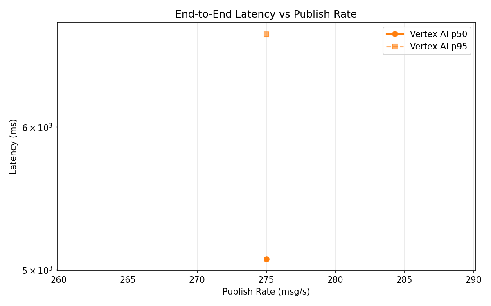
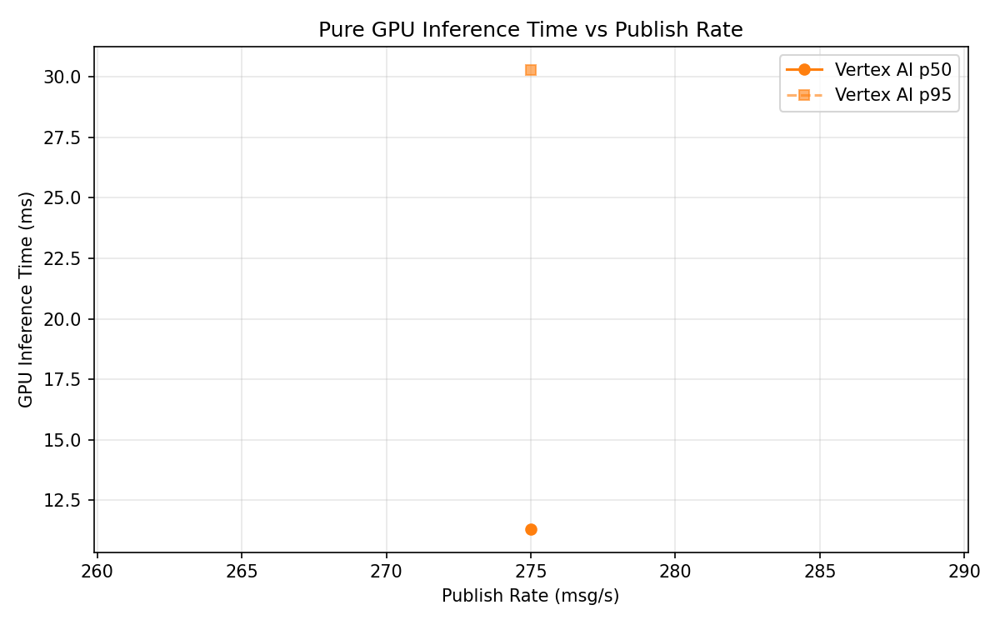
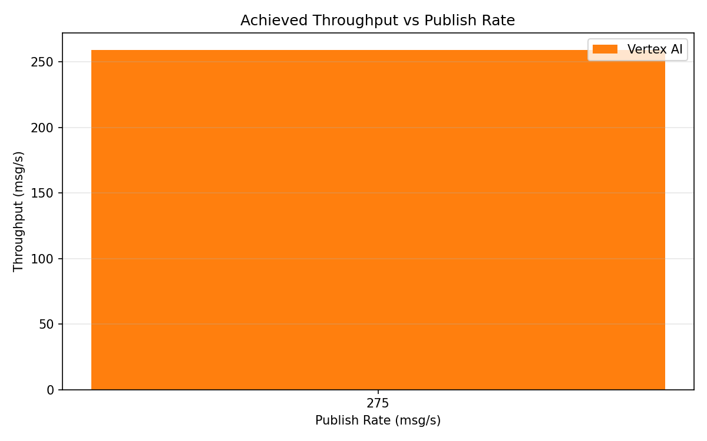

# Benchmark Report

Generated: 2026-03-09 18:55:21

## Configuration

| Parameter | Value |
|---|---|
| Messages per phase | 100s per phase |
| Rates (msg/s) | 275 |
| Experiments | Vertex AI |

## Throughput

| Rate (msg/s) | Vertex AI |
|---|---|
| 275 | 259.1 |

## End-to-End Latency (ms)

| Rate | Percentile | Vertex AI |
|---|---|---|
| 275 | p50 | 5069.0 |
| 275 | p95 | 6756.0 |
| 275 | p99 | 6891.0 |

## GPU Inference Time (ms)

| Rate | Percentile | Vertex AI |
|---|---|---|
| 275 | p50 | 11.3 |
| 275 | p95 | 30.3 |
| 275 | p99 | 35.1 |

## Charts

### Latency vs Publish Rate

### GPU Inference Time vs Publish Rate

### Throughput vs Publish Rate

