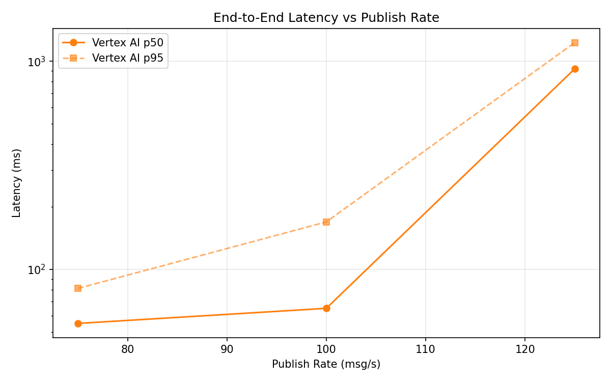
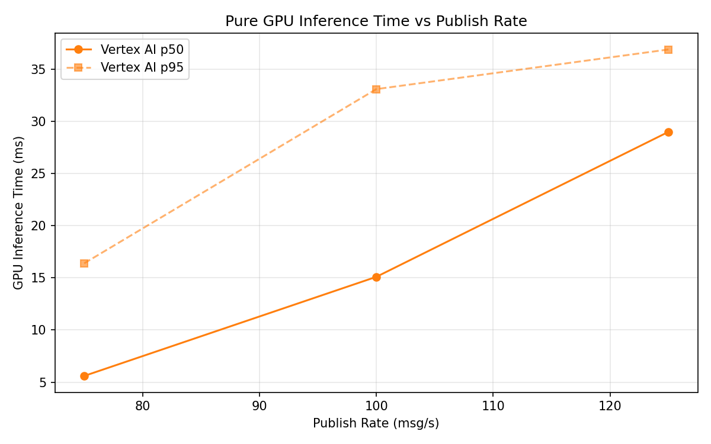
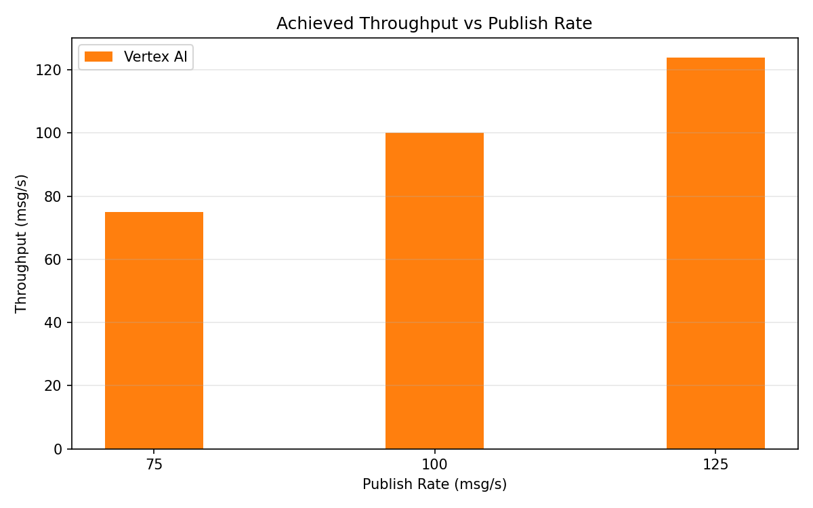

# Benchmark Report

Generated: 2026-03-09 16:01:08

## Configuration

| Parameter | Value |
|---|---|
| Messages per phase | 100s per phase |
| Rates (msg/s) | 75, 100, 125 |
| Experiments | Vertex AI |

## Throughput

| Rate (msg/s) | Vertex AI |
|---|---|
| 75 | 75.0 |
| 100 | 100.0 |
| 125 | 123.9 |

## End-to-End Latency (ms)

| Rate | Percentile | Vertex AI |
|---|---|---|
| 75 | p50 | 55.0 |
| 75 | p95 | 81.0 |
| 75 | p99 | 241.0 |
| 100 | p50 | 65.0 |
| 100 | p95 | 169.0 |
| 100 | p99 | 521.0 |
| 125 | p50 | 919.0 |
| 125 | p95 | 1229.0 |
| 125 | p99 | 1381.0 |

## GPU Inference Time (ms)

| Rate | Percentile | Vertex AI |
|---|---|---|
| 75 | p50 | 5.6 |
| 75 | p95 | 16.4 |
| 75 | p99 | 30.3 |
| 100 | p50 | 15.1 |
| 100 | p95 | 33.1 |
| 100 | p99 | 40.3 |
| 125 | p50 | 29.0 |
| 125 | p95 | 36.9 |
| 125 | p99 | 42.8 |

## Charts

### Latency vs Publish Rate

### GPU Inference Time vs Publish Rate

### Throughput vs Publish Rate

