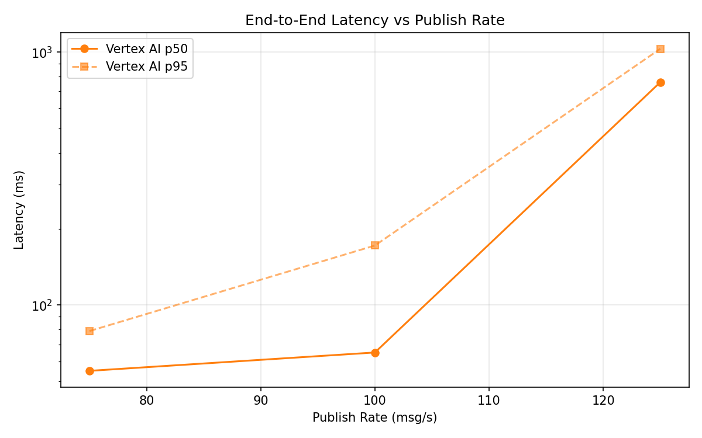
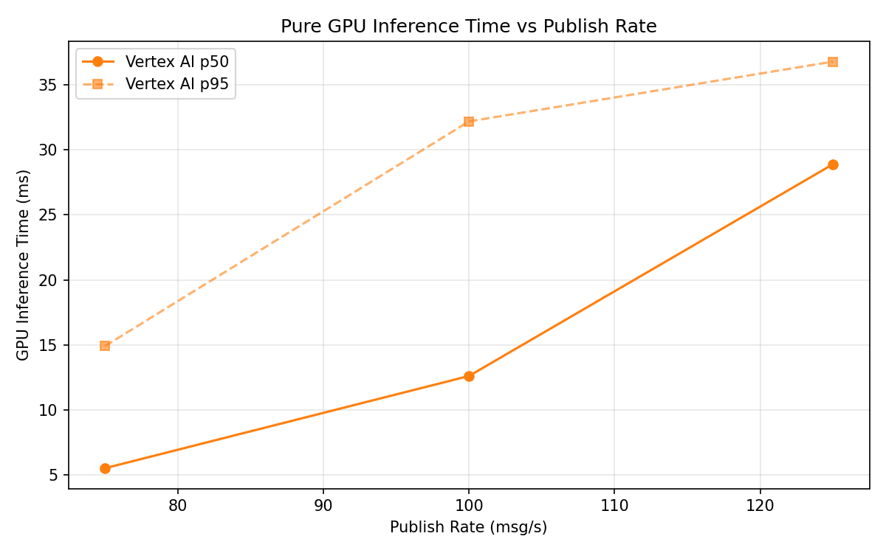

# Benchmark Report

Generated: 2026-03-09 16:40:09

## Configuration

| Parameter | Value |
|---|---|
| Messages per phase | 100s per phase |
| Rates (msg/s) | 75, 100, 125 |
| Experiments | Vertex AI |

## Throughput

| Rate (msg/s) | Vertex AI |
|---|---|
| 75 | 75.0 |
| 100 | 99.9 |
| 125 | 124.0 |

## End-to-End Latency (ms)

| Rate | Percentile | Vertex AI |
|---|---|---|
| 75 | p50 | 55.0 |
| 75 | p95 | 79.0 |
| 75 | p99 | 133.0 |
| 100 | p50 | 65.0 |
| 100 | p95 | 172.0 |
| 100 | p99 | 601.0 |
| 125 | p50 | 760.0 |
| 125 | p95 | 1030.0 |
| 125 | p99 | 1158.0 |

## GPU Inference Time (ms)

| Rate | Percentile | Vertex AI |
|---|---|---|
| 75 | p50 | 5.5 |
| 75 | p95 | 14.9 |
| 75 | p99 | 27.7 |
| 100 | p50 | 12.6 |
| 100 | p95 | 32.2 |
| 100 | p99 | 40.6 |
| 125 | p50 | 28.9 |
| 125 | p95 | 36.8 |
| 125 | p99 | 42.1 |

## Charts

### Latency vs Publish Rate

### GPU Inference Time vs Publish Rate

### Throughput vs Publish Rate

