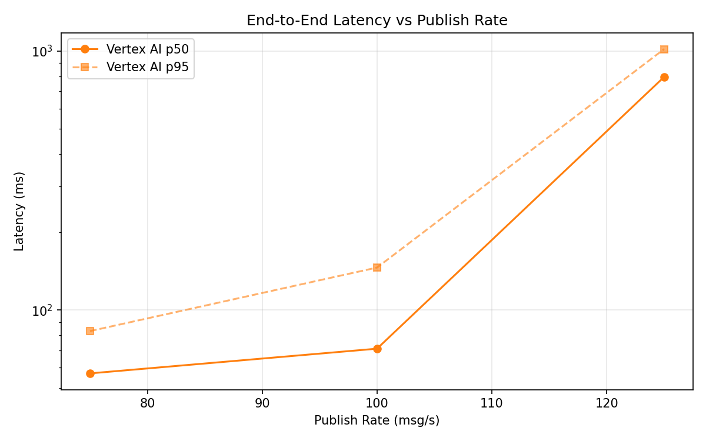
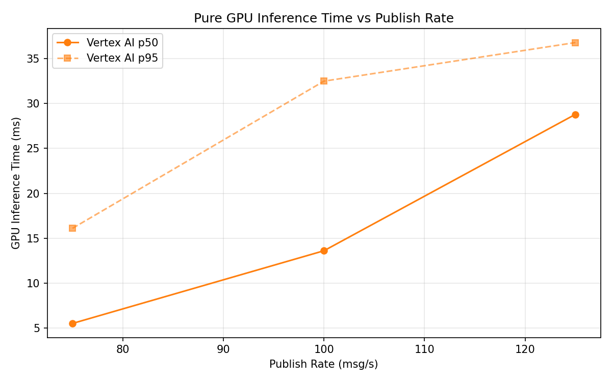
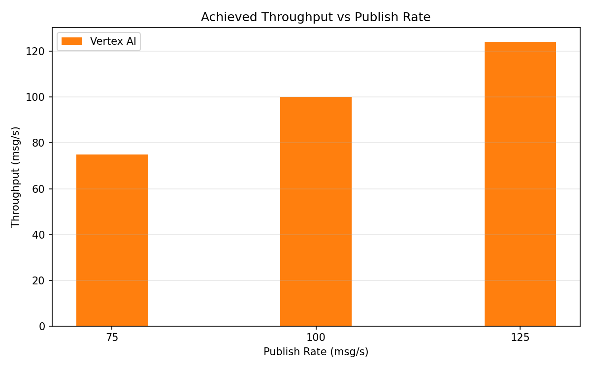

# Benchmark Report

Generated: 2026-03-09 17:17:10

## Configuration

| Parameter | Value |
|---|---|
| Messages per phase | 100s per phase |
| Rates (msg/s) | 75, 100, 125 |
| Experiments | Vertex AI |

## Throughput

| Rate (msg/s) | Vertex AI |
|---|---|
| 75 | 75.0 |
| 100 | 100.0 |
| 125 | 124.2 |

## End-to-End Latency (ms)

| Rate | Percentile | Vertex AI |
|---|---|---|
| 75 | p50 | 57.0 |
| 75 | p95 | 83.0 |
| 75 | p99 | 584.0 |
| 100 | p50 | 71.0 |
| 100 | p95 | 146.0 |
| 100 | p99 | 365.0 |
| 125 | p50 | 794.0 |
| 125 | p95 | 1017.0 |
| 125 | p99 | 1104.0 |

## GPU Inference Time (ms)

| Rate | Percentile | Vertex AI |
|---|---|---|
| 75 | p50 | 5.5 |
| 75 | p95 | 16.1 |
| 75 | p99 | 30.9 |
| 100 | p50 | 13.6 |
| 100 | p95 | 32.5 |
| 100 | p99 | 39.6 |
| 125 | p50 | 28.8 |
| 125 | p95 | 36.8 |
| 125 | p99 | 42.8 |

## Charts

### Latency vs Publish Rate

### GPU Inference Time vs Publish Rate

### Throughput vs Publish Rate

