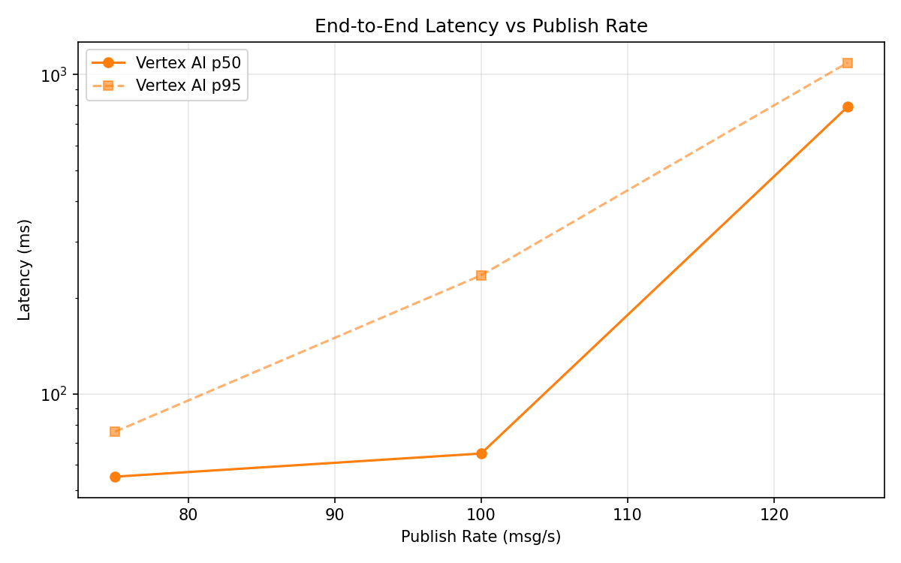
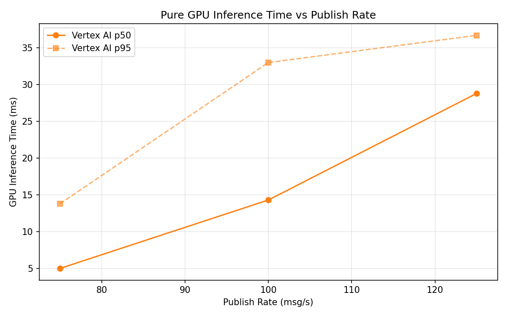

# Benchmark Report

Generated: 2026-03-09 17:29:03

## Configuration

| Parameter | Value |
|---|---|
| Messages per phase | 100s per phase |
| Rates (msg/s) | 75, 100, 125 |
| Experiments | Vertex AI |

## Throughput

| Rate (msg/s) | Vertex AI |
|---|---|
| 75 | 75.0 |
| 100 | 99.8 |
| 125 | 124.1 |

## End-to-End Latency (ms)

| Rate | Percentile | Vertex AI |
|---|---|---|
| 75 | p50 | 55.0 |
| 75 | p95 | 76.0 |
| 75 | p99 | 161.0 |
| 100 | p50 | 65.0 |
| 100 | p95 | 235.0 |
| 100 | p99 | 690.0 |
| 125 | p50 | 791.0 |
| 125 | p95 | 1088.0 |
| 125 | p99 | 1168.0 |

## GPU Inference Time (ms)

| Rate | Percentile | Vertex AI |
|---|---|---|
| 75 | p50 | 5.0 |
| 75 | p95 | 13.8 |
| 75 | p99 | 27.4 |
| 100 | p50 | 14.3 |
| 100 | p95 | 33.0 |
| 100 | p99 | 40.6 |
| 125 | p50 | 28.8 |
| 125 | p95 | 36.7 |
| 125 | p99 | 43.6 |

## Charts

### Latency vs Publish Rate

### GPU Inference Time vs Publish Rate

### Throughput vs Publish Rate

