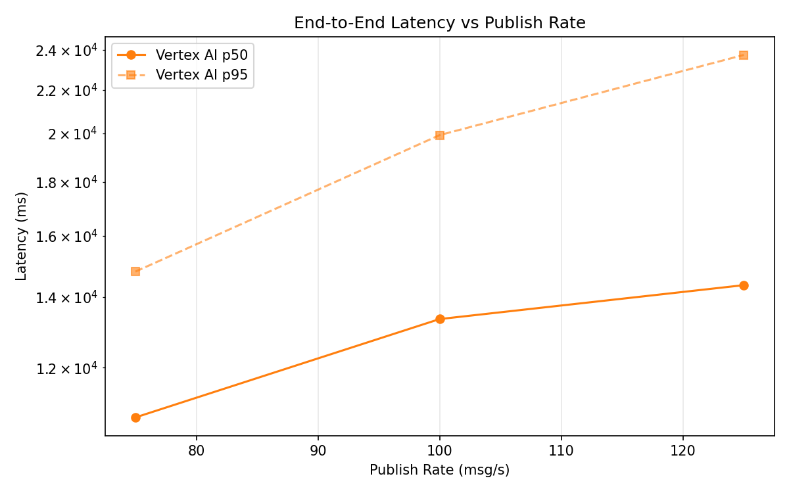
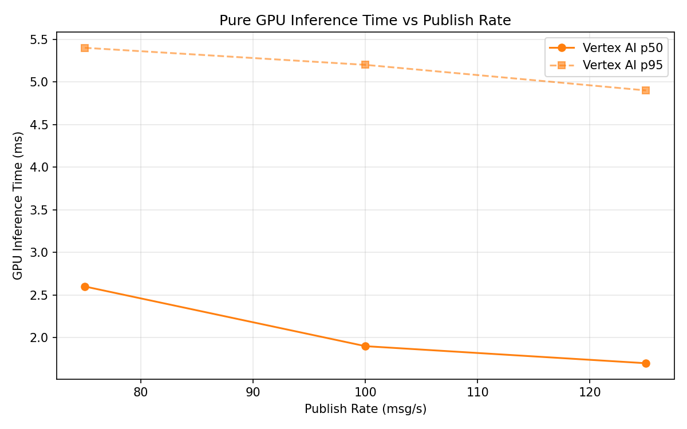
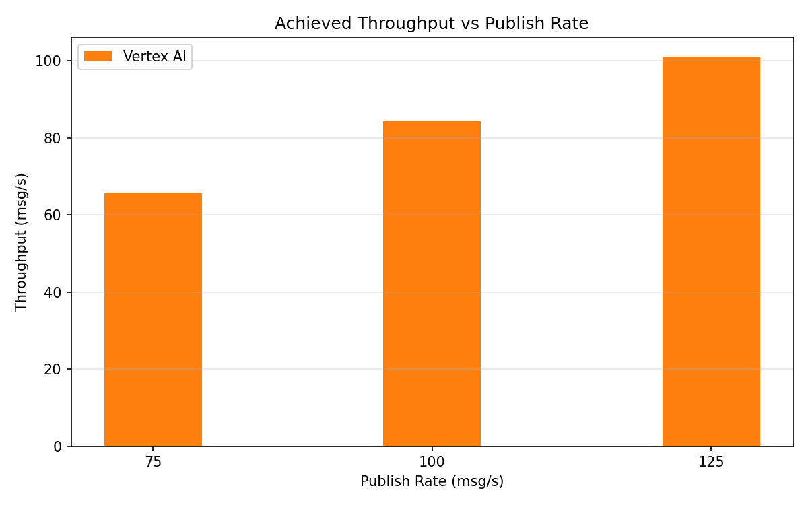

# Benchmark Report

Generated: 2026-03-09 12:40:23

## Configuration

| Parameter | Value |
|---|---|
| Messages per phase | 100s per phase |
| Rates (msg/s) | 75, 100, 125 |
| Experiments | Vertex AI |

## Throughput

| Rate (msg/s) | Vertex AI |
|---|---|
| 75 | 65.6 |
| 100 | 84.3 |
| 125 | 100.9 |

## End-to-End Latency (ms)

| Rate | Percentile | Vertex AI |
|---|---|---|
| 75 | p50 | 10769.0 |
| 75 | p95 | 14800.0 |
| 75 | p99 | 14947.0 |
| 100 | p50 | 13344.5 |
| 100 | p95 | 19929.1 |
| 100 | p99 | 20152.0 |
| 125 | p50 | 14368.5 |
| 125 | p95 | 23736.0 |
| 125 | p99 | 23945.0 |

## GPU Inference Time (ms)

| Rate | Percentile | Vertex AI |
|---|---|---|
| 75 | p50 | 2.6 |
| 75 | p95 | 5.4 |
| 75 | p99 | 7.0 |
| 100 | p50 | 1.9 |
| 100 | p95 | 5.2 |
| 100 | p99 | 6.3 |
| 125 | p50 | 1.7 |
| 125 | p95 | 4.9 |
| 125 | p99 | 5.6 |

## Charts

### Latency vs Publish Rate

### GPU Inference Time vs Publish Rate

### Throughput vs Publish Rate

