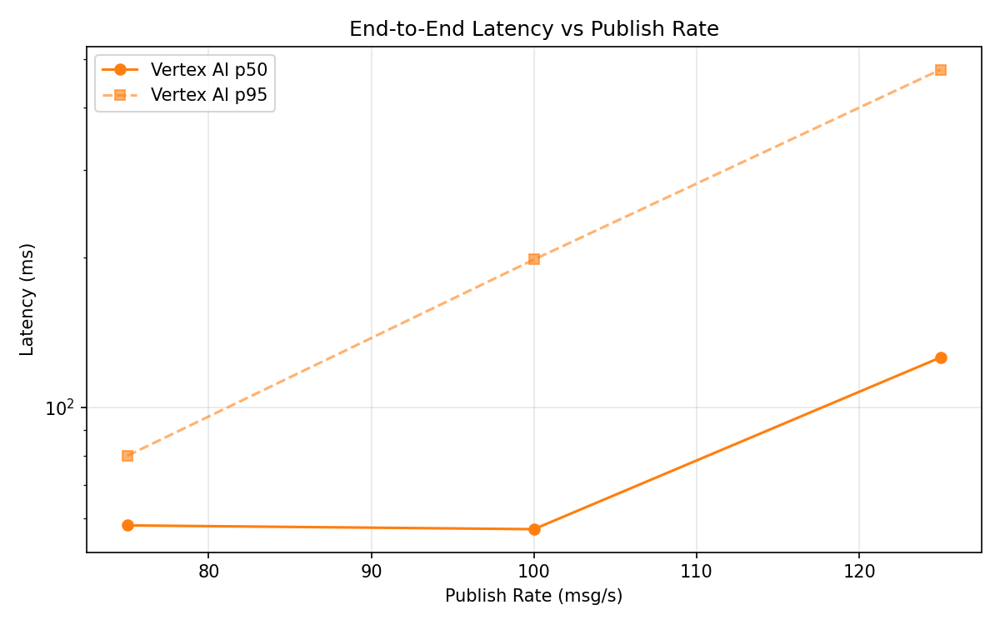
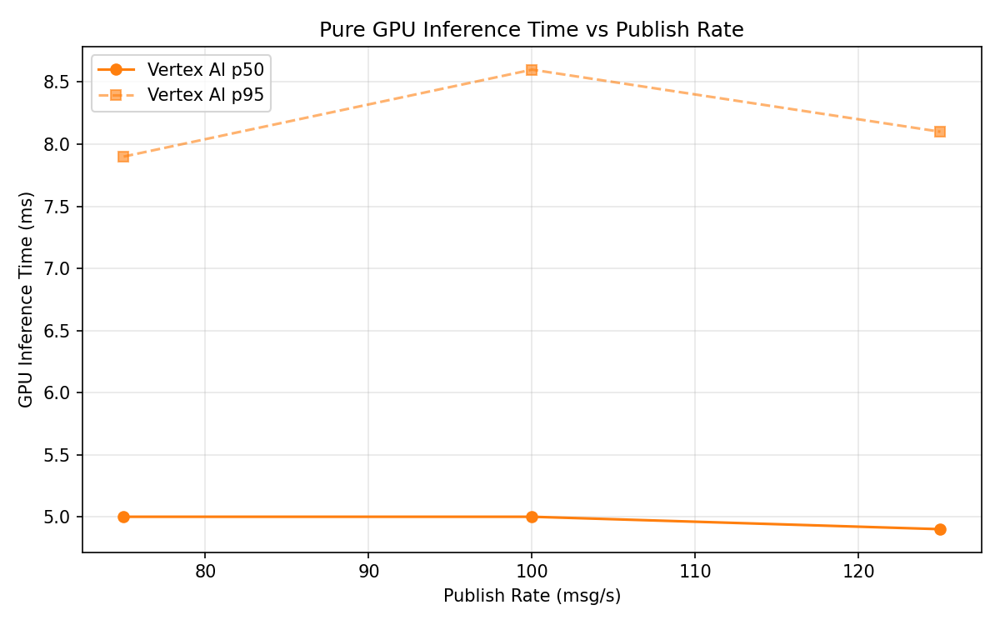

# Benchmark Report

Generated: 2026-03-09 14:33:12

## Configuration

| Parameter | Value |
|---|---|
| Messages per phase | 100s per phase |
| Rates (msg/s) | 75, 100, 125 |
| Experiments | Vertex AI |

## Throughput

| Rate (msg/s) | Vertex AI |
|---|---|
| 75 | 75.0 |
| 100 | 99.9 |
| 125 | 124.8 |

## End-to-End Latency (ms)

| Rate | Percentile | Vertex AI |
|---|---|---|
| 75 | p50 | 58.0 |
| 75 | p95 | 80.0 |
| 75 | p99 | 182.1 |
| 100 | p50 | 57.0 |
| 100 | p95 | 198.0 |
| 100 | p99 | 1390.0 |
| 125 | p50 | 126.0 |
| 125 | p95 | 476.0 |
| 125 | p99 | 598.0 |

## GPU Inference Time (ms)

| Rate | Percentile | Vertex AI |
|---|---|---|
| 75 | p50 | 5.0 |
| 75 | p95 | 7.9 |
| 75 | p99 | 9.9 |
| 100 | p50 | 5.0 |
| 100 | p95 | 8.6 |
| 100 | p99 | 11.4 |
| 125 | p50 | 4.9 |
| 125 | p95 | 8.1 |
| 125 | p99 | 10.9 |

## Charts

### Latency vs Publish Rate

### GPU Inference Time vs Publish Rate

### Throughput vs Publish Rate

