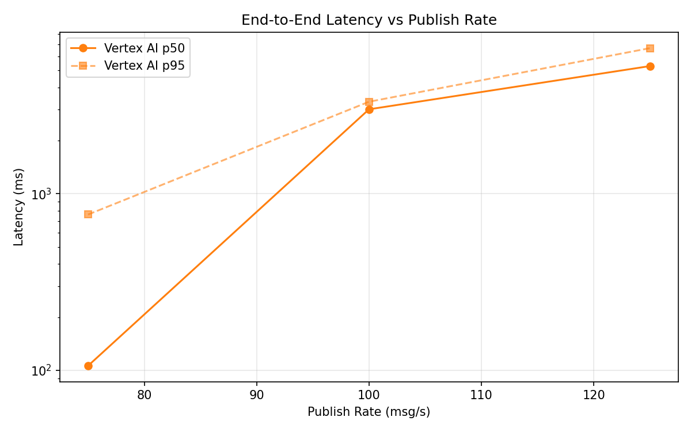
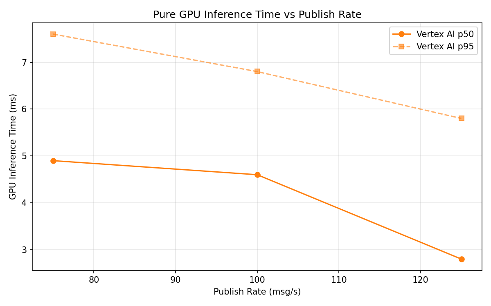
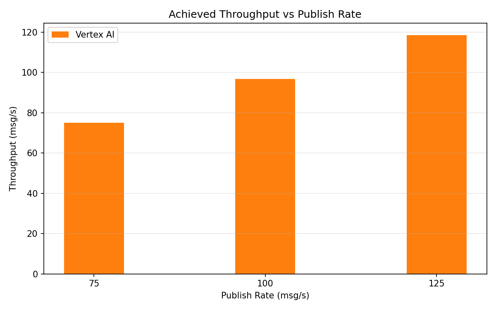

# Benchmark Report

Generated: 2026-03-09 12:52:22

## Configuration

| Parameter | Value |
|---|---|
| Messages per phase | 100s per phase |
| Rates (msg/s) | 75, 100, 125 |
| Experiments | Vertex AI |

## Throughput

| Rate (msg/s) | Vertex AI |
|---|---|
| 75 | 74.9 |
| 100 | 96.8 |
| 125 | 118.5 |

## End-to-End Latency (ms)

| Rate | Percentile | Vertex AI |
|---|---|---|
| 75 | p50 | 106.0 |
| 75 | p95 | 762.0 |
| 75 | p99 | 1120.0 |
| 100 | p50 | 3006.0 |
| 100 | p95 | 3318.0 |
| 100 | p99 | 3360.0 |
| 125 | p50 | 5282.5 |
| 125 | p95 | 6675.0 |
| 125 | p99 | 9133.1 |

## GPU Inference Time (ms)

| Rate | Percentile | Vertex AI |
|---|---|---|
| 75 | p50 | 4.9 |
| 75 | p95 | 7.6 |
| 75 | p99 | 9.4 |
| 100 | p50 | 4.6 |
| 100 | p95 | 6.8 |
| 100 | p99 | 8.9 |
| 125 | p50 | 2.8 |
| 125 | p95 | 5.8 |
| 125 | p99 | 8.6 |

## Charts

### Latency vs Publish Rate

### GPU Inference Time vs Publish Rate

### Throughput vs Publish Rate

