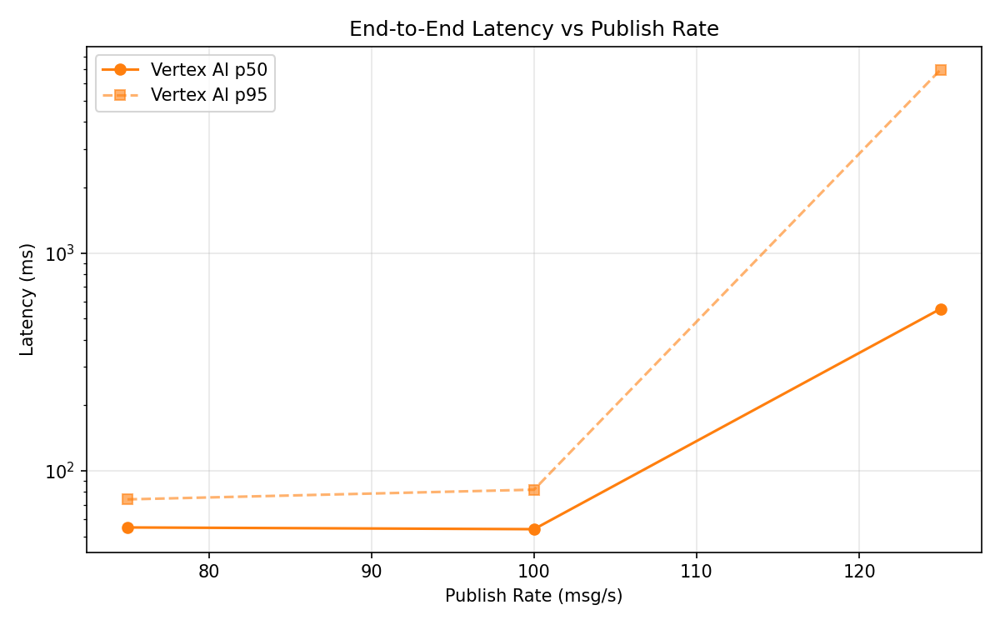
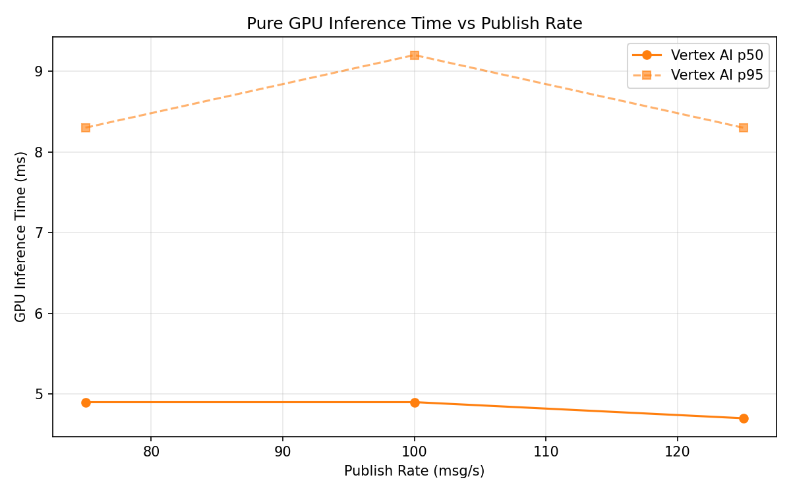
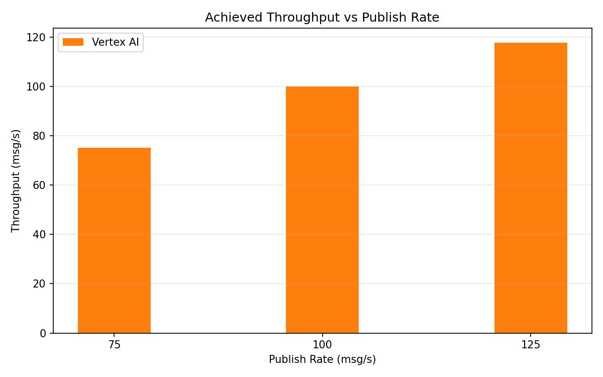

# Benchmark Report

Generated: 2026-03-09 13:17:06

## Configuration

| Parameter | Value |
|---|---|
| Messages per phase | 100s per phase |
| Rates (msg/s) | 75, 100, 125 |
| Experiments | Vertex AI |

## Throughput

| Rate (msg/s) | Vertex AI |
|---|---|
| 75 | 75.0 |
| 100 | 99.9 |
| 125 | 117.7 |

## End-to-End Latency (ms)

| Rate | Percentile | Vertex AI |
|---|---|---|
| 75 | p50 | 55.0 |
| 75 | p95 | 74.0 |
| 75 | p99 | 480.1 |
| 100 | p50 | 54.0 |
| 100 | p95 | 82.0 |
| 100 | p99 | 414.0 |
| 125 | p50 | 555.0 |
| 125 | p95 | 6960.0 |
| 125 | p99 | 7700.0 |

## GPU Inference Time (ms)

| Rate | Percentile | Vertex AI |
|---|---|---|
| 75 | p50 | 4.9 |
| 75 | p95 | 8.3 |
| 75 | p99 | 12.1 |
| 100 | p50 | 4.9 |
| 100 | p95 | 9.2 |
| 100 | p99 | 14.6 |
| 125 | p50 | 4.7 |
| 125 | p95 | 8.3 |
| 125 | p99 | 12.7 |

## Charts

### Latency vs Publish Rate

### GPU Inference Time vs Publish Rate

### Throughput vs Publish Rate

