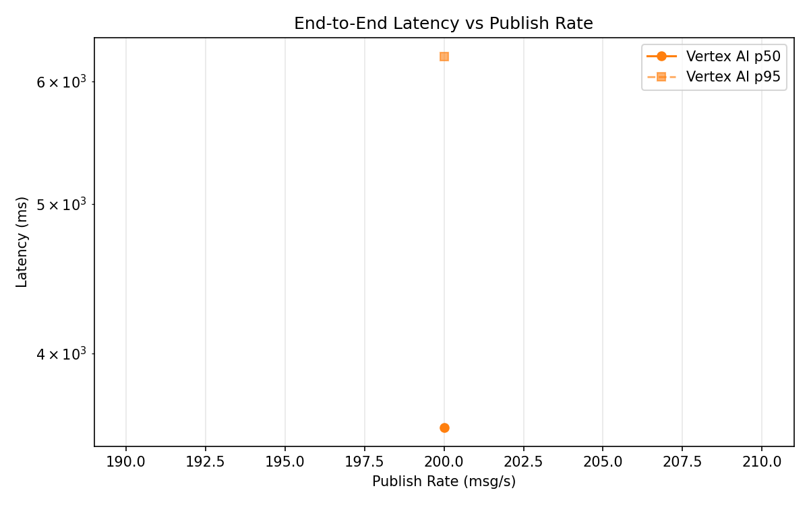
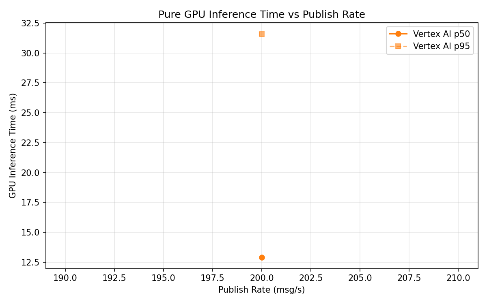
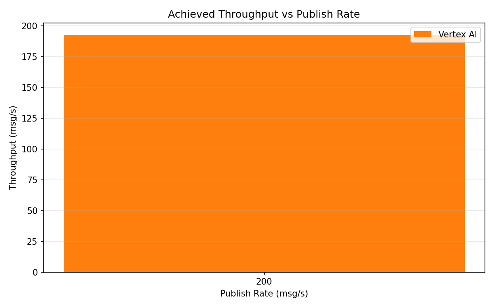

# Benchmark Report

Generated: 2026-03-10 01:10:53

## Configuration

| Parameter | Value |
|---|---|
| Messages per phase | 100s per phase |
| Rates (msg/s) | 200 |
| Experiments | Vertex AI |

## Throughput

| Rate (msg/s) | Vertex AI |
|---|---|
| 200 | 192.7 |

## End-to-End Latency (ms)

| Rate | Percentile | Vertex AI |
|---|---|---|
| 200 | p50 | 3582.0 |
| 200 | p95 | 6229.0 |
| 200 | p99 | 7032.0 |

## GPU Inference Time (ms)

| Rate | Percentile | Vertex AI |
|---|---|---|
| 200 | p50 | 12.9 |
| 200 | p95 | 31.6 |
| 200 | p99 | 37.5 |

## Charts

### Latency vs Publish Rate

### GPU Inference Time vs Publish Rate

### Throughput vs Publish Rate

