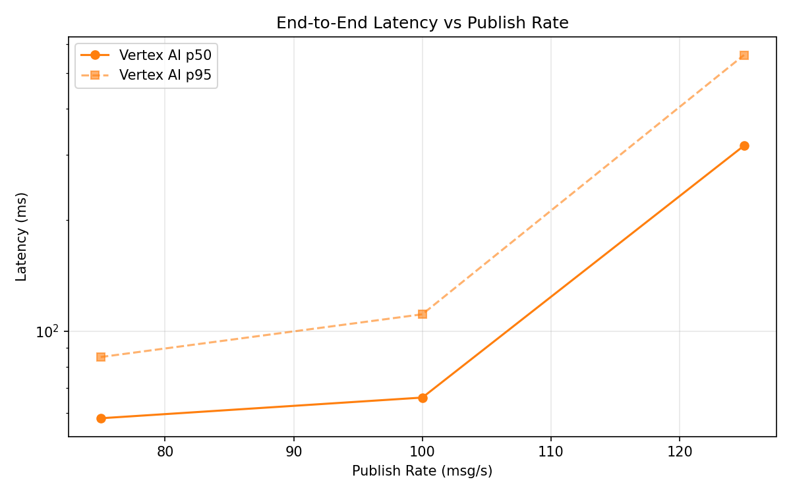
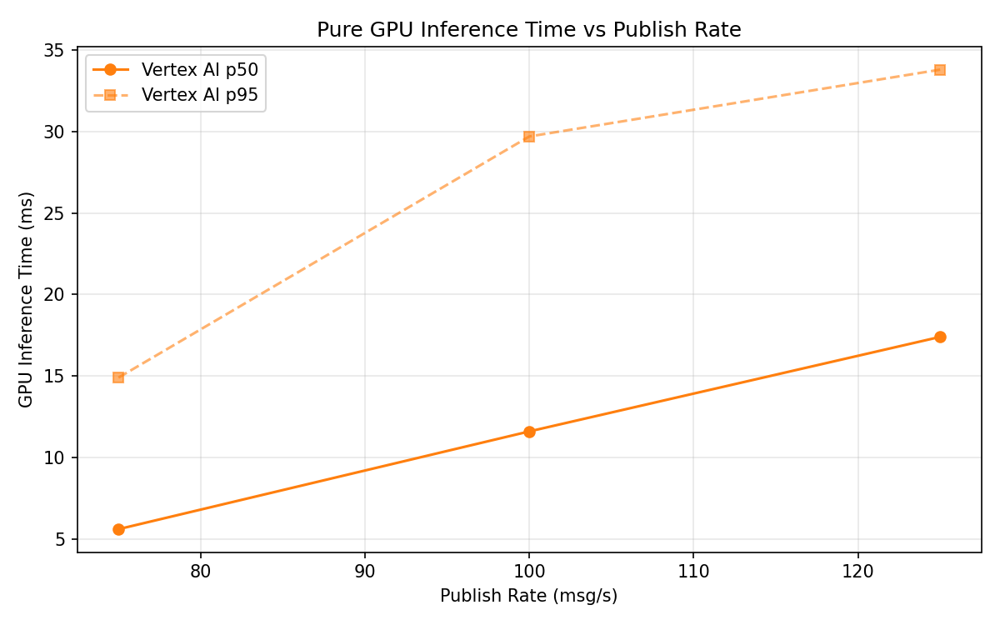

# Benchmark Report

Generated: 2026-03-09 22:19:00

## Configuration

| Parameter | Value |
|---|---|
| Messages per phase | 100s per phase |
| Rates (msg/s) | 75, 100, 125 |
| Experiments | Vertex AI |

## Throughput

| Rate (msg/s) | Vertex AI |
|---|---|
| 75 | 75.0 |
| 100 | 99.9 |
| 125 | 124.6 |

## End-to-End Latency (ms)

| Rate | Percentile | Vertex AI |
|---|---|---|
| 75 | p50 | 58.0 |
| 75 | p95 | 85.0 |
| 75 | p99 | 715.0 |
| 100 | p50 | 66.0 |
| 100 | p95 | 111.0 |
| 100 | p99 | 208.0 |
| 125 | p50 | 318.0 |
| 125 | p95 | 560.0 |
| 125 | p99 | 713.0 |

## GPU Inference Time (ms)

| Rate | Percentile | Vertex AI |
|---|---|---|
| 75 | p50 | 5.6 |
| 75 | p95 | 14.9 |
| 75 | p99 | 26.0 |
| 100 | p50 | 11.6 |
| 100 | p95 | 29.7 |
| 100 | p99 | 39.3 |
| 125 | p50 | 17.4 |
| 125 | p95 | 33.8 |
| 125 | p99 | 41.6 |

## Charts

### Latency vs Publish Rate

### GPU Inference Time vs Publish Rate

### Throughput vs Publish Rate

