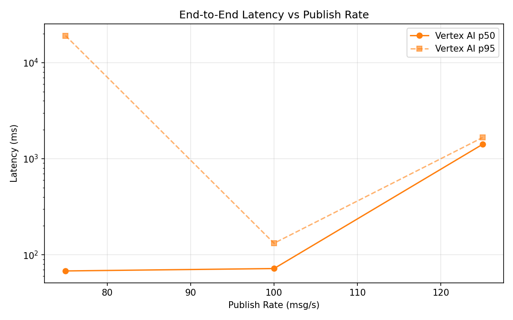
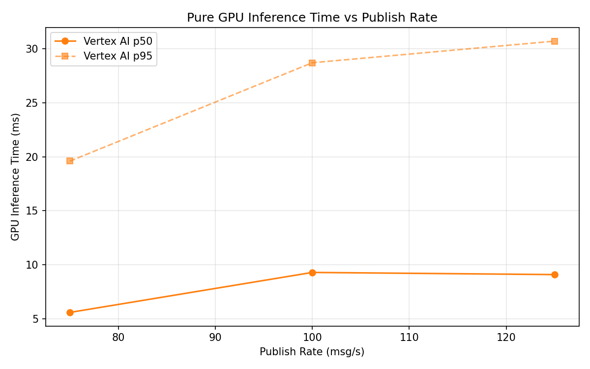
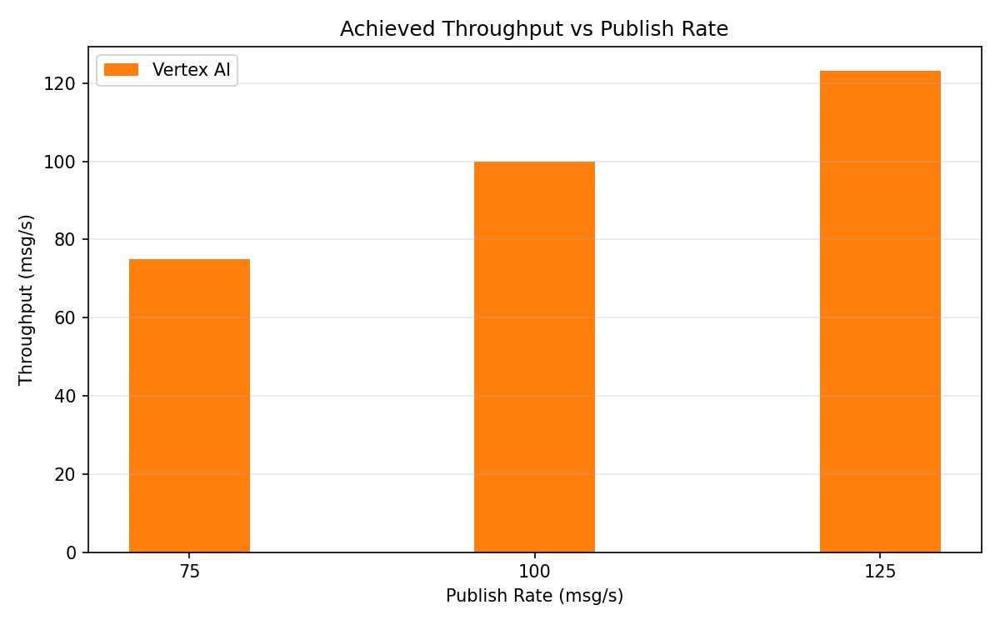

# Benchmark Report

Generated: 2026-03-09 22:31:11

## Configuration

| Parameter | Value |
|---|---|
| Messages per phase | 100s per phase |
| Rates (msg/s) | 75, 100, 125 |
| Experiments | Vertex AI |

## Throughput

| Rate (msg/s) | Vertex AI |
|---|---|
| 75 | 75.0 |
| 100 | 99.9 |
| 125 | 123.2 |

## End-to-End Latency (ms)

| Rate | Percentile | Vertex AI |
|---|---|---|
| 75 | p50 | 68.0 |
| 75 | p95 | 19088.1 |
| 75 | p99 | 20977.0 |
| 100 | p50 | 72.0 |
| 100 | p95 | 132.0 |
| 100 | p99 | 224.0 |
| 125 | p50 | 1411.0 |
| 125 | p95 | 1661.0 |
| 125 | p99 | 1696.0 |

## GPU Inference Time (ms)

| Rate | Percentile | Vertex AI |
|---|---|---|
| 75 | p50 | 5.6 |
| 75 | p95 | 19.6 |
| 75 | p99 | 31.1 |
| 100 | p50 | 9.3 |
| 100 | p95 | 28.7 |
| 100 | p99 | 37.4 |
| 125 | p50 | 9.1 |
| 125 | p95 | 30.7 |
| 125 | p99 | 39.3 |

## Charts

### Latency vs Publish Rate

### GPU Inference Time vs Publish Rate

### Throughput vs Publish Rate

