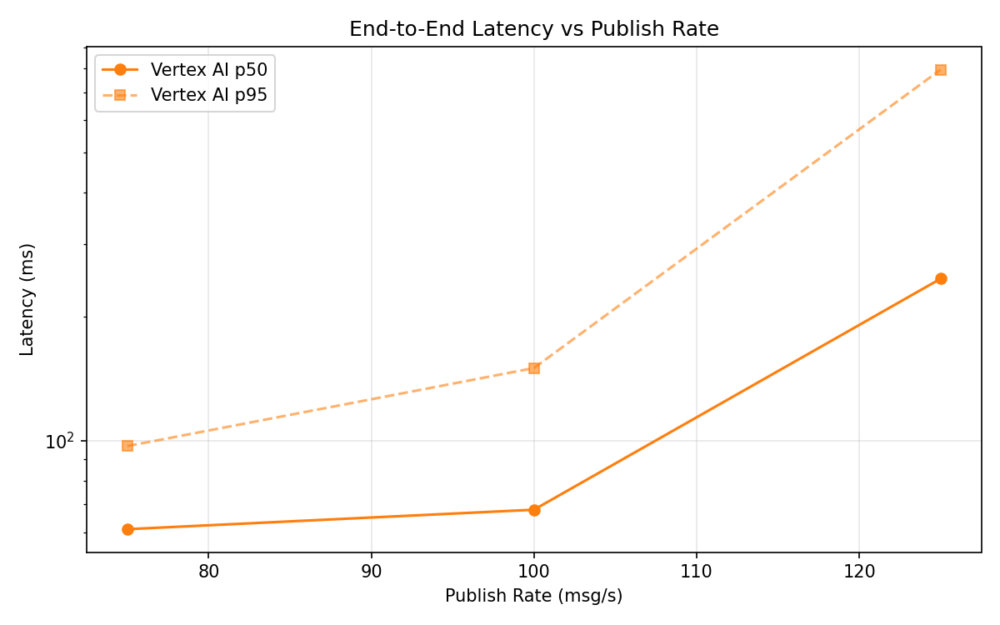
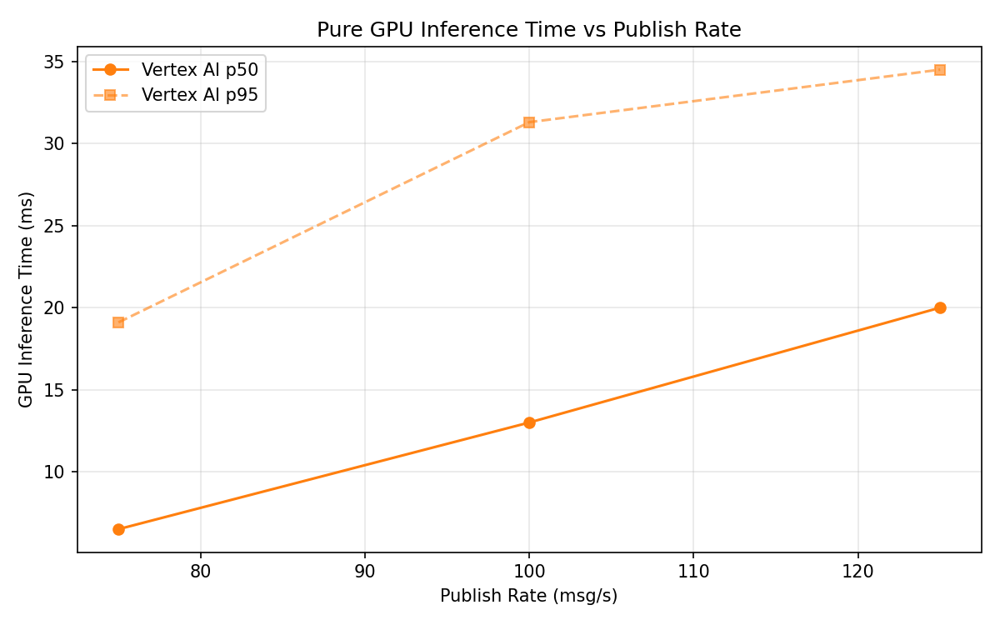

# Benchmark Report

Generated: 2026-03-09 22:56:03

## Configuration

| Parameter | Value |
|---|---|
| Messages per phase | 100s per phase |
| Rates (msg/s) | 75, 100, 125 |
| Experiments | Vertex AI |

## Throughput

| Rate (msg/s) | Vertex AI |
|---|---|
| 75 | 75.0 |
| 100 | 99.9 |
| 125 | 124.5 |

## End-to-End Latency (ms)

| Rate | Percentile | Vertex AI |
|---|---|---|
| 75 | p50 | 61.0 |
| 75 | p95 | 97.0 |
| 75 | p99 | 476.0 |
| 100 | p50 | 68.0 |
| 100 | p95 | 150.0 |
| 100 | p99 | 448.0 |
| 125 | p50 | 247.0 |
| 125 | p95 | 794.0 |
| 125 | p99 | 1042.0 |

## GPU Inference Time (ms)

| Rate | Percentile | Vertex AI |
|---|---|---|
| 75 | p50 | 6.5 |
| 75 | p95 | 19.1 |
| 75 | p99 | 29.4 |
| 100 | p50 | 13.0 |
| 100 | p95 | 31.3 |
| 100 | p99 | 41.1 |
| 125 | p50 | 20.0 |
| 125 | p95 | 34.5 |
| 125 | p99 | 41.6 |

## Charts

### Latency vs Publish Rate

### GPU Inference Time vs Publish Rate

### Throughput vs Publish Rate

