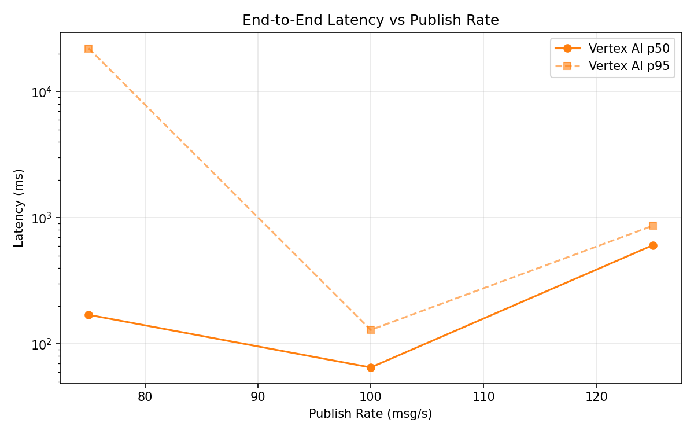
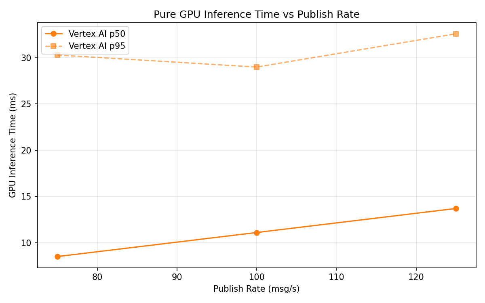

# Benchmark Report

Generated: 2026-03-09 23:08:01

## Configuration

| Parameter | Value |
|---|---|
| Messages per phase | 100s per phase |
| Rates (msg/s) | 75, 100, 125 |
| Experiments | Vertex AI |

## Throughput

| Rate (msg/s) | Vertex AI |
|---|---|
| 75 | 75.0 |
| 100 | 100.0 |
| 125 | 124.1 |

## End-to-End Latency (ms)

| Rate | Percentile | Vertex AI |
|---|---|---|
| 75 | p50 | 170.0 |
| 75 | p95 | 22057.6 |
| 75 | p99 | 24088.0 |
| 100 | p50 | 65.0 |
| 100 | p95 | 129.0 |
| 100 | p99 | 417.0 |
| 125 | p50 | 606.0 |
| 125 | p95 | 864.0 |
| 125 | p99 | 929.0 |

## GPU Inference Time (ms)

| Rate | Percentile | Vertex AI |
|---|---|---|
| 75 | p50 | 8.5 |
| 75 | p95 | 30.3 |
| 75 | p99 | 36.6 |
| 100 | p50 | 11.1 |
| 100 | p95 | 29.0 |
| 100 | p99 | 38.7 |
| 125 | p50 | 13.7 |
| 125 | p95 | 32.6 |
| 125 | p99 | 40.6 |

## Charts

### Latency vs Publish Rate

### GPU Inference Time vs Publish Rate

### Throughput vs Publish Rate

