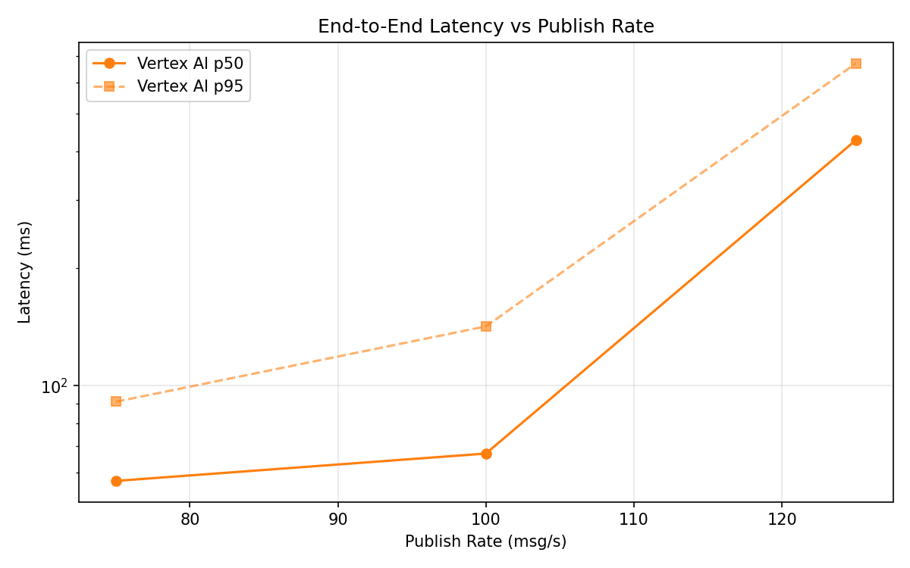
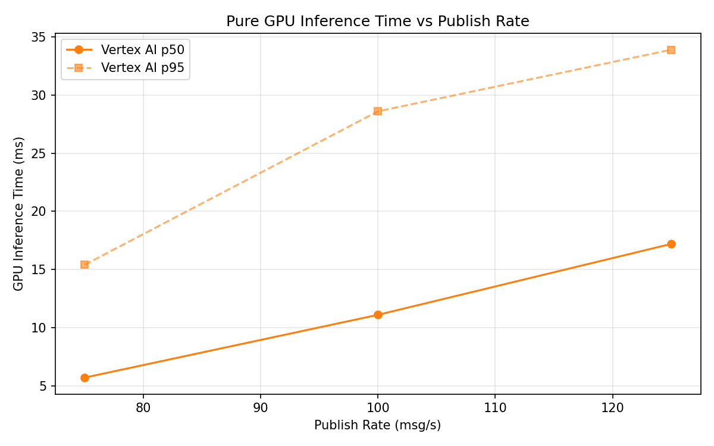

# Benchmark Report

Generated: 2026-03-09 21:55:16

## Configuration

| Parameter | Value |
|---|---|
| Messages per phase | 100s per phase |
| Rates (msg/s) | 75, 100, 125 |
| Experiments | Vertex AI |

## Throughput

| Rate (msg/s) | Vertex AI |
|---|---|
| 75 | 75.0 |
| 100 | 99.9 |
| 125 | 124.8 |

## End-to-End Latency (ms)

| Rate | Percentile | Vertex AI |
|---|---|---|
| 75 | p50 | 57.0 |
| 75 | p95 | 91.0 |
| 75 | p99 | 848.0 |
| 100 | p50 | 67.0 |
| 100 | p95 | 142.0 |
| 100 | p99 | 275.0 |
| 125 | p50 | 427.0 |
| 125 | p95 | 672.0 |
| 125 | p99 | 707.0 |

## GPU Inference Time (ms)

| Rate | Percentile | Vertex AI |
|---|---|---|
| 75 | p50 | 5.7 |
| 75 | p95 | 15.4 |
| 75 | p99 | 25.7 |
| 100 | p50 | 11.1 |
| 100 | p95 | 28.6 |
| 100 | p99 | 37.9 |
| 125 | p50 | 17.2 |
| 125 | p95 | 33.9 |
| 125 | p99 | 41.2 |

## Charts

### Latency vs Publish Rate

### GPU Inference Time vs Publish Rate

### Throughput vs Publish Rate

