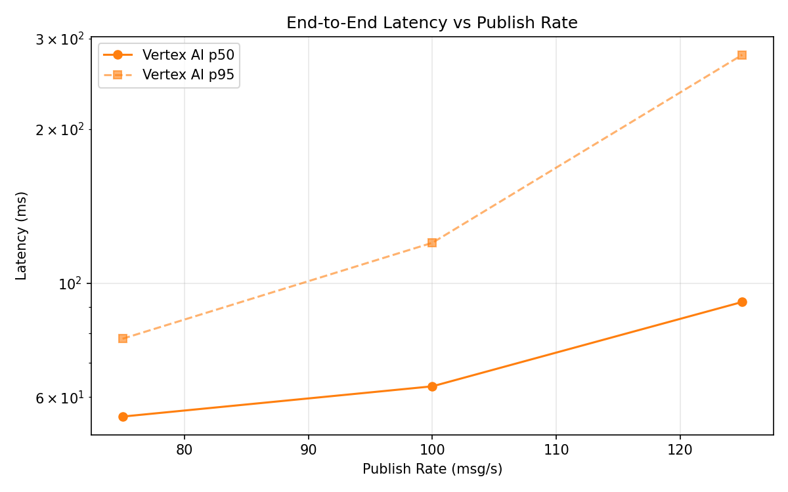
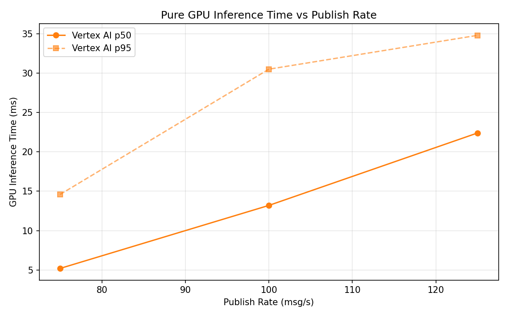

# Benchmark Report

Generated: 2026-03-09 23:19:53

## Configuration

| Parameter | Value |
|---|---|
| Messages per phase | 100s per phase |
| Rates (msg/s) | 75, 100, 125 |
| Experiments | Vertex AI |

## Throughput

| Rate (msg/s) | Vertex AI |
|---|---|
| 75 | 75.0 |
| 100 | 99.9 |
| 125 | 124.9 |

## End-to-End Latency (ms)

| Rate | Percentile | Vertex AI |
|---|---|---|
| 75 | p50 | 55.0 |
| 75 | p95 | 78.0 |
| 75 | p99 | 175.0 |
| 100 | p50 | 63.0 |
| 100 | p95 | 120.0 |
| 100 | p99 | 408.0 |
| 125 | p50 | 92.0 |
| 125 | p95 | 279.0 |
| 125 | p99 | 470.0 |

## GPU Inference Time (ms)

| Rate | Percentile | Vertex AI |
|---|---|---|
| 75 | p50 | 5.2 |
| 75 | p95 | 14.6 |
| 75 | p99 | 26.8 |
| 100 | p50 | 13.2 |
| 100 | p95 | 30.5 |
| 100 | p99 | 38.8 |
| 125 | p50 | 22.4 |
| 125 | p95 | 34.8 |
| 125 | p99 | 41.5 |

## Charts

### Latency vs Publish Rate

### GPU Inference Time vs Publish Rate

### Throughput vs Publish Rate

