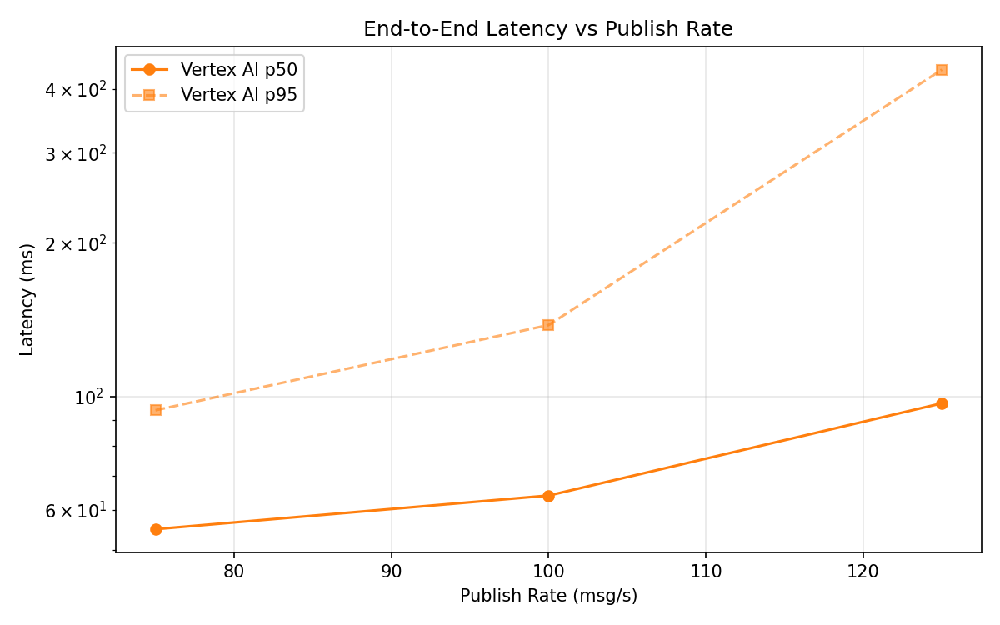

# Benchmark Report

Generated: 2026-03-10 00:08:42

## Configuration

| Parameter | Value |
|---|---|
| Messages per phase | 100s per phase |
| Rates (msg/s) | 75, 100, 125 |
| Experiments | Vertex AI |

## Throughput

| Rate (msg/s) | Vertex AI |
|---|---|
| 75 | 75.0 |
| 100 | 100.0 |
| 125 | 124.9 |

## End-to-End Latency (ms)

| Rate | Percentile | Vertex AI |
|---|---|---|
| 75 | p50 | 55.0 |
| 75 | p95 | 94.0 |
| 75 | p99 | 565.0 |
| 100 | p50 | 64.0 |
| 100 | p95 | 138.0 |
| 100 | p99 | 249.0 |
| 125 | p50 | 97.0 |
| 125 | p95 | 436.0 |
| 125 | p99 | 539.0 |

## GPU Inference Time (ms)

| Rate | Percentile | Vertex AI |
|---|---|---|
| 75 | p50 | 5.3 |
| 75 | p95 | 17.2 |
| 75 | p99 | 29.5 |
| 100 | p50 | 13.7 |
| 100 | p95 | 31.7 |
| 100 | p99 | 40.1 |
| 125 | p50 | 21.8 |
| 125 | p95 | 34.9 |
| 125 | p99 | 41.6 |

## Charts

### Latency vs Publish Rate

### GPU Inference Time vs Publish Rate

### Throughput vs Publish Rate

