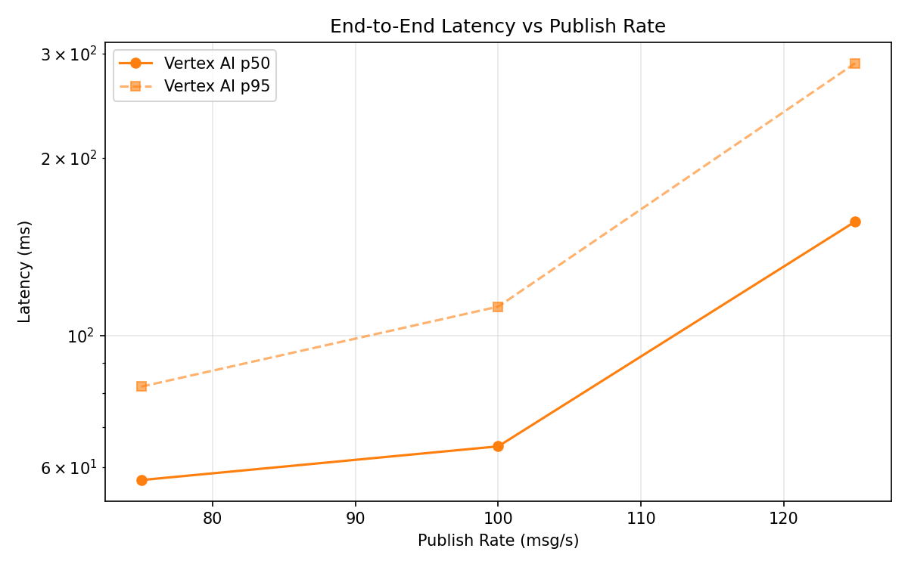
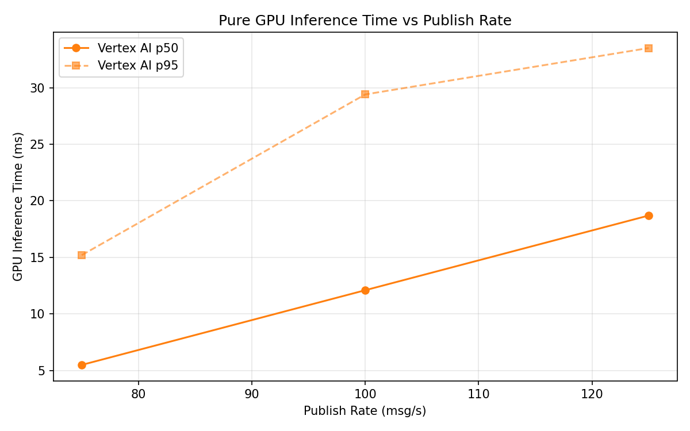

# Benchmark Report

Generated: 2026-03-09 23:43:58

## Configuration

| Parameter | Value |
|---|---|
| Messages per phase | 100s per phase |
| Rates (msg/s) | 75, 100, 125 |
| Experiments | Vertex AI |

## Throughput

| Rate (msg/s) | Vertex AI |
|---|---|
| 75 | 75.0 |
| 100 | 99.9 |
| 125 | 124.8 |

## End-to-End Latency (ms)

| Rate | Percentile | Vertex AI |
|---|---|---|
| 75 | p50 | 57.0 |
| 75 | p95 | 82.0 |
| 75 | p99 | 246.0 |
| 100 | p50 | 65.0 |
| 100 | p95 | 112.0 |
| 100 | p99 | 424.0 |
| 125 | p50 | 156.0 |
| 125 | p95 | 289.0 |
| 125 | p99 | 340.0 |

## GPU Inference Time (ms)

| Rate | Percentile | Vertex AI |
|---|---|---|
| 75 | p50 | 5.5 |
| 75 | p95 | 15.2 |
| 75 | p99 | 26.5 |
| 100 | p50 | 12.1 |
| 100 | p95 | 29.4 |
| 100 | p99 | 37.8 |
| 125 | p50 | 18.7 |
| 125 | p95 | 33.5 |
| 125 | p99 | 41.2 |

## Charts

### Latency vs Publish Rate

### GPU Inference Time vs Publish Rate

### Throughput vs Publish Rate

