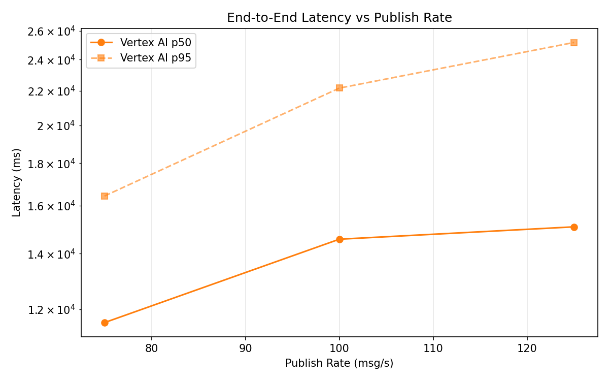
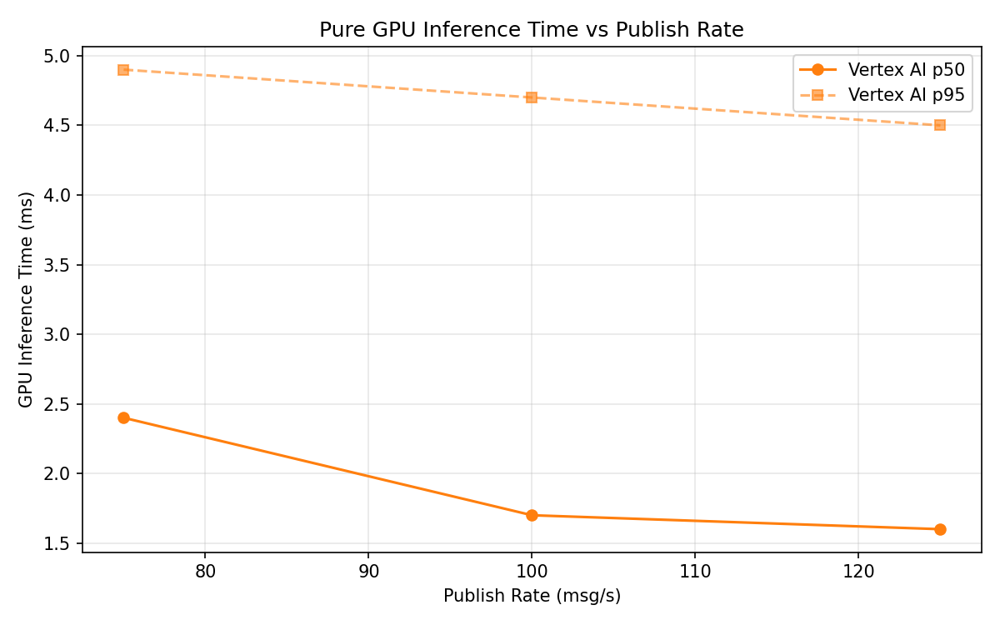
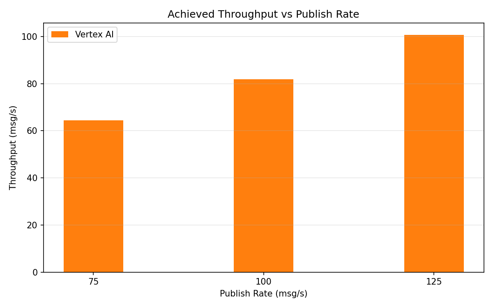

# Benchmark Report

Generated: 2026-03-09 19:25:17

## Configuration

| Parameter | Value |
|---|---|
| Messages per phase | 100s per phase |
| Rates (msg/s) | 75, 100, 125 |
| Experiments | Vertex AI |

## Throughput

| Rate (msg/s) | Vertex AI |
|---|---|
| 75 | 64.5 |
| 100 | 81.8 |
| 125 | 100.7 |

## End-to-End Latency (ms)

| Rate | Percentile | Vertex AI |
|---|---|---|
| 75 | p50 | 11562.0 |
| 75 | p95 | 16435.0 |
| 75 | p99 | 16576.0 |
| 100 | p50 | 14575.0 |
| 100 | p95 | 22176.0 |
| 100 | p99 | 22369.0 |
| 125 | p50 | 15084.5 |
| 125 | p95 | 25174.0 |
| 125 | p99 | 25515.0 |

## GPU Inference Time (ms)

| Rate | Percentile | Vertex AI |
|---|---|---|
| 75 | p50 | 2.4 |
| 75 | p95 | 4.9 |
| 75 | p99 | 6.5 |
| 100 | p50 | 1.7 |
| 100 | p95 | 4.7 |
| 100 | p99 | 5.5 |
| 125 | p50 | 1.6 |
| 125 | p95 | 4.5 |
| 125 | p99 | 5.0 |

## Charts

### Latency vs Publish Rate

### GPU Inference Time vs Publish Rate

### Throughput vs Publish Rate

