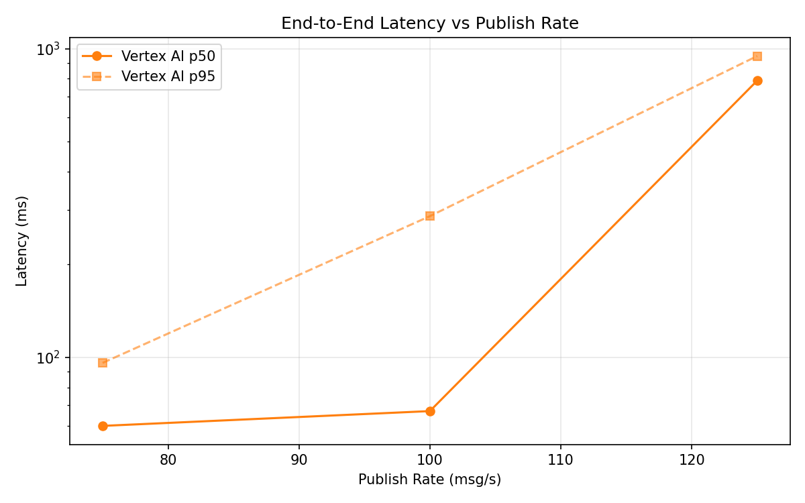
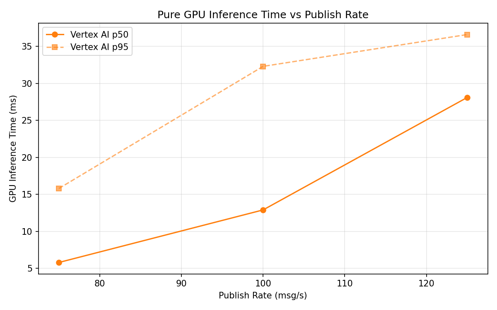
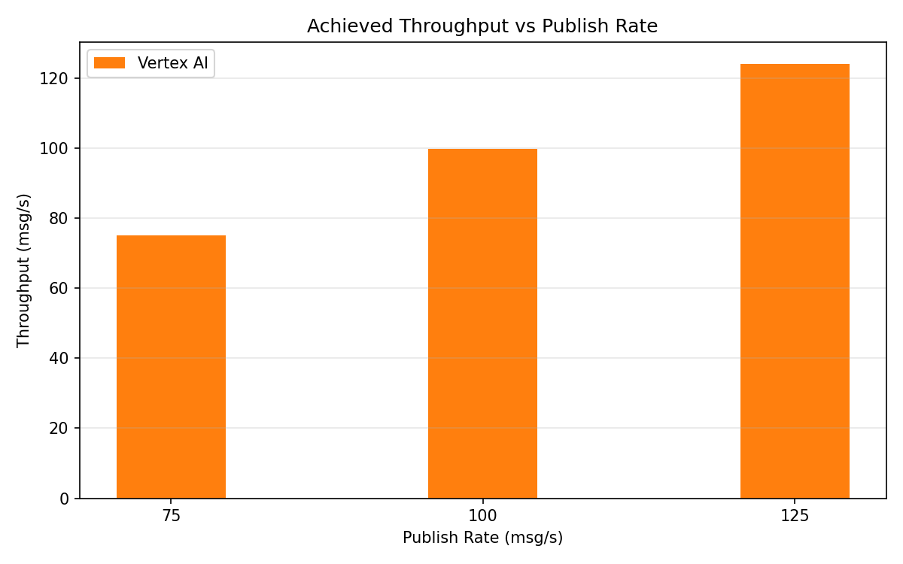

# Benchmark Report

Generated: 2026-03-09 21:18:13

## Configuration

| Parameter | Value |
|---|---|
| Messages per phase | 100s per phase |
| Rates (msg/s) | 75, 100, 125 |
| Experiments | Vertex AI |

## Throughput

| Rate (msg/s) | Vertex AI |
|---|---|
| 75 | 75.0 |
| 100 | 99.9 |
| 125 | 124.1 |

## End-to-End Latency (ms)

| Rate | Percentile | Vertex AI |
|---|---|---|
| 75 | p50 | 60.0 |
| 75 | p95 | 96.0 |
| 75 | p99 | 572.0 |
| 100 | p50 | 67.0 |
| 100 | p95 | 287.0 |
| 100 | p99 | 961.0 |
| 125 | p50 | 789.0 |
| 125 | p95 | 948.0 |
| 125 | p99 | 1038.0 |

## GPU Inference Time (ms)

| Rate | Percentile | Vertex AI |
|---|---|---|
| 75 | p50 | 5.8 |
| 75 | p95 | 15.8 |
| 75 | p99 | 28.0 |
| 100 | p50 | 12.9 |
| 100 | p95 | 32.3 |
| 100 | p99 | 39.8 |
| 125 | p50 | 28.1 |
| 125 | p95 | 36.6 |
| 125 | p99 | 42.5 |

## Charts

### Latency vs Publish Rate

### GPU Inference Time vs Publish Rate

### Throughput vs Publish Rate

