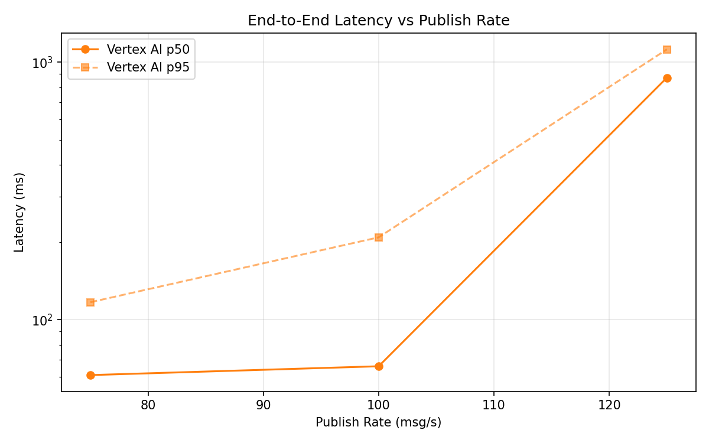
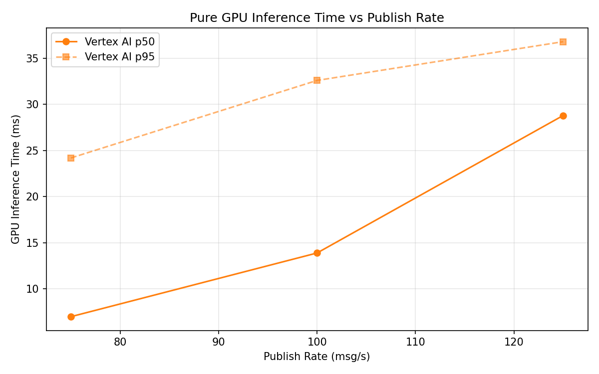
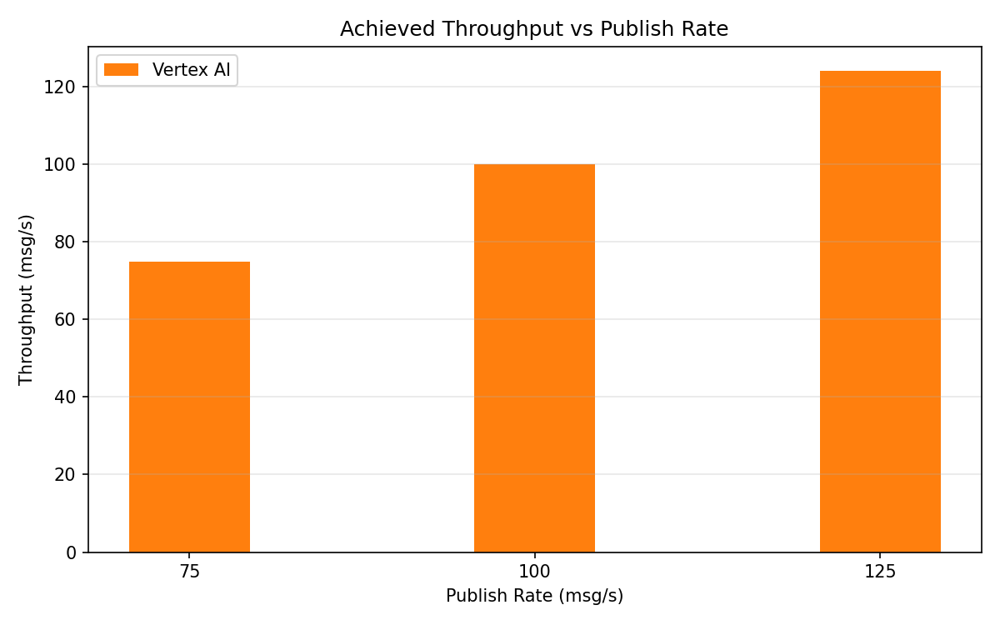

# Benchmark Report

Generated: 2026-03-09 21:43:13

## Configuration

| Parameter | Value |
|---|---|
| Messages per phase | 100s per phase |
| Rates (msg/s) | 75, 100, 125 |
| Experiments | Vertex AI |

## Throughput

| Rate (msg/s) | Vertex AI |
|---|---|
| 75 | 74.9 |
| 100 | 99.9 |
| 125 | 124.0 |

## End-to-End Latency (ms)

| Rate | Percentile | Vertex AI |
|---|---|---|
| 75 | p50 | 61.0 |
| 75 | p95 | 117.0 |
| 75 | p99 | 542.1 |
| 100 | p50 | 66.0 |
| 100 | p95 | 209.0 |
| 100 | p99 | 827.0 |
| 125 | p50 | 871.0 |
| 125 | p95 | 1122.0 |
| 125 | p99 | 1229.0 |

## GPU Inference Time (ms)

| Rate | Percentile | Vertex AI |
|---|---|---|
| 75 | p50 | 7.0 |
| 75 | p95 | 24.2 |
| 75 | p99 | 33.9 |
| 100 | p50 | 13.9 |
| 100 | p95 | 32.6 |
| 100 | p99 | 40.0 |
| 125 | p50 | 28.8 |
| 125 | p95 | 36.8 |
| 125 | p99 | 42.3 |

## Charts

### Latency vs Publish Rate

### GPU Inference Time vs Publish Rate

### Throughput vs Publish Rate

