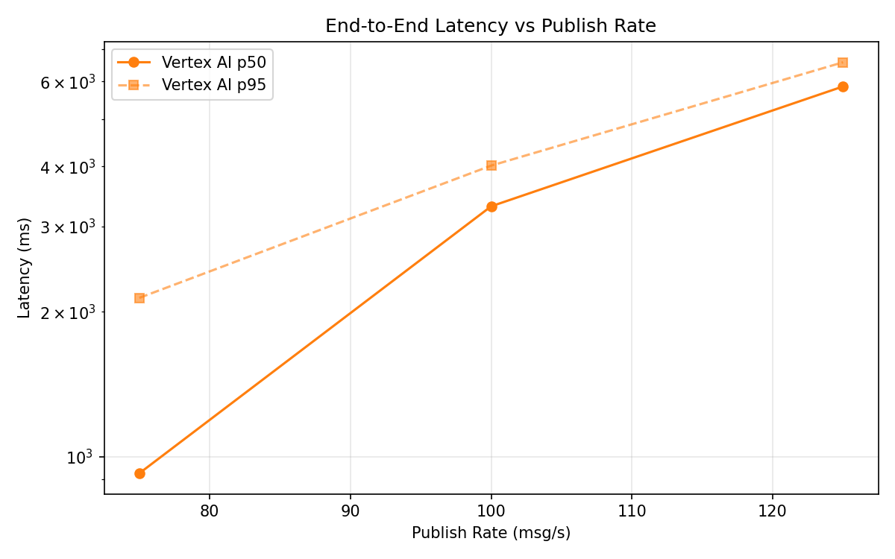
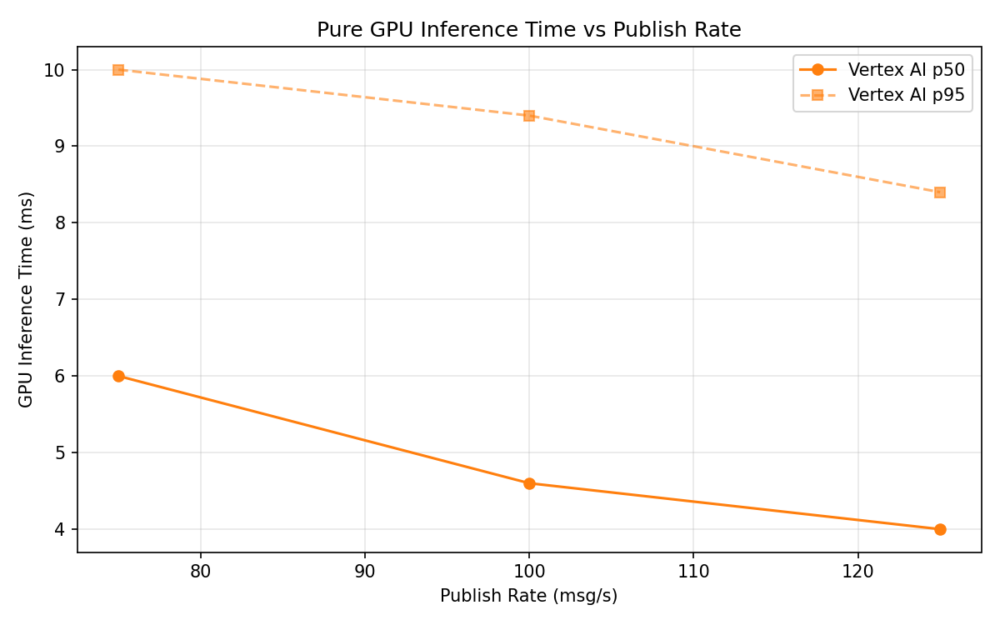
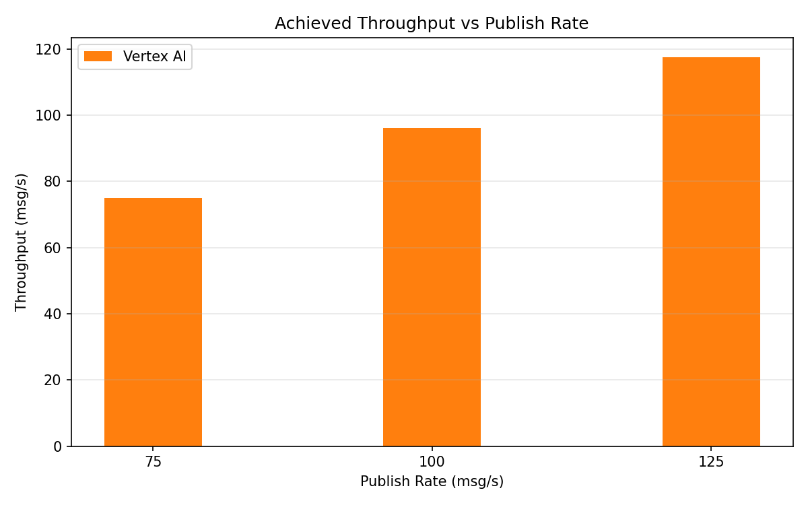

# Benchmark Report

Generated: 2026-03-09 19:37:42

## Configuration

| Parameter | Value |
|---|---|
| Messages per phase | 100s per phase |
| Rates (msg/s) | 75, 100, 125 |
| Experiments | Vertex AI |

## Throughput

| Rate (msg/s) | Vertex AI |
|---|---|
| 75 | 75.0 |
| 100 | 96.2 |
| 125 | 117.5 |

## End-to-End Latency (ms)

| Rate | Percentile | Vertex AI |
|---|---|---|
| 75 | p50 | 925.0 |
| 75 | p95 | 2136.0 |
| 75 | p99 | 2457.0 |
| 100 | p50 | 3306.0 |
| 100 | p95 | 4014.0 |
| 100 | p99 | 4082.0 |
| 125 | p50 | 5855.0 |
| 125 | p95 | 6571.0 |
| 125 | p99 | 6630.0 |

## GPU Inference Time (ms)

| Rate | Percentile | Vertex AI |
|---|---|---|
| 75 | p50 | 6.0 |
| 75 | p95 | 10.0 |
| 75 | p99 | 11.8 |
| 100 | p50 | 4.6 |
| 100 | p95 | 9.4 |
| 100 | p99 | 11.8 |
| 125 | p50 | 4.0 |
| 125 | p95 | 8.4 |
| 125 | p99 | 11.0 |

## Charts

### Latency vs Publish Rate

### GPU Inference Time vs Publish Rate

### Throughput vs Publish Rate

