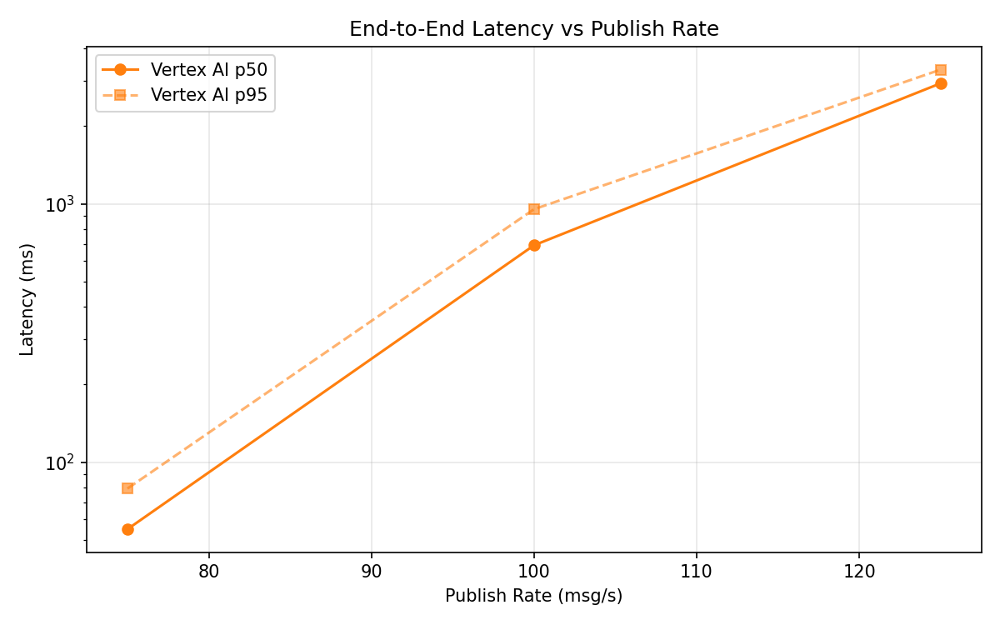
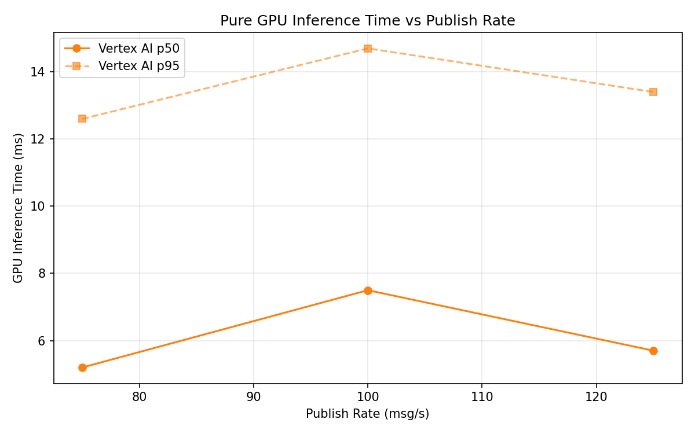
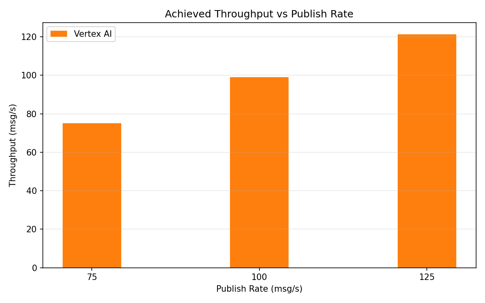

# Benchmark Report

Generated: 2026-03-09 19:49:57

## Configuration

| Parameter | Value |
|---|---|
| Messages per phase | 100s per phase |
| Rates (msg/s) | 75, 100, 125 |
| Experiments | Vertex AI |

## Throughput

| Rate (msg/s) | Vertex AI |
|---|---|
| 75 | 75.0 |
| 100 | 99.1 |
| 125 | 121.3 |

## End-to-End Latency (ms)

| Rate | Percentile | Vertex AI |
|---|---|---|
| 75 | p50 | 55.0 |
| 75 | p95 | 79.0 |
| 75 | p99 | 161.0 |
| 100 | p50 | 691.0 |
| 100 | p95 | 953.0 |
| 100 | p99 | 1023.0 |
| 125 | p50 | 2927.0 |
| 125 | p95 | 3307.0 |
| 125 | p99 | 3368.0 |

## GPU Inference Time (ms)

| Rate | Percentile | Vertex AI |
|---|---|---|
| 75 | p50 | 5.2 |
| 75 | p95 | 12.6 |
| 75 | p99 | 16.1 |
| 100 | p50 | 7.5 |
| 100 | p95 | 14.7 |
| 100 | p99 | 18.1 |
| 125 | p50 | 5.7 |
| 125 | p95 | 13.4 |
| 125 | p99 | 17.0 |

## Charts

### Latency vs Publish Rate

### GPU Inference Time vs Publish Rate

### Throughput vs Publish Rate

