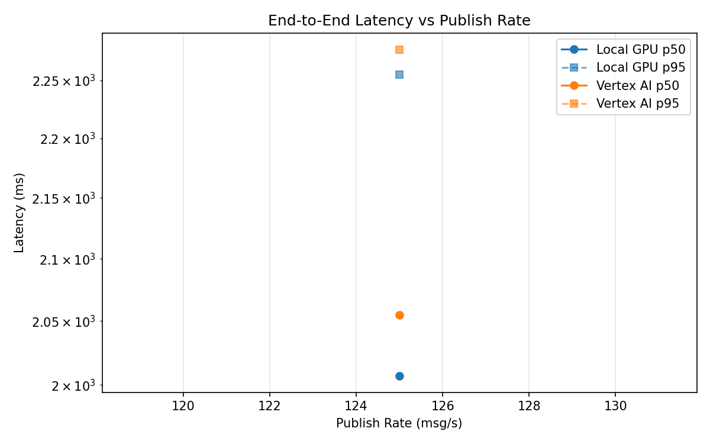
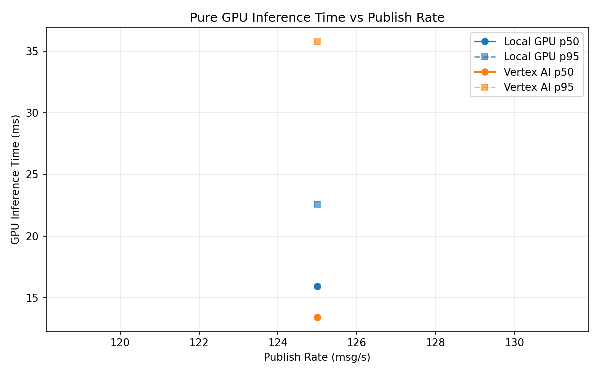
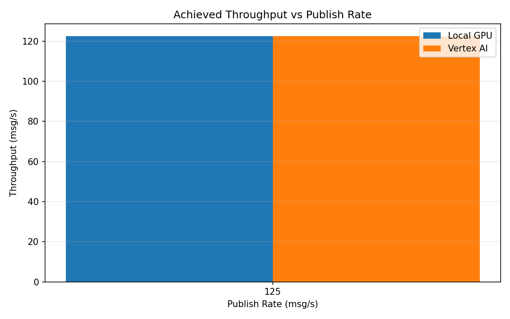

# Benchmark Report

Generated: 2026-03-08 09:11:54

## Configuration

| Parameter | Value |
|---|---|
| Messages per phase | 100s per phase |
| Rates (msg/s) | 125 |
| Experiments | Local GPU, Vertex AI |

## Throughput

| Rate (msg/s) | Local GPU | Vertex AI |
|---|---|---|
| 125 | 122.5 | 122.4 |

## End-to-End Latency (ms)

| Rate | Percentile | Local GPU | Vertex AI |
|---|---|---|---|
| 125 | p50 | 2007.0 | 2055.0 |
| 125 | p95 | 2255.0 | 2277.0 |
| 125 | p99 | 2322.0 | 2334.0 |

## GPU Inference Time (ms)

| Rate | Percentile | Local GPU | Vertex AI |
|---|---|---|---|
| 125 | p50 | 15.9 | 13.4 |
| 125 | p95 | 22.6 | 35.8 |
| 125 | p99 | 24.8 | 44.8 |

## Charts

### Latency vs Publish Rate

### GPU Inference Time vs Publish Rate

### Throughput vs Publish Rate

