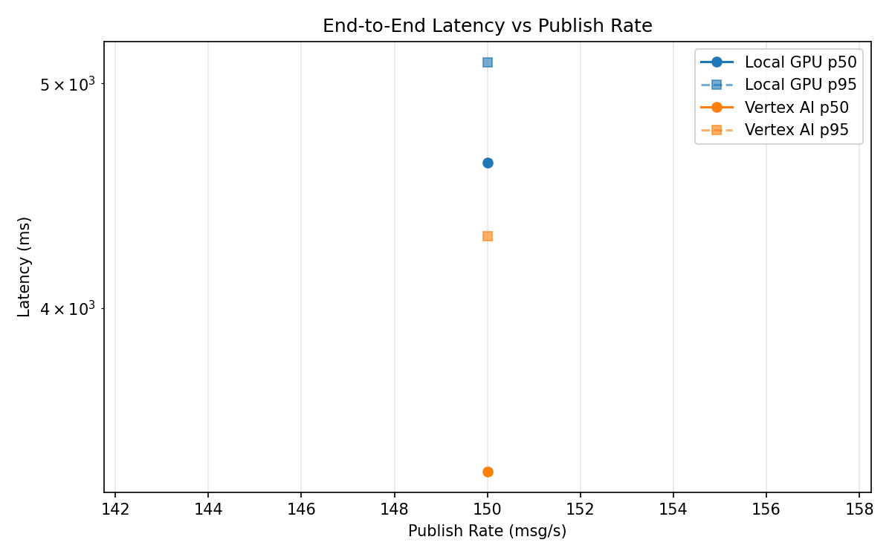
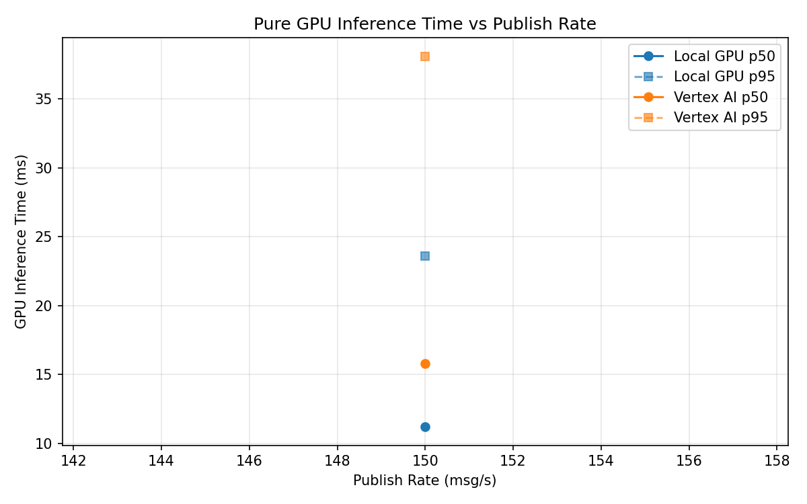
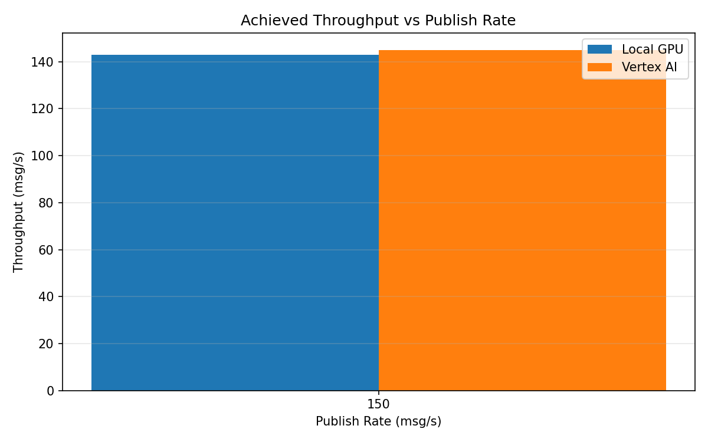

# Benchmark Report

Generated: 2026-03-08 09:20:49

## Configuration

| Parameter | Value |
|---|---|
| Messages per phase | 100s per phase |
| Rates (msg/s) | 150 |
| Experiments | Local GPU, Vertex AI |

## Throughput

| Rate (msg/s) | Local GPU | Vertex AI |
|---|---|---|
| 150 | 142.9 | 145.0 |

## End-to-End Latency (ms)

| Rate | Percentile | Local GPU | Vertex AI |
|---|---|---|---|
| 150 | p50 | 4622.0 | 3400.5 |
| 150 | p95 | 5107.0 | 4297.0 |
| 150 | p99 | 5173.0 | 4578.0 |

## GPU Inference Time (ms)

| Rate | Percentile | Local GPU | Vertex AI |
|---|---|---|---|
| 150 | p50 | 11.2 | 15.8 |
| 150 | p95 | 23.6 | 38.1 |
| 150 | p99 | 26.3 | 45.8 |

## Charts

### Latency vs Publish Rate

### GPU Inference Time vs Publish Rate

### Throughput vs Publish Rate

