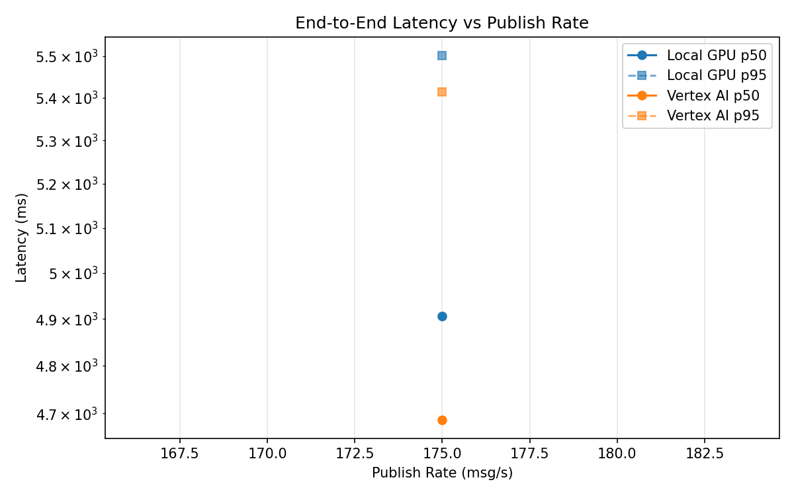
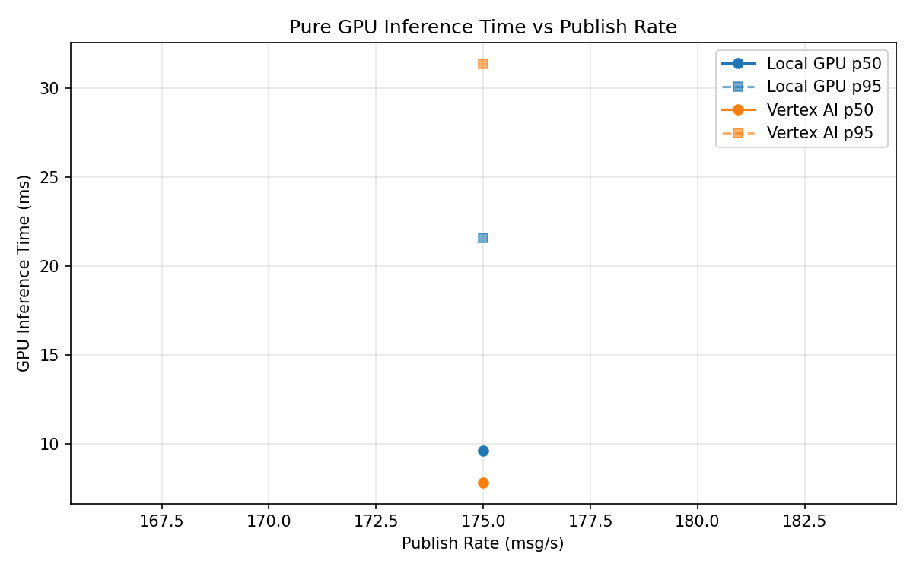
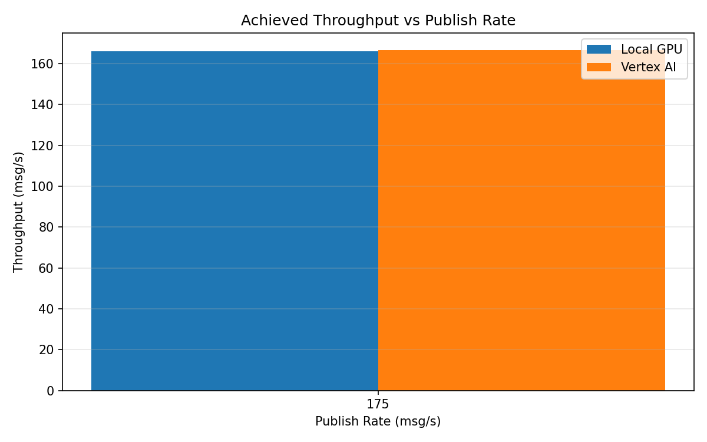

# Benchmark Report

Generated: 2026-03-08 09:29:55

## Configuration

| Parameter | Value |
|---|---|
| Messages per phase | 100s per phase |
| Rates (msg/s) | 175 |
| Experiments | Local GPU, Vertex AI |

## Throughput

| Rate (msg/s) | Local GPU | Vertex AI |
|---|---|---|
| 175 | 166.0 | 166.7 |

## End-to-End Latency (ms)

| Rate | Percentile | Local GPU | Vertex AI |
|---|---|---|---|
| 175 | p50 | 4906.0 | 4687.0 |
| 175 | p95 | 5502.0 | 5414.0 |
| 175 | p99 | 5556.0 | 5496.0 |

## GPU Inference Time (ms)

| Rate | Percentile | Local GPU | Vertex AI |
|---|---|---|---|
| 175 | p50 | 9.6 | 7.8 |
| 175 | p95 | 21.6 | 31.4 |
| 175 | p99 | 24.4 | 38.6 |

## Charts

### Latency vs Publish Rate

### GPU Inference Time vs Publish Rate

### Throughput vs Publish Rate

