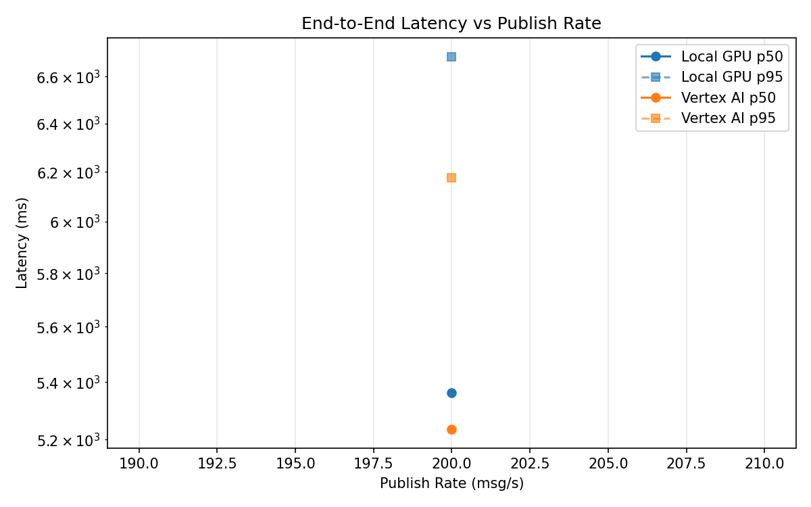
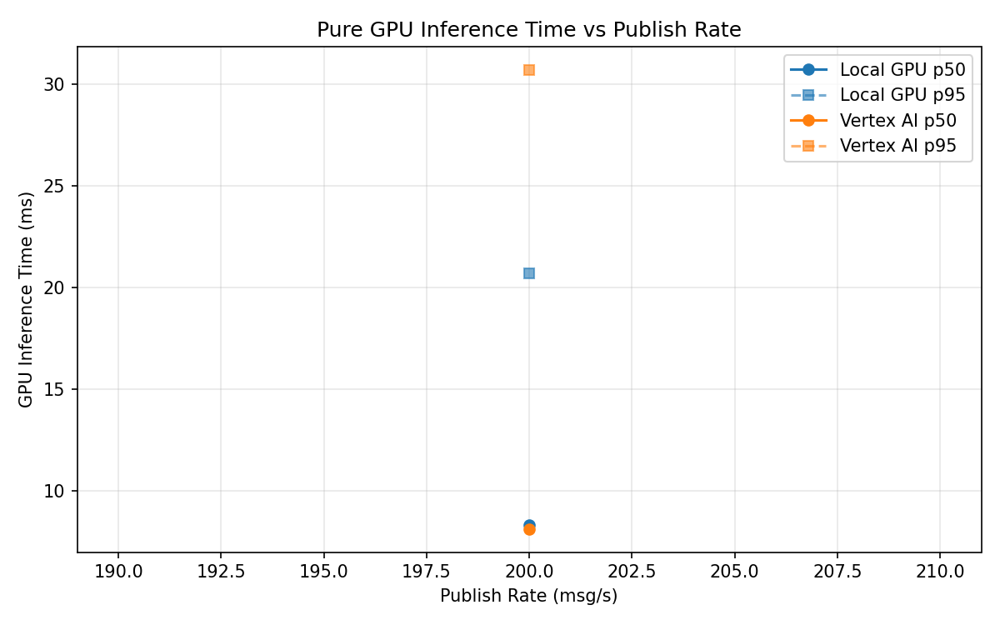
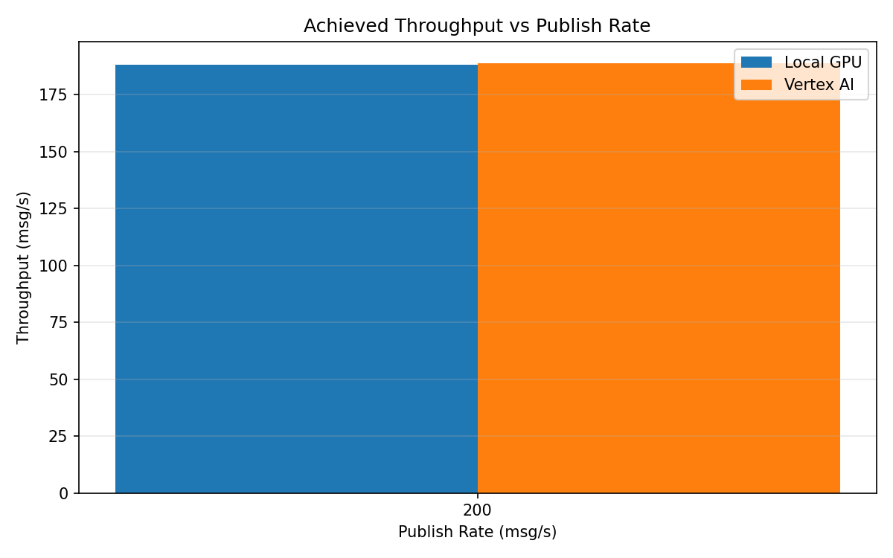

# Benchmark Report

Generated: 2026-03-08 09:38:37

## Configuration

| Parameter | Value |
|---|---|
| Messages per phase | 100s per phase |
| Rates (msg/s) | 200 |
| Experiments | Local GPU, Vertex AI |

## Throughput

| Rate (msg/s) | Local GPU | Vertex AI |
|---|---|---|
| 200 | 188.0 | 188.8 |

## End-to-End Latency (ms)

| Rate | Percentile | Local GPU | Vertex AI |
|---|---|---|---|
| 200 | p50 | 5363.0 | 5235.5 |
| 200 | p95 | 6688.0 | 6176.0 |
| 200 | p99 | 6785.0 | 6249.0 |

## GPU Inference Time (ms)

| Rate | Percentile | Local GPU | Vertex AI |
|---|---|---|---|
| 200 | p50 | 8.3 | 8.1 |
| 200 | p95 | 20.7 | 30.7 |
| 200 | p99 | 23.8 | 37.5 |

## Charts

### Latency vs Publish Rate

### GPU Inference Time vs Publish Rate

### Throughput vs Publish Rate

