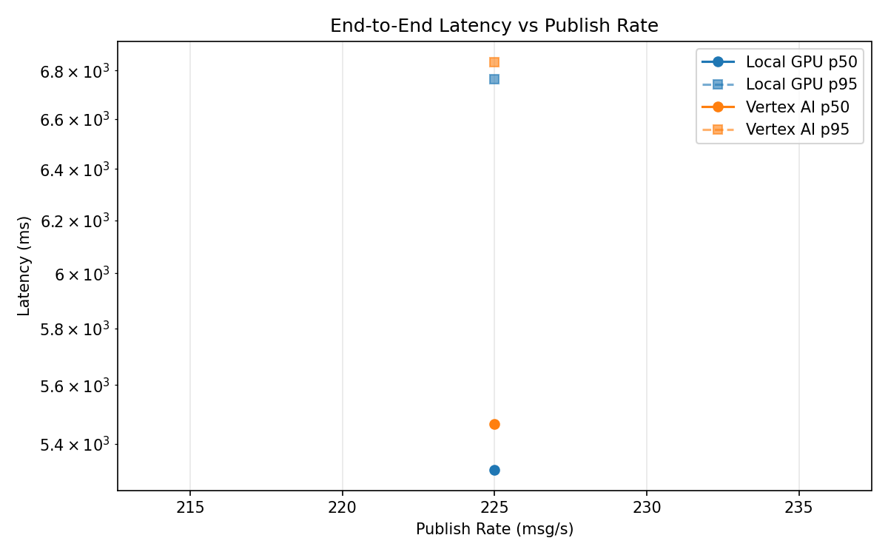
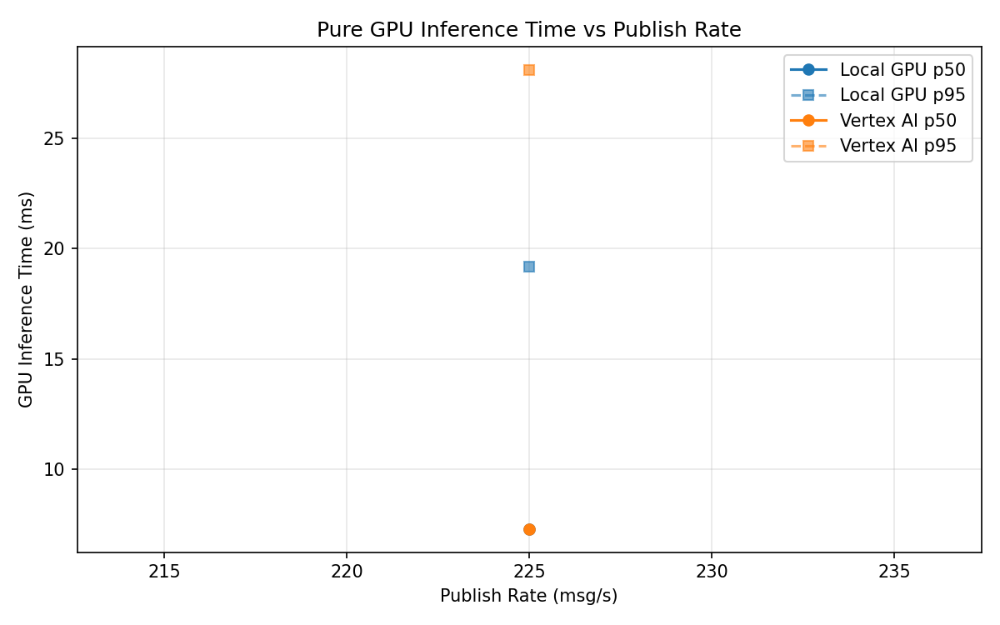
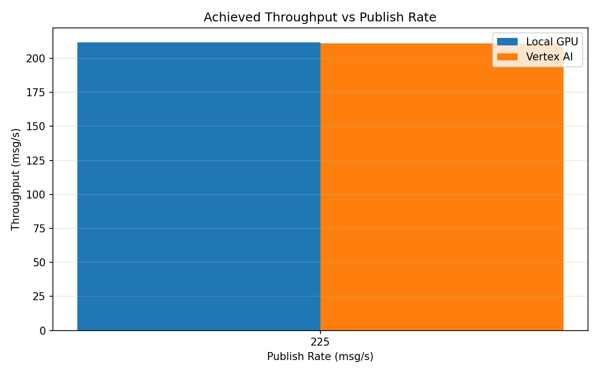

# Benchmark Report

Generated: 2026-03-08 09:48:07

## Configuration

| Parameter | Value |
|---|---|
| Messages per phase | 100s per phase |
| Rates (msg/s) | 225 |
| Experiments | Local GPU, Vertex AI |

## Throughput

| Rate (msg/s) | Local GPU | Vertex AI |
|---|---|---|
| 225 | 211.8 | 211.2 |

## End-to-End Latency (ms)

| Rate | Percentile | Local GPU | Vertex AI |
|---|---|---|---|
| 225 | p50 | 5314.0 | 5467.0 |
| 225 | p95 | 6764.0 | 6837.0 |
| 225 | p99 | 6826.0 | 7029.0 |

## GPU Inference Time (ms)

| Rate | Percentile | Local GPU | Vertex AI |
|---|---|---|---|
| 225 | p50 | 7.3 | 7.3 |
| 225 | p95 | 19.2 | 28.1 |
| 225 | p99 | 22.5 | 36.2 |

## Charts

### Latency vs Publish Rate

### GPU Inference Time vs Publish Rate

### Throughput vs Publish Rate

