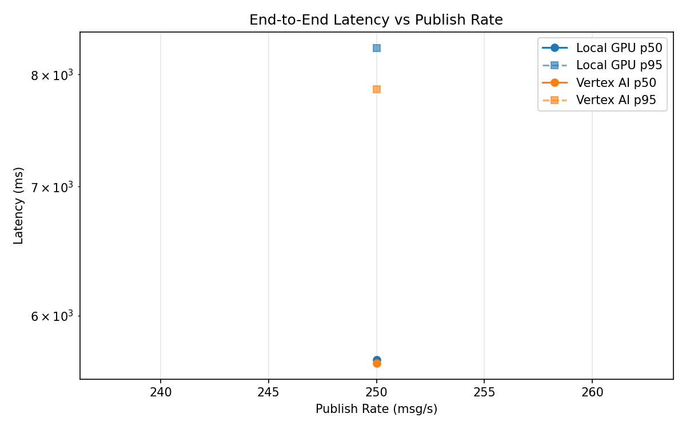
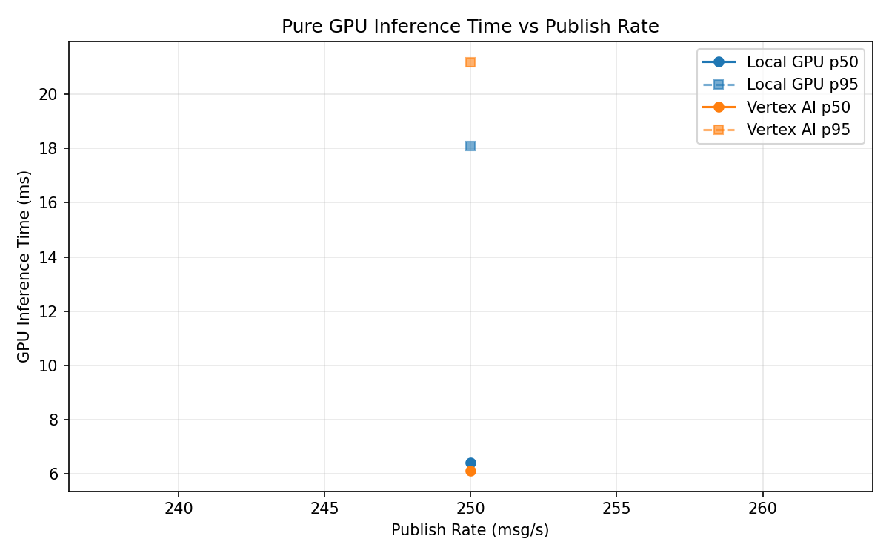
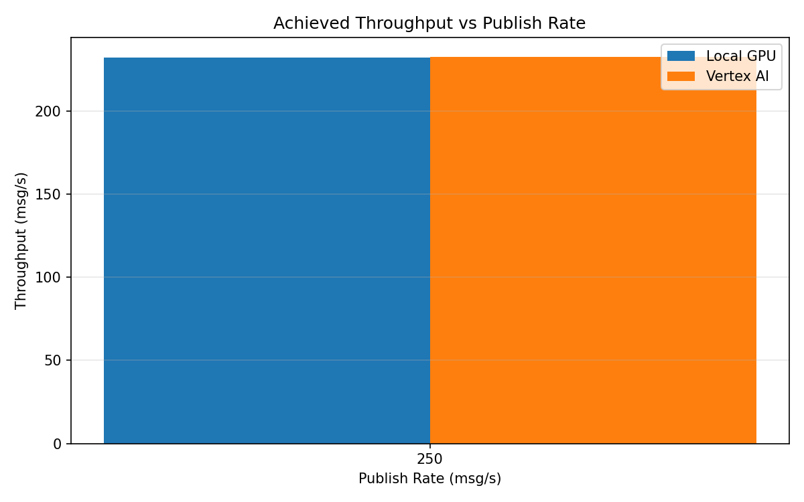

# Benchmark Report

Generated: 2026-03-08 09:56:53

## Configuration

| Parameter | Value |
|---|---|
| Messages per phase | 100s per phase |
| Rates (msg/s) | 250 |
| Experiments | Local GPU, Vertex AI |

## Throughput

| Rate (msg/s) | Local GPU | Vertex AI |
|---|---|---|
| 250 | 232.2 | 232.7 |

## End-to-End Latency (ms)

| Rate | Percentile | Local GPU | Vertex AI |
|---|---|---|---|
| 250 | p50 | 5692.0 | 5670.0 |
| 250 | p95 | 8260.0 | 7860.0 |
| 250 | p99 | 8371.0 | 8011.0 |

## GPU Inference Time (ms)

| Rate | Percentile | Local GPU | Vertex AI |
|---|---|---|---|
| 250 | p50 | 6.4 | 6.1 |
| 250 | p95 | 18.1 | 21.2 |
| 250 | p99 | 21.5 | 34.2 |

## Charts

### Latency vs Publish Rate

### GPU Inference Time vs Publish Rate

### Throughput vs Publish Rate

