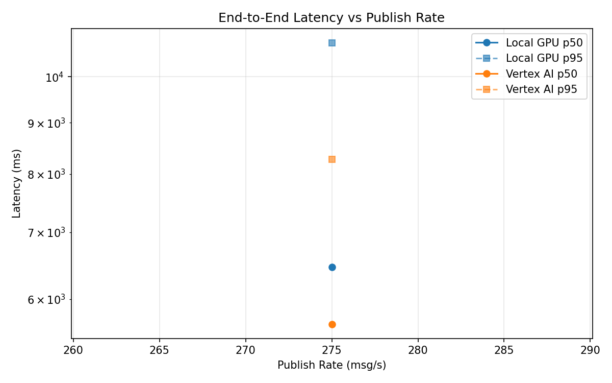
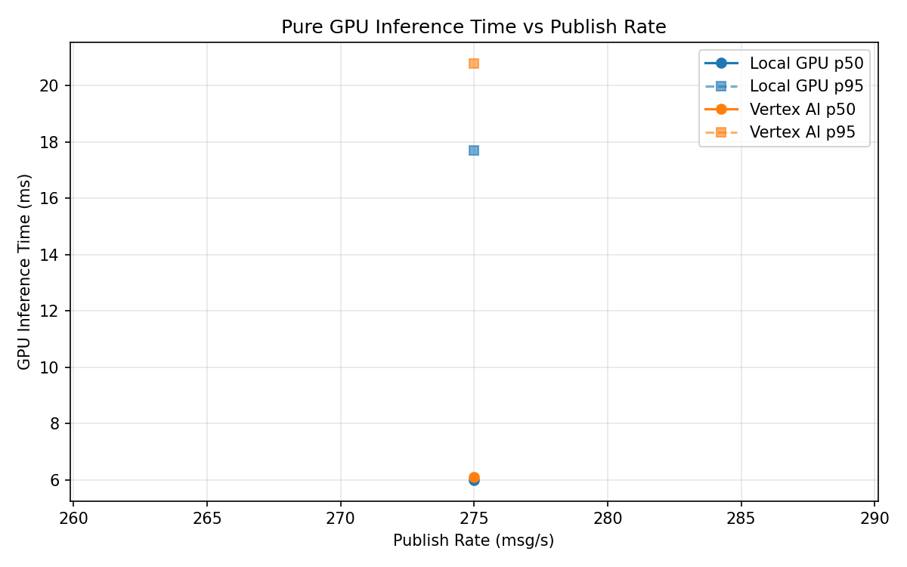
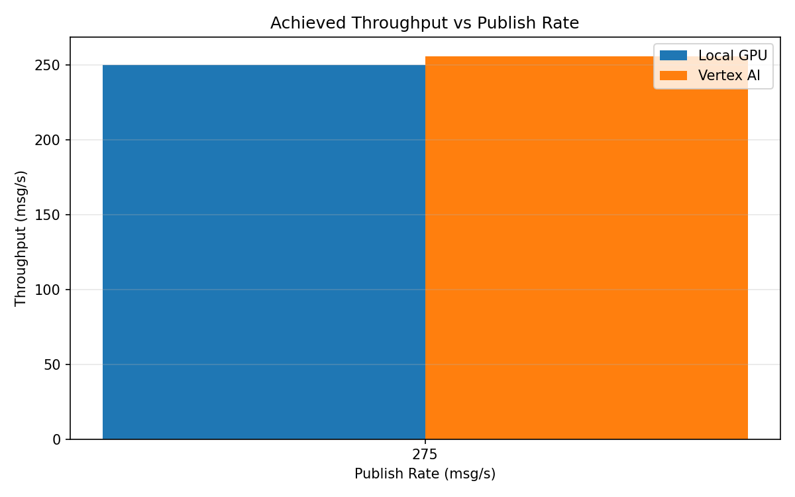

# Benchmark Report

Generated: 2026-03-08 10:06:04

## Configuration

| Parameter | Value |
|---|---|
| Messages per phase | 100s per phase |
| Rates (msg/s) | 275 |
| Experiments | Local GPU, Vertex AI |

## Throughput

| Rate (msg/s) | Local GPU | Vertex AI |
|---|---|---|
| 275 | 249.9 | 255.7 |

## End-to-End Latency (ms)

| Rate | Percentile | Local GPU | Vertex AI |
|---|---|---|---|
| 275 | p50 | 6461.0 | 5665.0 |
| 275 | p95 | 10815.0 | 8269.0 |
| 275 | p99 | 10983.0 | 8384.0 |

## GPU Inference Time (ms)

| Rate | Percentile | Local GPU | Vertex AI |
|---|---|---|---|
| 275 | p50 | 6.0 | 6.1 |
| 275 | p95 | 17.7 | 20.8 |
| 275 | p99 | 23.2 | 33.9 |

## Charts

### Latency vs Publish Rate

### GPU Inference Time vs Publish Rate

### Throughput vs Publish Rate

