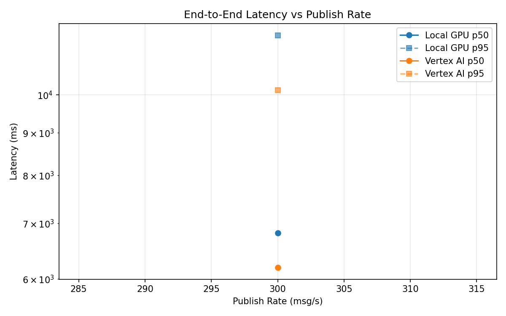
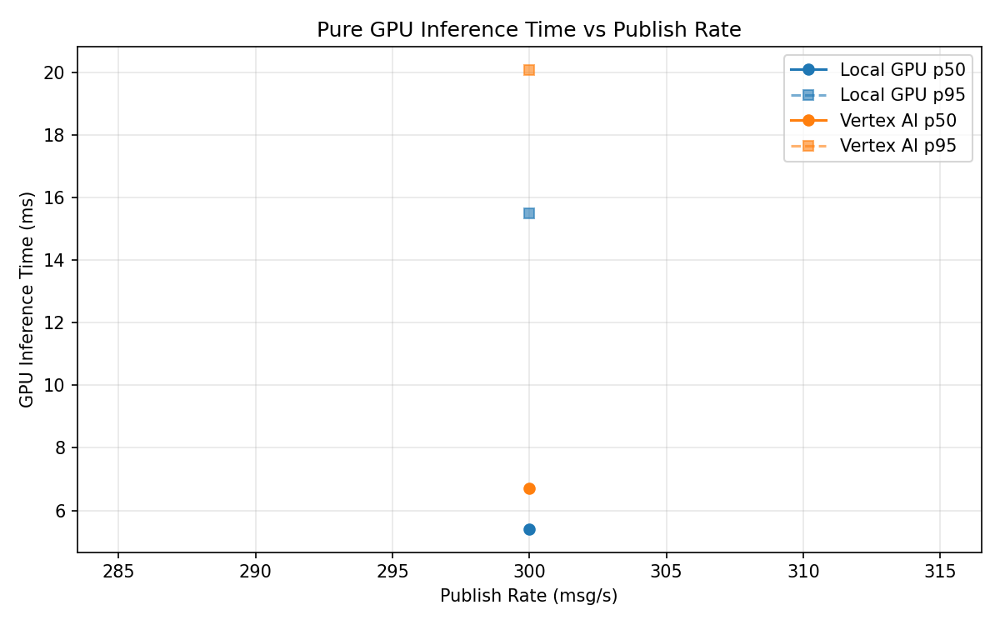
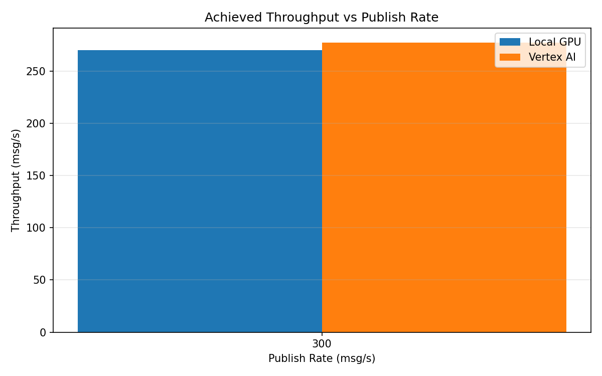

# Benchmark Report

Generated: 2026-03-08 10:14:49

## Configuration

| Parameter | Value |
|---|---|
| Messages per phase | 100s per phase |
| Rates (msg/s) | 300 |
| Experiments | Local GPU, Vertex AI |

## Throughput

| Rate (msg/s) | Local GPU | Vertex AI |
|---|---|---|
| 300 | 270.2 | 277.4 |

## End-to-End Latency (ms)

| Rate | Percentile | Local GPU | Vertex AI |
|---|---|---|---|
| 300 | p50 | 6817.0 | 6195.0 |
| 300 | p95 | 11802.0 | 10137.0 |
| 300 | p99 | 11976.0 | 10716.0 |

## GPU Inference Time (ms)

| Rate | Percentile | Local GPU | Vertex AI |
|---|---|---|---|
| 300 | p50 | 5.4 | 6.7 |
| 300 | p95 | 15.5 | 20.1 |
| 300 | p99 | 21.9 | 35.4 |

## Charts

### Latency vs Publish Rate

### GPU Inference Time vs Publish Rate

### Throughput vs Publish Rate

