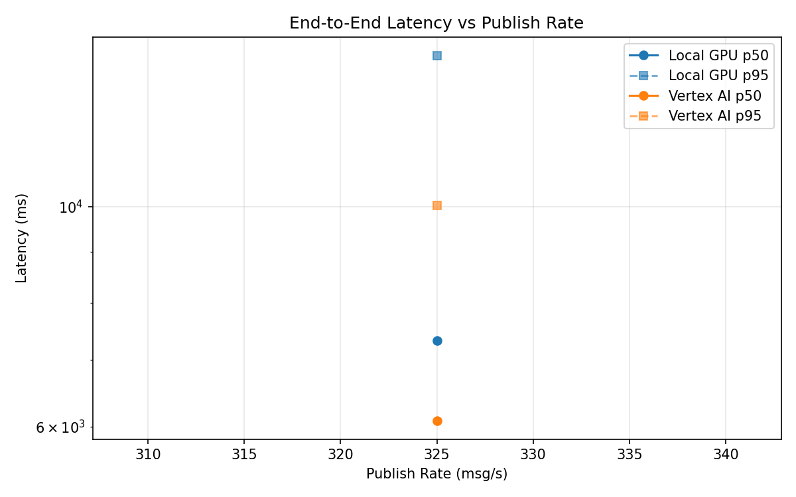
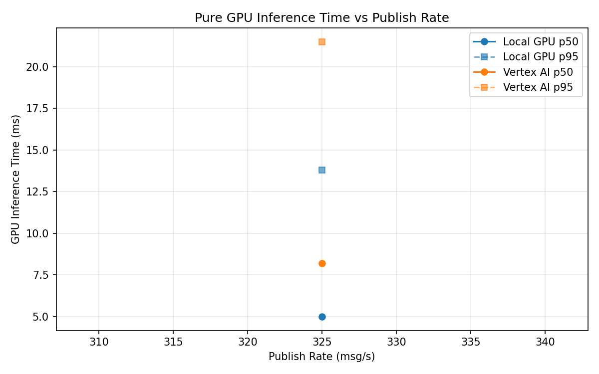
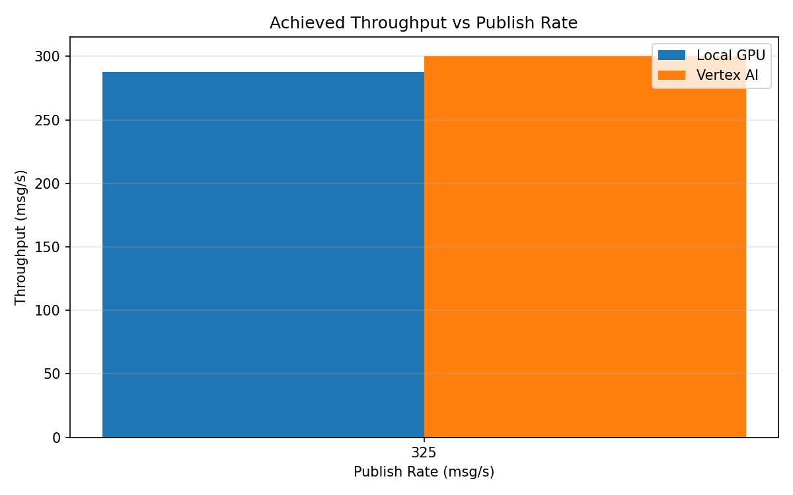

# Benchmark Report

Generated: 2026-03-08 10:25:43

## Configuration

| Parameter | Value |
|---|---|
| Messages per phase | 100s per phase |
| Rates (msg/s) | 325 |
| Experiments | Local GPU, Vertex AI |

## Throughput

| Rate (msg/s) | Local GPU | Vertex AI |
|---|---|---|
| 325 | 287.9 | 300.3 |

## End-to-End Latency (ms)

| Rate | Percentile | Local GPU | Vertex AI |
|---|---|---|---|
| 325 | p50 | 7329.0 | 6079.5 |
| 325 | p95 | 14204.0 | 10019.0 |
| 325 | p99 | 14552.0 | 10261.0 |

## GPU Inference Time (ms)

| Rate | Percentile | Local GPU | Vertex AI |
|---|---|---|---|
| 325 | p50 | 5.0 | 8.2 |
| 325 | p95 | 13.8 | 21.5 |
| 325 | p99 | 22.1 | 36.2 |

## Charts

### Latency vs Publish Rate

### GPU Inference Time vs Publish Rate

### Throughput vs Publish Rate

