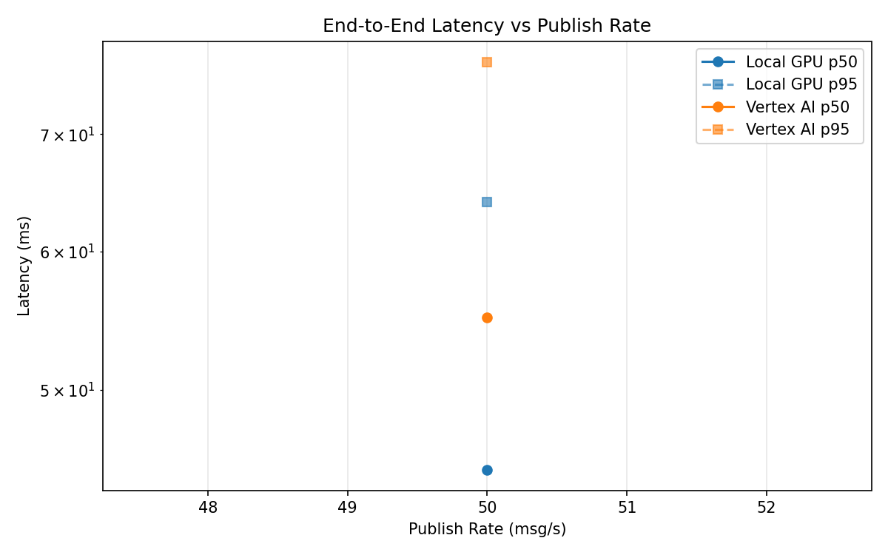
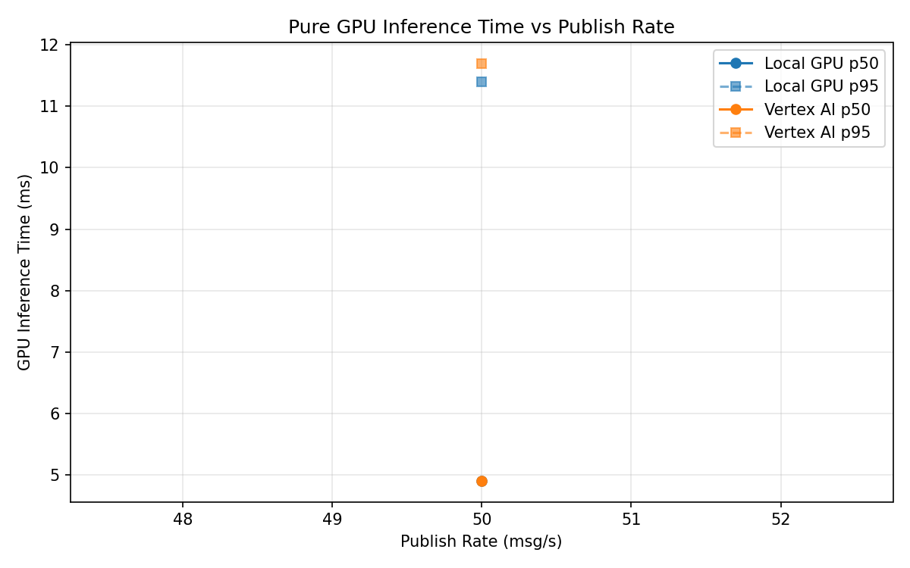

# Benchmark Report

Generated: 2026-03-08 08:44:21

## Configuration

| Parameter | Value |
|---|---|
| Messages per phase | 100s per phase |
| Rates (msg/s) | 50 |
| Experiments | Local GPU, Vertex AI |

## Throughput

| Rate (msg/s) | Local GPU | Vertex AI |
|---|---|---|
| 50 | 50.0 | 50.0 |

## End-to-End Latency (ms)

| Rate | Percentile | Local GPU | Vertex AI |
|---|---|---|---|
| 50 | p50 | 45.0 | 55.0 |
| 50 | p95 | 64.0 | 77.0 |
| 50 | p99 | 93.0 | 253.1 |

## GPU Inference Time (ms)

| Rate | Percentile | Local GPU | Vertex AI |
|---|---|---|---|
| 50 | p50 | 4.9 | 4.9 |
| 50 | p95 | 11.4 | 11.7 |
| 50 | p99 | 17.1 | 19.0 |

## Charts

### Latency vs Publish Rate

### GPU Inference Time vs Publish Rate

### Throughput vs Publish Rate

