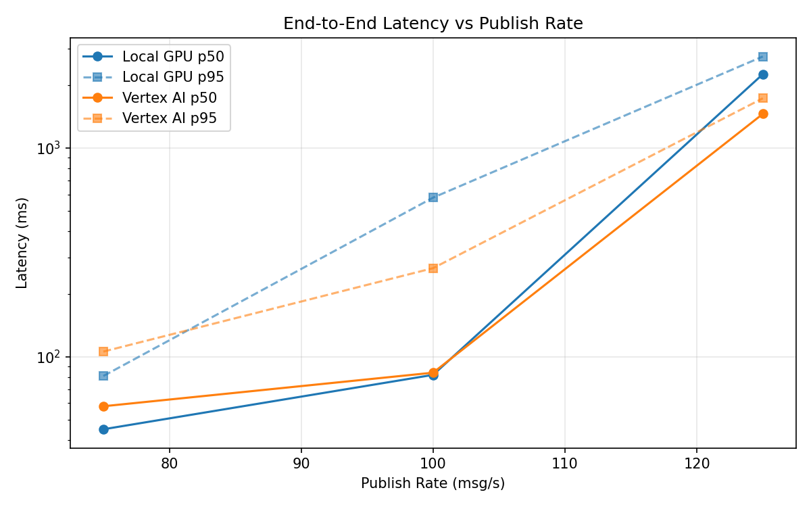
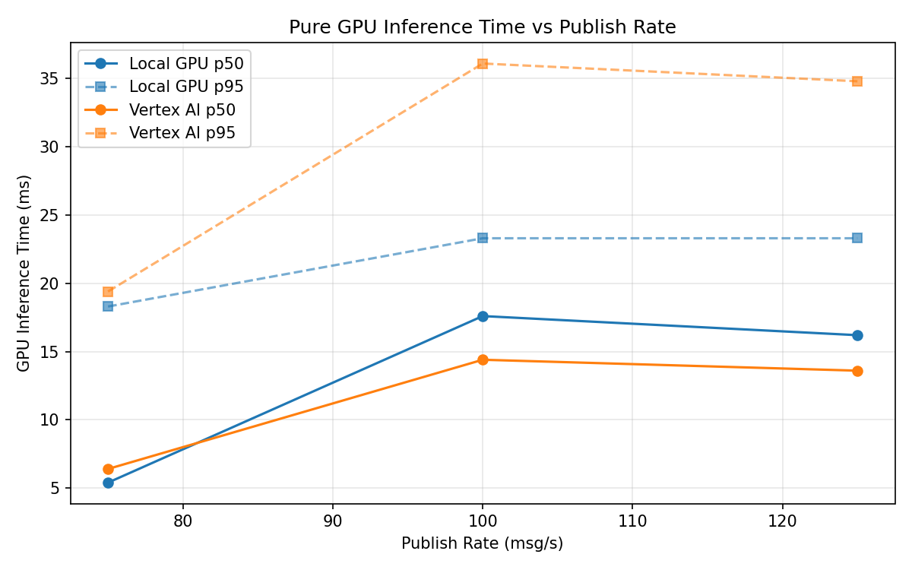
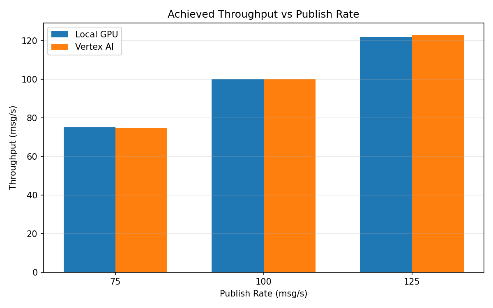

# Benchmark Report

Generated: 2026-03-08 06:13:05

## Configuration

| Parameter | Value |
|---|---|
| Messages per phase | 100s per phase |
| Rates (msg/s) | 75, 100, 125 |
| Experiments | Local GPU, Vertex AI |

## Throughput

| Rate (msg/s) | Local GPU | Vertex AI |
|---|---|---|
| 75 | 75.0 | 74.9 |
| 100 | 99.9 | 99.9 |
| 125 | 121.8 | 122.9 |

## End-to-End Latency (ms)

| Rate | Percentile | Local GPU | Vertex AI |
|---|---|---|---|
| 75 | p50 | 45.0 | 58.0 |
| 75 | p95 | 81.0 | 106.0 |
| 75 | p99 | 566.0 | 500.0 |
| 100 | p50 | 82.0 | 84.0 |
| 100 | p95 | 579.0 | 266.0 |
| 100 | p99 | 893.0 | 509.0 |
| 125 | p50 | 2259.0 | 1458.0 |
| 125 | p95 | 2746.0 | 1732.0 |
| 125 | p99 | 2837.0 | 1784.0 |

## GPU Inference Time (ms)

| Rate | Percentile | Local GPU | Vertex AI |
|---|---|---|---|
| 75 | p50 | 5.4 | 6.4 |
| 75 | p95 | 18.3 | 19.4 |
| 75 | p99 | 22.2 | 33.2 |
| 100 | p50 | 17.6 | 14.4 |
| 100 | p95 | 23.3 | 36.1 |
| 100 | p99 | 25.6 | 46.0 |
| 125 | p50 | 16.2 | 13.6 |
| 125 | p95 | 23.3 | 34.8 |
| 125 | p99 | 25.5 | 43.6 |

## Charts

### Latency vs Publish Rate

### GPU Inference Time vs Publish Rate

### Throughput vs Publish Rate

