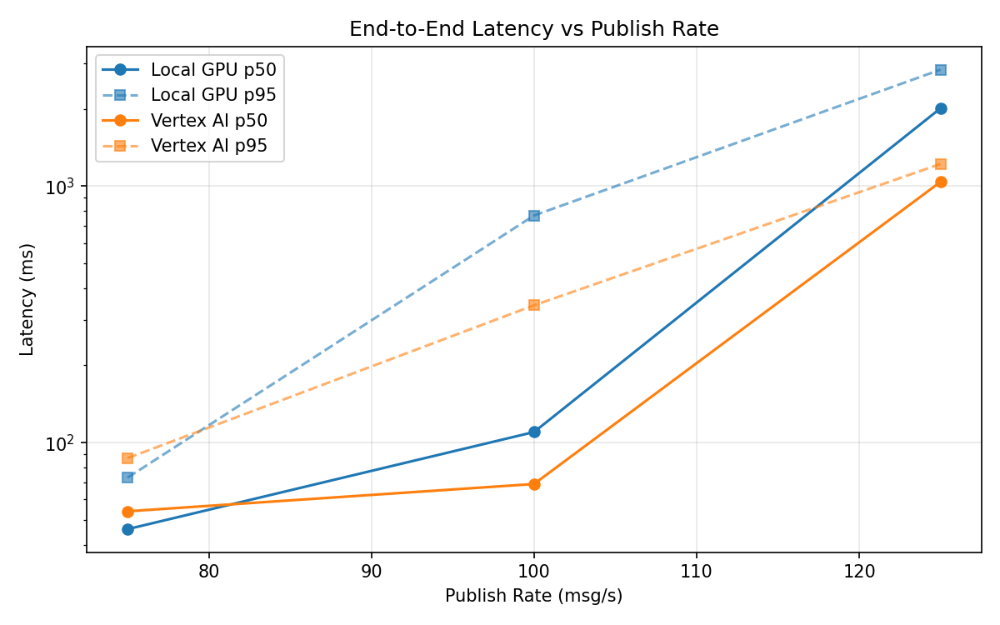
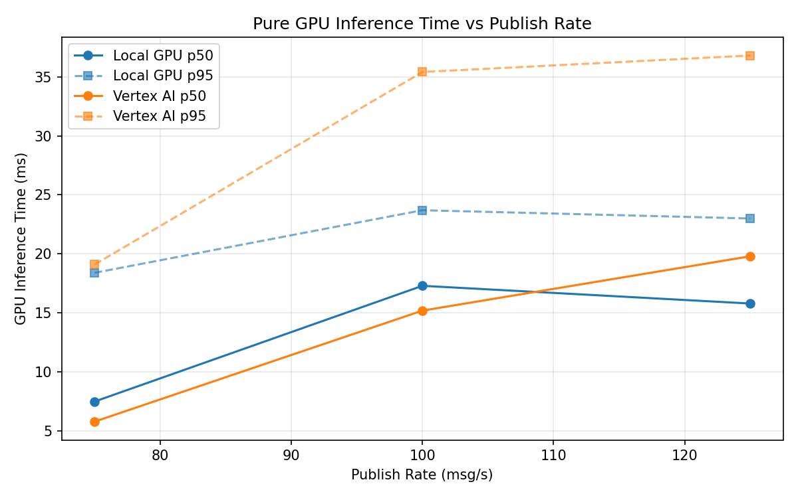
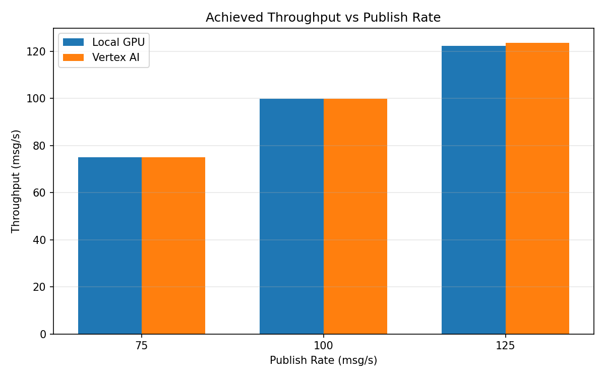

# Benchmark Report

Generated: 2026-03-08 06:25:36

## Configuration

| Parameter | Value |
|---|---|
| Messages per phase | 100s per phase |
| Rates (msg/s) | 75, 100, 125 |
| Experiments | Local GPU, Vertex AI |

## Throughput

| Rate (msg/s) | Local GPU | Vertex AI |
|---|---|---|
| 75 | 75.0 | 75.0 |
| 100 | 99.9 | 99.9 |
| 125 | 122.3 | 123.6 |

## End-to-End Latency (ms)

| Rate | Percentile | Local GPU | Vertex AI |
|---|---|---|---|
| 75 | p50 | 46.0 | 54.0 |
| 75 | p95 | 73.0 | 87.0 |
| 75 | p99 | 242.0 | 320.0 |
| 100 | p50 | 110.0 | 69.0 |
| 100 | p95 | 768.0 | 343.0 |
| 100 | p99 | 997.0 | 989.0 |
| 125 | p50 | 2011.0 | 1039.0 |
| 125 | p95 | 2843.1 | 1220.0 |
| 125 | p99 | 3149.0 | 1280.0 |

## GPU Inference Time (ms)

| Rate | Percentile | Local GPU | Vertex AI |
|---|---|---|---|
| 75 | p50 | 7.5 | 5.8 |
| 75 | p95 | 18.4 | 19.1 |
| 75 | p99 | 22.7 | 33.9 |
| 100 | p50 | 17.3 | 15.2 |
| 100 | p95 | 23.7 | 35.4 |
| 100 | p99 | 26.6 | 45.4 |
| 125 | p50 | 15.8 | 19.8 |
| 125 | p95 | 23.0 | 36.8 |
| 125 | p99 | 25.8 | 46.6 |

## Charts

### Latency vs Publish Rate

### GPU Inference Time vs Publish Rate

### Throughput vs Publish Rate

