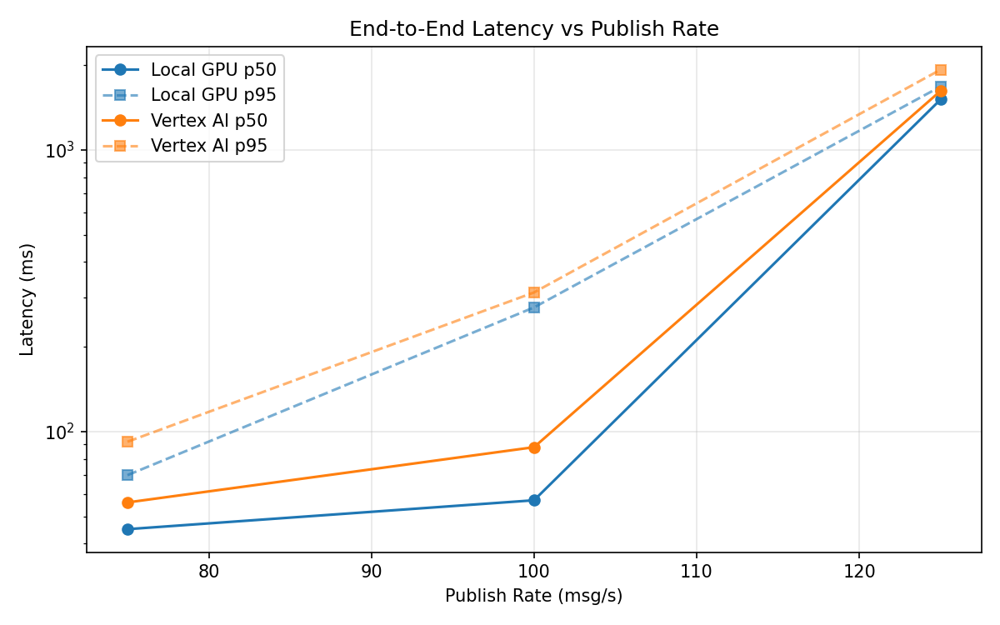
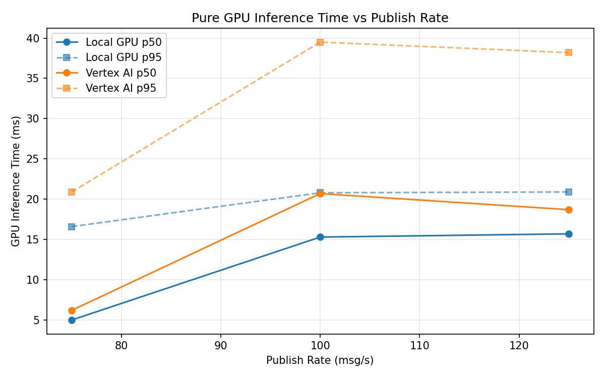
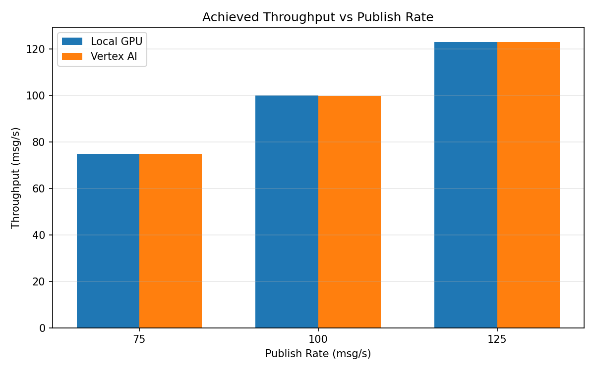

# Benchmark Report

Generated: 2026-03-08 06:38:13

## Configuration

| Parameter | Value |
|---|---|
| Messages per phase | 100s per phase |
| Rates (msg/s) | 75, 100, 125 |
| Experiments | Local GPU, Vertex AI |

## Throughput

| Rate (msg/s) | Local GPU | Vertex AI |
|---|---|---|
| 75 | 75.0 | 75.0 |
| 100 | 100.0 | 99.9 |
| 125 | 123.1 | 123.1 |

## End-to-End Latency (ms)

| Rate | Percentile | Local GPU | Vertex AI |
|---|---|---|---|
| 75 | p50 | 45.0 | 56.0 |
| 75 | p95 | 70.0 | 92.0 |
| 75 | p99 | 259.0 | 214.0 |
| 100 | p50 | 57.0 | 88.0 |
| 100 | p95 | 276.0 | 312.0 |
| 100 | p99 | 565.0 | 588.0 |
| 125 | p50 | 1512.0 | 1622.0 |
| 125 | p95 | 1681.0 | 1930.0 |
| 125 | p99 | 1749.0 | 1981.0 |

## GPU Inference Time (ms)

| Rate | Percentile | Local GPU | Vertex AI |
|---|---|---|---|
| 75 | p50 | 5.0 | 6.2 |
| 75 | p95 | 16.6 | 20.9 |
| 75 | p99 | 20.2 | 36.0 |
| 100 | p50 | 15.3 | 20.7 |
| 100 | p95 | 20.8 | 39.5 |
| 100 | p99 | 23.0 | 49.9 |
| 125 | p50 | 15.7 | 18.7 |
| 125 | p95 | 20.9 | 38.2 |
| 125 | p99 | 22.9 | 47.9 |

## Charts

### Latency vs Publish Rate

### GPU Inference Time vs Publish Rate

### Throughput vs Publish Rate

