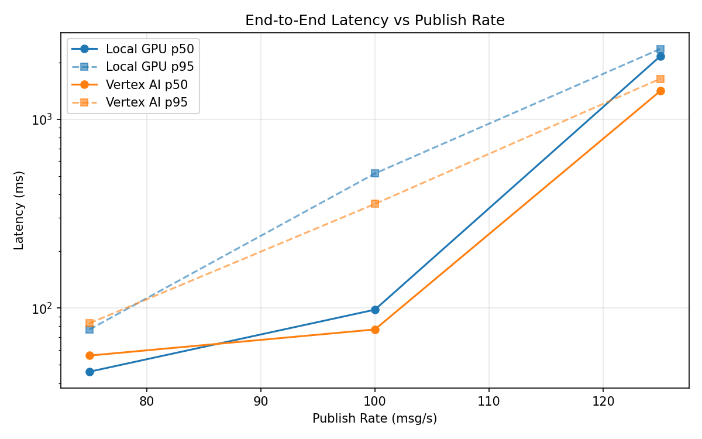
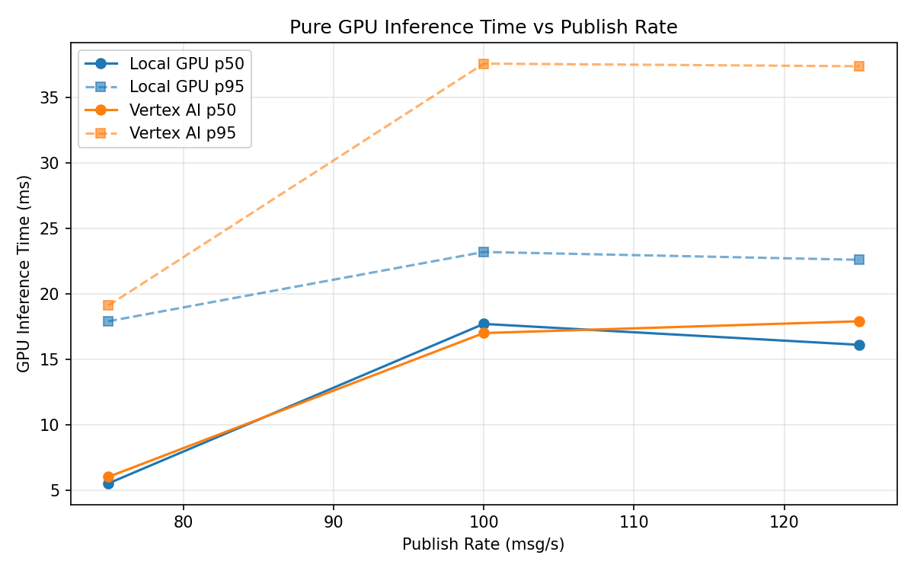
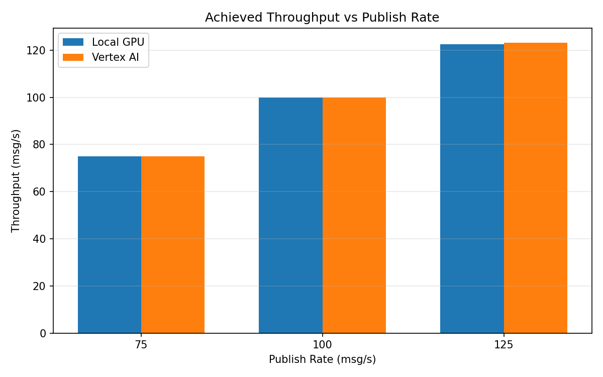

# Benchmark Report

Generated: 2026-03-08 06:51:16

## Configuration

| Parameter | Value |
|---|---|
| Messages per phase | 100s per phase |
| Rates (msg/s) | 75, 100, 125 |
| Experiments | Local GPU, Vertex AI |

## Throughput

| Rate (msg/s) | Local GPU | Vertex AI |
|---|---|---|
| 75 | 75.0 | 75.0 |
| 100 | 99.9 | 99.9 |
| 125 | 122.5 | 123.2 |

## End-to-End Latency (ms)

| Rate | Percentile | Local GPU | Vertex AI |
|---|---|---|---|
| 75 | p50 | 46.0 | 56.0 |
| 75 | p95 | 77.0 | 83.0 |
| 75 | p99 | 521.0 | 200.0 |
| 100 | p50 | 98.0 | 77.0 |
| 100 | p95 | 516.0 | 356.0 |
| 100 | p99 | 645.0 | 847.0 |
| 125 | p50 | 2157.0 | 1411.0 |
| 125 | p95 | 2358.0 | 1639.0 |
| 125 | p99 | 2415.0 | 1703.0 |

## GPU Inference Time (ms)

| Rate | Percentile | Local GPU | Vertex AI |
|---|---|---|---|
| 75 | p50 | 5.5 | 6.0 |
| 75 | p95 | 17.9 | 19.1 |
| 75 | p99 | 21.4 | 31.8 |
| 100 | p50 | 17.7 | 17.0 |
| 100 | p95 | 23.2 | 37.6 |
| 100 | p99 | 25.3 | 48.0 |
| 125 | p50 | 16.1 | 17.9 |
| 125 | p95 | 22.6 | 37.4 |
| 125 | p99 | 24.9 | 46.6 |

## Charts

### Latency vs Publish Rate

### GPU Inference Time vs Publish Rate

### Throughput vs Publish Rate

