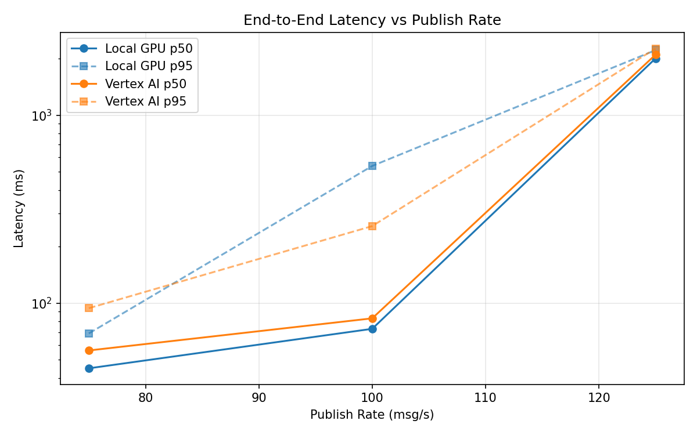
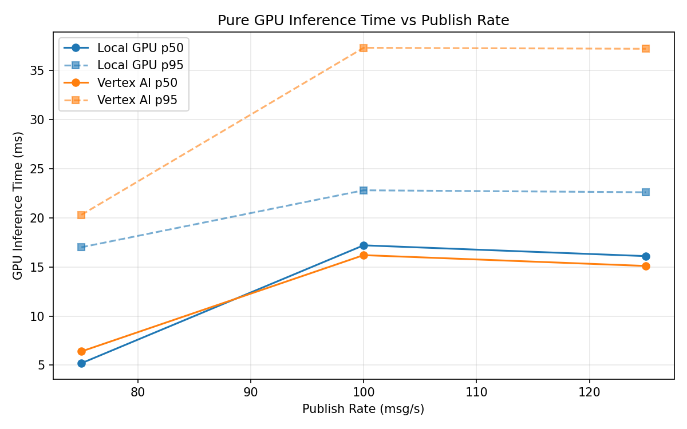

# Benchmark Report

Generated: 2026-03-08 07:03:40

## Configuration

| Parameter | Value |
|---|---|
| Messages per phase | 100s per phase |
| Rates (msg/s) | 75, 100, 125 |
| Experiments | Local GPU, Vertex AI |

## Throughput

| Rate (msg/s) | Local GPU | Vertex AI |
|---|---|---|
| 75 | 75.0 | 75.0 |
| 100 | 100.0 | 99.9 |
| 125 | 122.4 | 122.4 |

## End-to-End Latency (ms)

| Rate | Percentile | Local GPU | Vertex AI |
|---|---|---|---|
| 75 | p50 | 45.0 | 56.0 |
| 75 | p95 | 69.0 | 94.0 |
| 75 | p99 | 192.0 | 806.1 |
| 100 | p50 | 73.0 | 83.0 |
| 100 | p95 | 537.0 | 257.0 |
| 100 | p99 | 773.0 | 572.0 |
| 125 | p50 | 2007.0 | 2100.5 |
| 125 | p95 | 2219.0 | 2265.0 |
| 125 | p99 | 2266.0 | 2316.0 |

## GPU Inference Time (ms)

| Rate | Percentile | Local GPU | Vertex AI |
|---|---|---|---|
| 75 | p50 | 5.2 | 6.4 |
| 75 | p95 | 17.0 | 20.3 |
| 75 | p99 | 21.0 | 34.4 |
| 100 | p50 | 17.2 | 16.2 |
| 100 | p95 | 22.8 | 37.3 |
| 100 | p99 | 25.1 | 46.6 |
| 125 | p50 | 16.1 | 15.1 |
| 125 | p95 | 22.6 | 37.2 |
| 125 | p99 | 24.8 | 45.6 |

## Charts

### Latency vs Publish Rate

### GPU Inference Time vs Publish Rate

### Throughput vs Publish Rate

