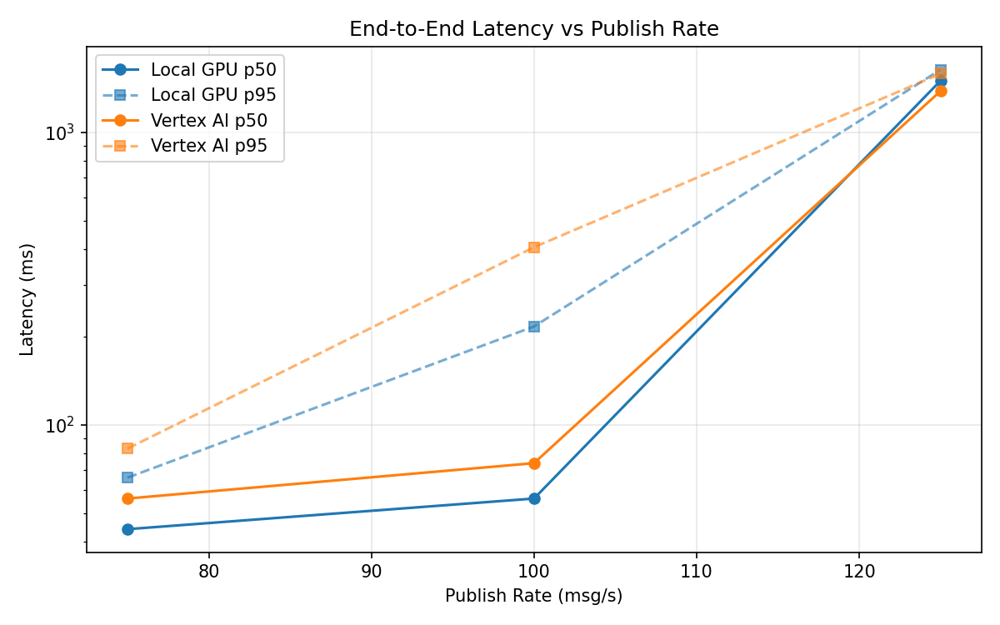
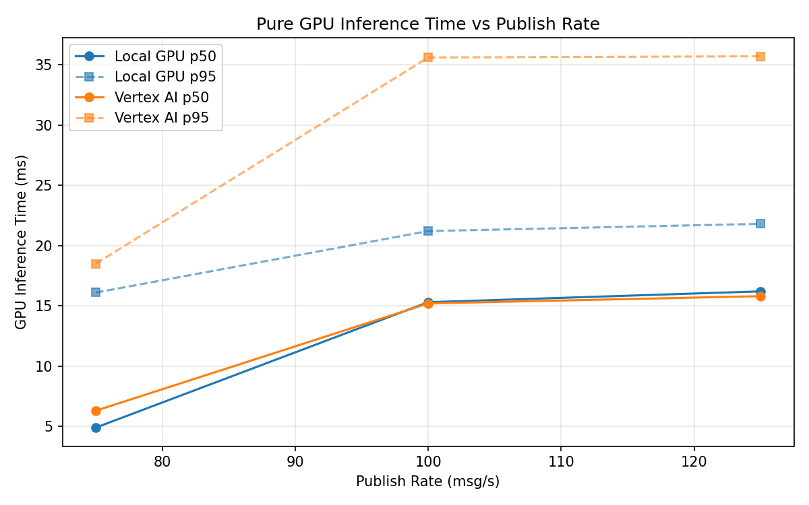
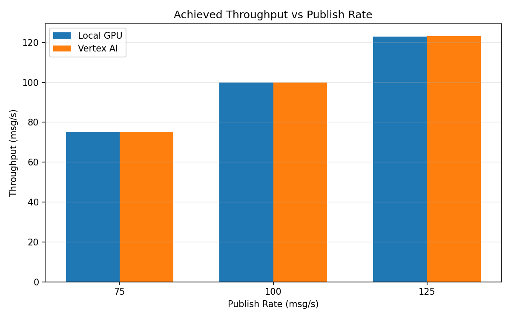

# Benchmark Report

Generated: 2026-03-08 05:47:57

## Configuration

| Parameter | Value |
|---|---|
| Messages per phase | 100s per phase |
| Rates (msg/s) | 75, 100, 125 |
| Experiments | Local GPU, Vertex AI |

## Throughput

| Rate (msg/s) | Local GPU | Vertex AI |
|---|---|---|
| 75 | 75.0 | 75.0 |
| 100 | 99.9 | 100.0 |
| 125 | 123.0 | 123.2 |

## End-to-End Latency (ms)

| Rate | Percentile | Local GPU | Vertex AI |
|---|---|---|---|
| 75 | p50 | 44.0 | 56.0 |
| 75 | p95 | 66.0 | 83.0 |
| 75 | p99 | 196.0 | 232.0 |
| 100 | p50 | 56.0 | 74.0 |
| 100 | p95 | 217.0 | 405.0 |
| 100 | p99 | 358.0 | 1041.0 |
| 125 | p50 | 1503.0 | 1386.0 |
| 125 | p95 | 1639.0 | 1588.0 |
| 125 | p99 | 1674.0 | 1632.0 |

## GPU Inference Time (ms)

| Rate | Percentile | Local GPU | Vertex AI |
|---|---|---|---|
| 75 | p50 | 4.9 | 6.3 |
| 75 | p95 | 16.1 | 18.5 |
| 75 | p99 | 19.4 | 29.6 |
| 100 | p50 | 15.3 | 15.2 |
| 100 | p95 | 21.2 | 35.6 |
| 100 | p99 | 23.4 | 44.3 |
| 125 | p50 | 16.2 | 15.8 |
| 125 | p95 | 21.8 | 35.7 |
| 125 | p99 | 23.9 | 44.1 |

## Charts

### Latency vs Publish Rate

### GPU Inference Time vs Publish Rate

### Throughput vs Publish Rate

