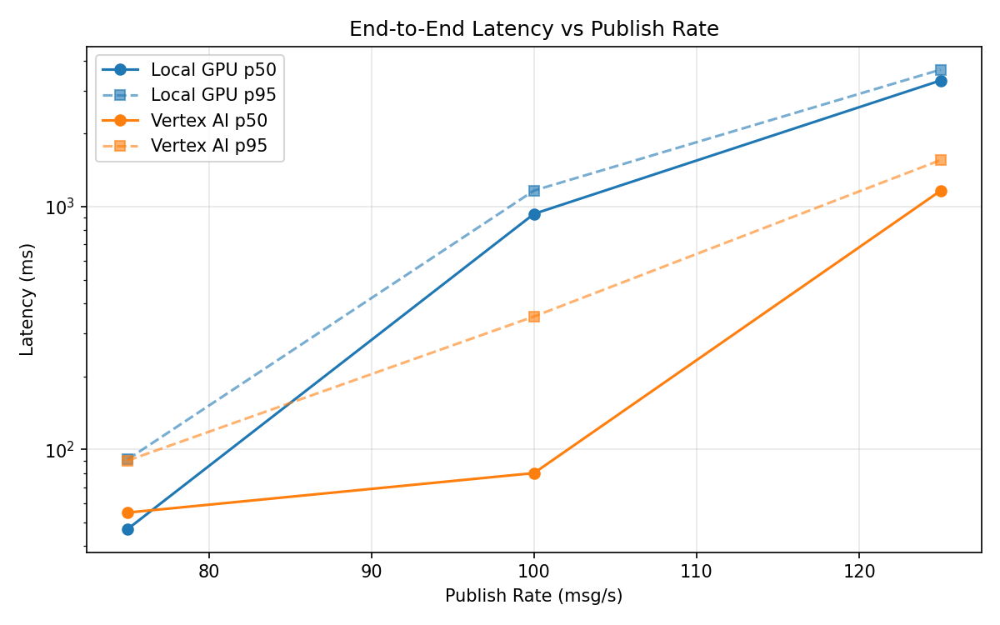
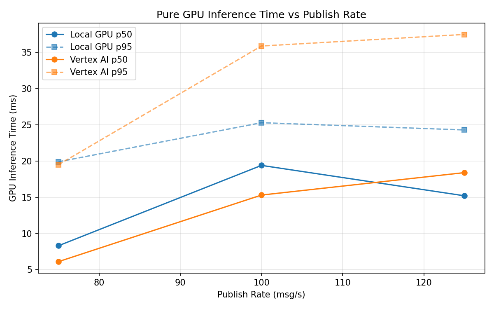
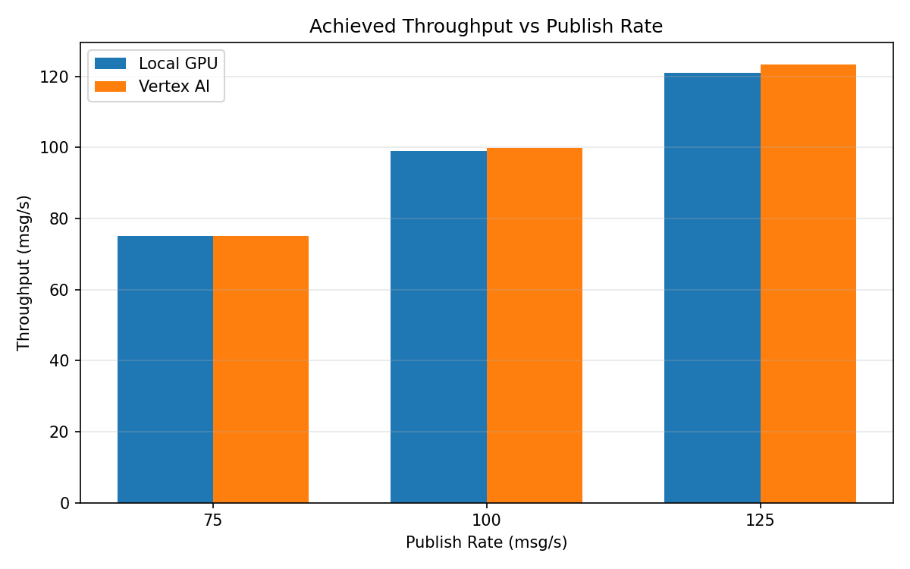

# Benchmark Report

Generated: 2026-03-08 06:00:32

## Configuration

| Parameter | Value |
|---|---|
| Messages per phase | 100s per phase |
| Rates (msg/s) | 75, 100, 125 |
| Experiments | Local GPU, Vertex AI |

## Throughput

| Rate (msg/s) | Local GPU | Vertex AI |
|---|---|---|
| 75 | 75.0 | 75.0 |
| 100 | 99.0 | 99.9 |
| 125 | 121.0 | 123.4 |

## End-to-End Latency (ms)

| Rate | Percentile | Local GPU | Vertex AI |
|---|---|---|---|
| 75 | p50 | 47.0 | 55.0 |
| 75 | p95 | 91.0 | 90.0 |
| 75 | p99 | 534.0 | 639.0 |
| 100 | p50 | 934.0 | 80.0 |
| 100 | p95 | 1165.0 | 353.0 |
| 100 | p99 | 1205.0 | 762.0 |
| 125 | p50 | 3307.0 | 1163.0 |
| 125 | p95 | 3665.0 | 1555.0 |
| 125 | p99 | 3743.0 | 1715.0 |

## GPU Inference Time (ms)

| Rate | Percentile | Local GPU | Vertex AI |
|---|---|---|---|
| 75 | p50 | 8.3 | 6.1 |
| 75 | p95 | 19.9 | 19.5 |
| 75 | p99 | 24.0 | 31.9 |
| 100 | p50 | 19.4 | 15.3 |
| 100 | p95 | 25.3 | 35.9 |
| 100 | p99 | 27.4 | 45.5 |
| 125 | p50 | 15.2 | 18.4 |
| 125 | p95 | 24.3 | 37.5 |
| 125 | p99 | 26.6 | 47.4 |

## Charts

### Latency vs Publish Rate

### GPU Inference Time vs Publish Rate

### Throughput vs Publish Rate

