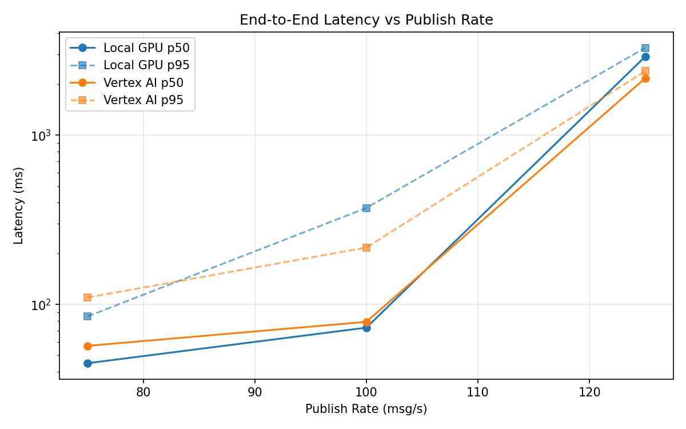
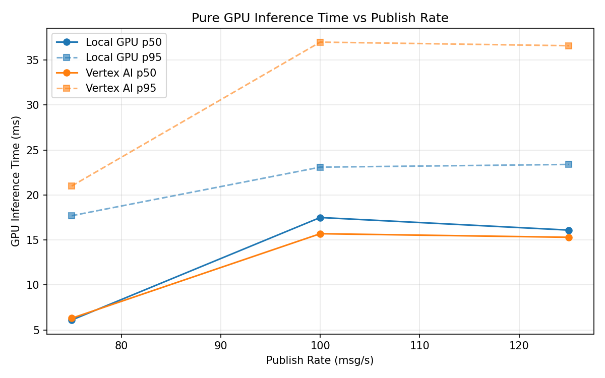
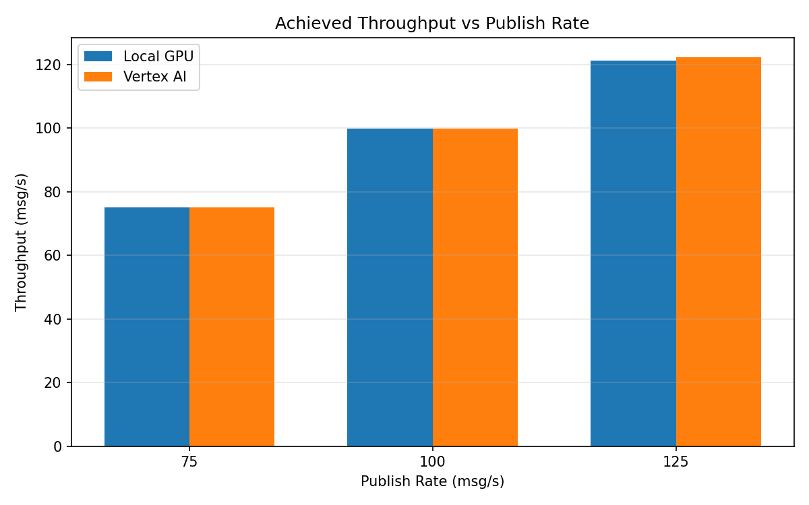

# Benchmark Report

Generated: 2026-03-08 07:16:13

## Configuration

| Parameter | Value |
|---|---|
| Messages per phase | 100s per phase |
| Rates (msg/s) | 75, 100, 125 |
| Experiments | Local GPU, Vertex AI |

## Throughput

| Rate (msg/s) | Local GPU | Vertex AI |
|---|---|---|
| 75 | 75.0 | 75.0 |
| 100 | 99.9 | 99.9 |
| 125 | 121.3 | 122.3 |

## End-to-End Latency (ms)

| Rate | Percentile | Local GPU | Vertex AI |
|---|---|---|---|
| 75 | p50 | 45.0 | 57.0 |
| 75 | p95 | 85.0 | 110.0 |
| 75 | p99 | 942.0 | 933.1 |
| 100 | p50 | 73.0 | 79.0 |
| 100 | p95 | 372.0 | 217.0 |
| 100 | p99 | 573.0 | 346.0 |
| 125 | p50 | 2918.5 | 2174.0 |
| 125 | p95 | 3287.0 | 2394.0 |
| 125 | p99 | 3342.0 | 2431.0 |

## GPU Inference Time (ms)

| Rate | Percentile | Local GPU | Vertex AI |
|---|---|---|---|
| 75 | p50 | 6.1 | 6.3 |
| 75 | p95 | 17.7 | 21.0 |
| 75 | p99 | 21.5 | 34.4 |
| 100 | p50 | 17.5 | 15.7 |
| 100 | p95 | 23.1 | 37.0 |
| 100 | p99 | 25.2 | 47.4 |
| 125 | p50 | 16.1 | 15.3 |
| 125 | p95 | 23.4 | 36.6 |
| 125 | p99 | 26.0 | 45.2 |

## Charts

### Latency vs Publish Rate

### GPU Inference Time vs Publish Rate

### Throughput vs Publish Rate

