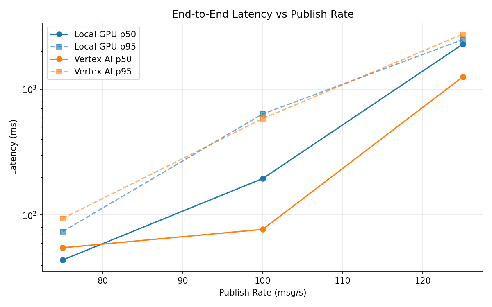
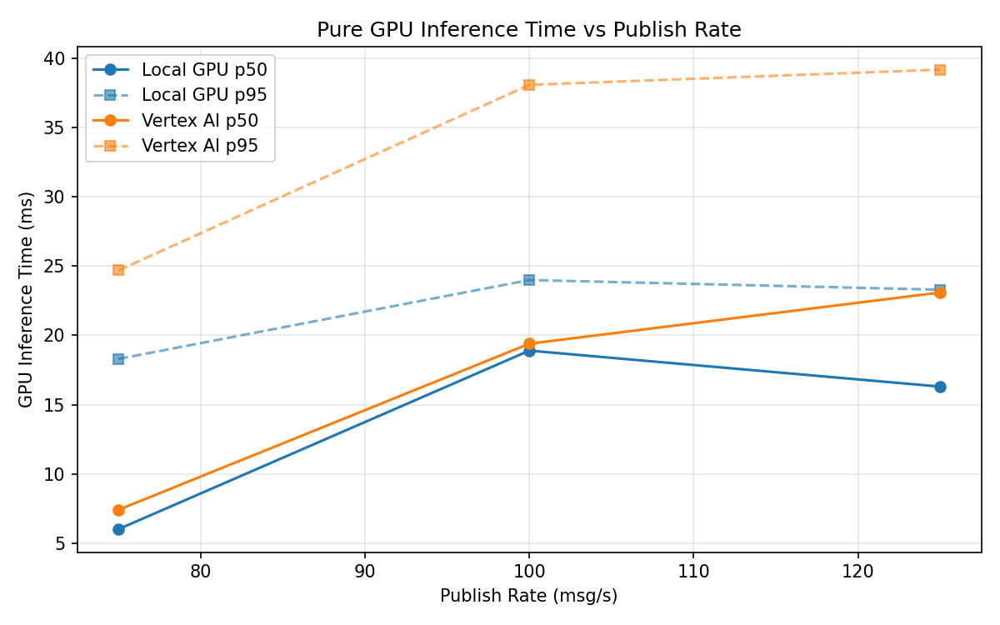
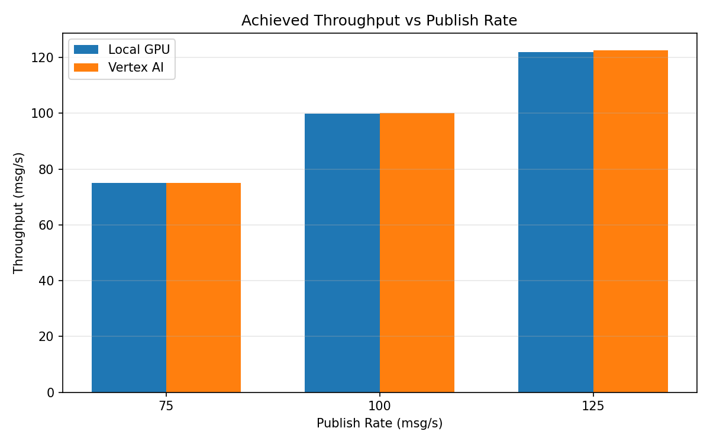

# Benchmark Report

Generated: 2026-03-08 07:53:39

## Configuration

| Parameter | Value |
|---|---|
| Messages per phase | 100s per phase |
| Rates (msg/s) | 75, 100, 125 |
| Experiments | Local GPU, Vertex AI |

## Throughput

| Rate (msg/s) | Local GPU | Vertex AI |
|---|---|---|
| 75 | 75.0 | 75.0 |
| 100 | 99.9 | 100.0 |
| 125 | 122.0 | 122.6 |

## End-to-End Latency (ms)

| Rate | Percentile | Local GPU | Vertex AI |
|---|---|---|---|
| 75 | p50 | 44.0 | 55.0 |
| 75 | p95 | 74.0 | 94.0 |
| 75 | p99 | 298.0 | 333.0 |
| 100 | p50 | 195.0 | 77.0 |
| 100 | p95 | 636.0 | 584.0 |
| 100 | p99 | 774.0 | 981.0 |
| 125 | p50 | 2276.0 | 1253.0 |
| 125 | p95 | 2476.0 | 2733.0 |
| 125 | p99 | 2567.0 | 2925.0 |

## GPU Inference Time (ms)

| Rate | Percentile | Local GPU | Vertex AI |
|---|---|---|---|
| 75 | p50 | 6.0 | 7.4 |
| 75 | p95 | 18.3 | 24.7 |
| 75 | p99 | 22.2 | 38.1 |
| 100 | p50 | 18.9 | 19.4 |
| 100 | p95 | 24.0 | 38.1 |
| 100 | p99 | 26.0 | 48.0 |
| 125 | p50 | 16.3 | 23.1 |
| 125 | p95 | 23.3 | 39.2 |
| 125 | p99 | 25.7 | 50.2 |

## Charts

### Latency vs Publish Rate

### GPU Inference Time vs Publish Rate

### Throughput vs Publish Rate

